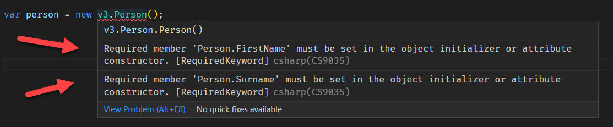
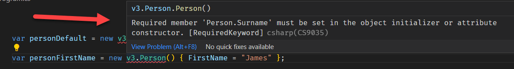

One of the improvements in .NET was the [record](https://learn.microsoft.com/en-us/dotnet/csharp/language-reference/builtin-types/record).

This allows you to create a type like this:

```csharp
public class Person
{
    public string FirstName { get; init; }
    public string Surname { get; init; }
}
```

This allows you to create a `Person` like this:

```csharp
var person = new Person() { FirstName = "James", Surname = "Bond" };
```

The `init` keyword here means that once you have created the `Person`, you can't change any of its properties - they are read-only.

This has several practical uses in writing predictable and maintainable code.

It does, however, present a few problems.

### 1. Nullable Checks

The first thing you will notice is your compiler will complain about enforcement of non-null values. You will get these two warnings when you build the code:

```plaintext
warning CS8618: Non-nullable property 'FirstName' must contain a non-null 
value when exiting constructor. Consider declaring the property as nullable
```

And this one:

```plaintext
warning CS8618: Non-nullable property 'Surname' must contain a non-null va 
lue when exiting constructor. Consider declaring the property as nullable.
```

The compiler is complaining that it is possible for those properties to be `null`.

There are two ways around this:

First, you can turn off this warning globally in your `.csproj` file.


Change

```xml
<Nullable>enable</Nullable>
```

to

```xml
<Nullable>disable</Nullable>
```

The problem with this solution is it turns off all those warnings that could potentially save you lots of subtle bugs and errors.

The other solution is to tell the compiler that you are going to take responsibility for those properties not being `null`.

You do this by providing a default value of your property indicating it is not null - `default!`

```csharp
public class Person
{
    public string FirstName { get; init; } = default!;
    public string Surname { get; init; } = default!;
}
```

### 2. Invalid Object Creation

The other problem is more subtle.

Much as you are meant to create a `Person` like this:

```csharp
var person = new Person() { FirstName = "James", Surname = "Bond" };
```

You can validly do this:

```csharp
var person = new Person();
```

This will create a `Person` with the `FirstName` and `Surname` set to default string values. This may be semantically valid, but such an object is meaningless.

You can try to fix this by creating a private default constructor.

```csharp
public class Person
{
    public string FirstName { get; init; } = default!;
    public string Surname { get; init; } = default!;
    
    private Person(){}
}
```

But this breaks the traditional construction of the object, as you can no longer do this:

```csharp
var person = new Person() { FirstName = "James", Surname = "Bond" };
```

You therefore have to write a constructor to properly create the object.

```csharp
public class Person
{
    public string FirstName { get; }
    public string Surname  { get; }

    private Person() { }
    public Person(string firstName, string surname) => (FirstName, Surname) = (firstName, surname);
}
```

So now the only way to create a `Person` is like this:

```csharp
var person = Person(firstName: "James", surname: "Bond");
```

This works perfectly, but we have had to write a lot of boilerplate code to protect the sanctity of the type.

A new keyword has been introduced to address this problem: the [required](https://learn.microsoft.com/en-us/dotnet/csharp/language-reference/keywords/required) keyword.

This keyword instructs the compiler that the property is required to be set in the object initializer or constructor.

We can re-write our class as follows.

```csharp
public class Person
{
    public required string FirstName { get; init; }
    public required string Surname { get; init; }
}
```

You can attempt to create a person without setting any of the properties.

```csharp
var person = new Person();
```

If you do, you will get this error:



What is handy is you will also get an error if you forget or otherwise emit one of the properties.



In other words, you must set all the values marked `required`.

With this keyword we can reduce the amounts of boilerplate code required to enforce behaviour.

The code is in my [Github](https://github.com/conradakunga/BlogCode/tree/master/2022-11-12%20-%20Required%20Keyword%20In%20C%23%2011%20%26%20.NET%207).

Happy hacking!