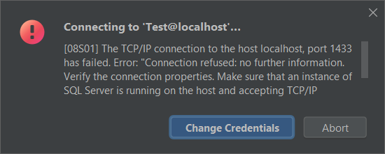
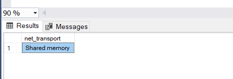
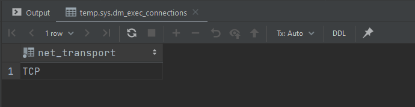
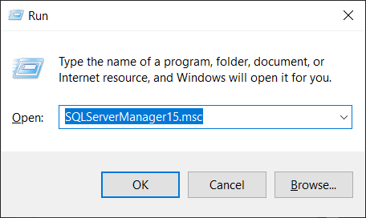
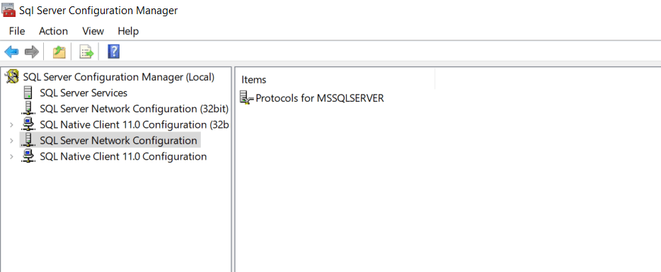
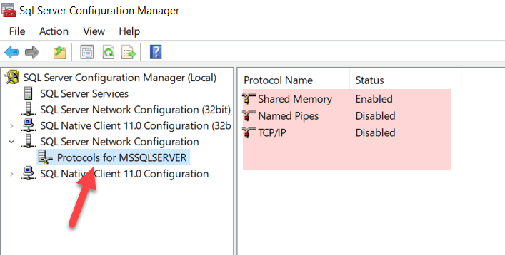
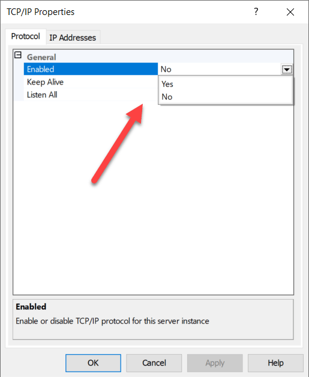
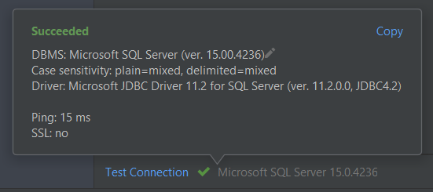

Access to the SQL Server database engine is achieved using one of three [protocols](https://www.sqlshack.com/sql-server-network-configuration/).

By default, SQL Server accepts connections using the **Shared Memory** protocol.

It may interest you to know that SQL Server supports two others - **Named Pipes** and **TCP/IP**.

Some drivers, like the [SQL Server JDBC Driver](https://learn.microsoft.com/en-us/sql/connect/jdbc/microsoft-jdbc-driver-for-sql-server?view=sql-server-ver16) [requires you to have the TCP/IP protocol enabled](https://learn.microsoft.com/en-us/sql/connect/jdbc/troubleshooting-connectivity?view=sql-server-ver16).

If you don't, you will get an error like this.

```plaintext
[08S01] The TCP/IP connection to the host localhost, port 1433
has failed. Error: "Connection refused: no further information.
Verify the connection properties. Make sure that an instance of
SQL Server is running on the host and accepting TCP/IP
connections at the port. Make sure that TCP connections to the
port are not blocked by a firewall.".
```



If you are connected to the database engine using [SQL Server Management Studio](https://learn.microsoft.com/en-us/sql/ssms/download-sql-server-management-studio-ssms?view=sql-server-ver16) or a tool like [Jetbrains DataGrip](https://www.jetbrains.com/datagrip/) you can check how you are connected using this query:

```sql
SELECT
    net_transport
FROM
    sys.dm_exec_connections
WHERE
    session_id = @@SPID;
```





If you are using SQL Server 2019 you can enable TCP as follows:

1. Hit Win + R, to open the run command
1. Paste the following in the dialog 
    
    `SQLServerManager15.msc`

1. With the dialog looking as below, press enter.
    
    
    
1. You should see the following:

    

1. Expand this node to see the protocols configured.

    
    
1. You will see that TCP/IP is disabled. Double click to open the configuration.

    
    
1. Set enabled to Yes then press **OK** to accept the changes.

1. Finally, restart the SQL Server service so that this change is accepted.

From an Administrative Powershell window, run the following command.

```powershell
Restart-Service MSSQLSERVER -force
```

Once done you can try again to connect.

You should now be able to connect successfully.



If you're using a different version of SQL Server, these are the names of the MMC consoles to launch.

| Version        | Snap In Name   |
|----------------|----------------|
| SQL Server 2019 | SQLServerManager15.msc |
| SQL Server 2017 | SQLServerManager14.msc |
| SQL Server 2016 | SQLServerManager13.msc |
| SQL Server 2014 (12.x) | SQLServerManager12.msc |
| SQL Server 2012 (11.x) | SQLServerManager11.msc |

Happy hacking!
