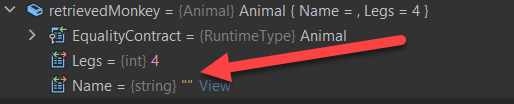
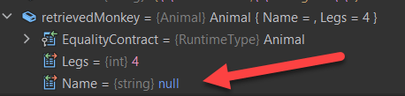

In a previous post I talked about [Handling Null And Empty Strings With System.Text.Json]()

Today Malthe wrote asking about how to tackle the problem in the reverse - your JSON has empty strings and you want to convert them to `NULL`.

Is this possible?

The answer is **absolutely**!

Let us use a simple model:

```csharp
// Tell the compiler we will handle nulls should they occur on our own
#nullable enable
// Define our class
public class Animal
{
    // The animal name may be null
    public string? Name { get; set; }
    // The number of legs cannot be null
    public int Legs { get; set; }
}
```

Let us then explicitly provide our raw JSON

```csharp
var rawJson = """
    {
      "Name": "",
      "Legs": 4
    }
    """;
```

First, let us use the default serialization to see what will happen:

```csharp
var retrievedMonkey = JsonSerializer.Deserialize<Animal>(rawJson);
```

If we run this and inspect in the debugger, the class looks like this:



This is not what we want.

We want that empty string to be deserialized as a `NULL`.

The way to achieve this, as it was for the serialization, is to write a [JsonConverter](https://learn.microsoft.com/en-us/dotnet/api/system.text.json.serialization.jsonconverter-1?view=net-7.0) for the string type, and to override the `Read` method.

So we write the following code, completing the serializer we had defined earlier:

```csharp
public override string Read(ref Utf8JsonReader reader, Type typeToConvert, JsonSerializerOptions options)
{
    // Read the string
    var res = reader.GetString();
    // If it is am empty string, return a null
    if (string.IsNullOrEmpty(res))
        return null;
    else
        // otherwise, return the read value
        return res;
}
```

Our final class, including the code for serialization, now looks like this:

```csharp
public class NullToEmptyStringConverter : JsonConverter<string>
{
    // Override default null handling
    public override bool HandleNull => true;

    // Check the type
    public override bool CanConvert(Type typeToConvert)
    {
        return typeToConvert == typeof(string);
    }

    public override string Read(ref Utf8JsonReader reader, Type typeToConvert, JsonSerializerOptions options)
    {
        // Read the string
        var res = reader.GetString();
        // If it is am empty string, return a null
        if (res == "")
            return null;
        else
            // otherwise, return the read value
            return res;
    }

    public override void Write(Utf8JsonWriter writer, string? value, JsonSerializerOptions options)
    {
        if (value == null)
            writer.WriteStringValue("");
        else
            writer.WriteStringValue(value);
    }
}
```

We finally create an [JsonSerializationOptions](https://learn.microsoft.com/en-us/dotnet/api/system.text.json.jsonserializeroptions?view=net-7.0) object to tell the serializer to use our custom converter.

```csharp
// create the options
var options = new JsonSerializerOptions()
{
    WriteIndented = true
};
// register the converter
options.Converters.Add(new NullToEmptyStringConverter());

retrievedMonkey = JsonSerializer.Deserialize<Animal>(rawJson, options);
```

If we run the code we see now that the name is correctly set to `NULL`



The code is in my [Github](https://github.com/conradakunga/BlogCode/tree/master/2022-11-21%20-%20Deserialize%20Null%20Strings).

Happy hacking!