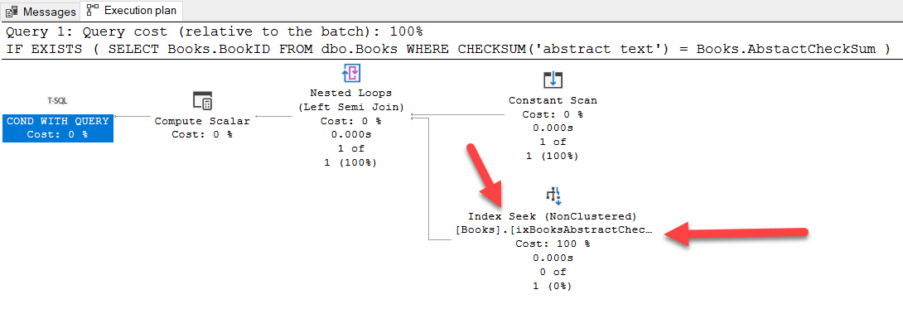

Suppose we have this table:

```sql
CREATE TABLE Books
    (
        BookID      UNIQUEIDENTIFIER PRIMARY KEY
            DEFAULT (NEWSEQUENTIALID()),
        Title       NVARCHAR(500)    NOT NULL
            UNIQUE,
        PublishDate DATE             NOT NULL,
        Abstract    NVARCHAR(MAX)    NOT NULL
    );
```

Let's insert a bit of data into it.

```sql
INSERT dbo.Books
    (
        Title,
        PublishDate,
        Abstract
    )
VALUES
    (
        'The Hunger Games', '09/14/08', ''
    ),
    (
        'Harry Potter and the Order of the Phoenix', '09/28/04', ''
    ),
    (
        'To Kill a Mockingbird', '05/23/06', ''
    ),
    (
        'Pride and Prejudice', '10/10/2000', ''
    ),
    (
        'Twilight', '09/06/2006', ''
    ),
    (
        'The Book Thief', '03/14/06', ''
    ),
    (
        'Animal Farm', '04/28/96', ''
    ),
    (
        'The Chronicles of Narnia', '09/16/02', ''
    ),
    (
        'J.R.R. Tolkien 4-Book Boxed Set: The Hobbit and The Lord of the Rings', '09/25/12', ''
    );
```

We then want to be able to query this data for a bunch of things, so it would make sense to index the columns.

```sql
CREATE INDEX ixBookTitle
    ON dbo.Books (Title);

CREATE INDEX ixBookPublishDate
    ON dbo.Books (PublishDate);

CREATE INDEX ixBookAbstract
    ON dbo.Books (Abstract);
```

The first two will execute successfully.

The third, however, would refuse with this error:

```plaintext
Msg 1919, Level 16, State 1, Line 7
Column 'Abstract' in table 'dbo.Books' is of a type that is invalid for use as a key column in an index.
```

This is because you [cannot actually index a NVARCHAR(MAX) column](https://learn.microsoft.com/en-us/sql/relational-databases/sql-server-index-design-guide?view=sql-server-ver16).


Not directly, anyway.

There are two ways to go around this.

#### 1. Include Indexes

Much as you cannot directly index `NVARCHAR(MAX)` columns, they can participate in an index by being [included](https://learn.microsoft.com/en-us/sql/relational-databases/indexes/create-indexes-with-included-columns?view=sql-server-ver16).

So you can do this:

```sql
CREATE INDEX ixBookIDAbstract
    ON dbo.Books (BookID)
    INCLUDE (Abstract);
```

We can verify that this index would be used by running a query and looking at the query plan.


#### 2. Index Computed Columns

Another way of going around this problem is to create a computed column and then index that

```sql
ALTER TABLE dbo.Books
ADD
    AbstactCheckSum AS CHECKSUM(Books.Abstract);
GO

CREATE INDEX ixBooksAbstractChecksum
    ON dbo.Books (AbstactCheckSum);
```

Here, we are making use of the knowledge of the [CHECKSUM](https://learn.microsoft.com/en-us/sql/t-sql/functions/checksum-transact-sql?view=sql-server-ver16) SQL Server function, which given an input, will generate a checksum value (a number).

This approach is useful when you want to do something like:

1. Enforce uniqueness (you can't have a unique constraint on a `NVARCHAR(MAX)` column)
   
    If you run this:
    
   ```sql
    ALTER TABLE dbo.Books
    ADD
        UniqueAbstract NVARCHAR(MAX)
            UNIQUE;
   ```
   
    You will get the following error:
   
    ```plaintext
    Msg 1919, Level 16, State 1, Line 1
    Column 'UniqueAbstract' in table 'Books' is of a type that is invalid for use as a key column in an index.
    Msg 1750, Level 16, State 0, Line 1
    Could not create constraint or index. See previous errors.
    ```

1. Query the presence or absence of a value in the column

To achieve #1, you can [set your new index as unique](https://learn.microsoft.com/en-us/sql/relational-databases/indexes/create-unique-indexes?view=sql-server-ver16) when creating it.

To achieve #2, you would query like this:

```sql
IF EXISTS
    (
        SELECT
            Books.BookID
        FROM
            dbo.Books
        WHERE
            CHECKSUM('abstract text') = Books.AbstactCheckSum
    )
    PRINT 'Found';
ELSE
    PRINT 'Not found';
```

If you look at the query plan you can see that not only is the index being used, it is an efficient [Index Seek](https://sqlserverfast.com/epr/index-seek/).



The code is in my [Github](https://github.com/conradakunga/BlogCode/tree/master/2022-11-26%20-%20Indexing%20NVARCHAR(MAX)%20Columns%20In%20SQL%20Server).

Happy hacking!