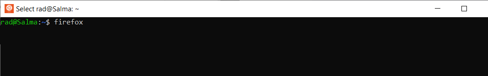

So very quietly last week a game changer was published to the [Windows Appstore](https://apps.microsoft.com/store/apps).

This change allowed you to do the following:

Launch this:


Type this:



And see this:


No big deal, you might think. You have just launched Firefox.

Well - that is true.

But this is not [Firefox for Windows](https://www.mozilla.org/en-US/firefox/windows/). This is [Firefox For Ubuntu Linux](https://www.mozilla.org/en-US/firefox/linux/).

Look closer.


And just for you doubting Thomases ...


**In other words, Windows is now capable or running native Linux GUI applications.**

Here I have both Firefox versions running side by side.


Since 2006 Windows has had support for [Windows Subsystem For Linux](https://learn.microsoft.com/en-us/windows/wsl/install) (know as WSL) which is a full Linux environment without requiring virtual machines or dual booting.

This allows you to do stuff like this:


With a key stroke I can have instant access to running versions of [Kali](https://www.kali.org/) (for security and experiments) and [Ubuntu](https://ubuntu.com/) (for stuff that is annoying or difficult on Windows like NodeJS / Ruby development).

WSL however has been a developer-centric thing and you had [to know what you were doing to set it up](https://www.conradakunga.com/blog/upgrading-to-wsl2/).

Now, WSL is just an app that you install from the Windows Store.


You then get the Linux distribution you want, also from the store.


Most of the usual suspects are there:
1. Ubuntu
1. Suse
1. Oracle
1. Debian
1. Alpine
1. etc.

Install to your heart's content (being cognizant of disk space of course!)

Once you do this they become available as apps. This is the **FULL** Linux - with all the things you expect from a distribution.

You can then install/uninstall software using the usual means - [apt](https://manpages.ubuntu.com/manpages/xenial/man8/apt.8.html) for Debian based distributions, [apk](https://wiki.alpinelinux.org/wiki/Alpine_Package_Keeper) for Alpine based distributions, etc.

So if I needed 7Zip support in my Ubuntu distribution:

```bash
sudo apt install p7zip-full p7zip-rar
```


How brilliant is that? Full proper access to Linux tools and ecosystem as well as GUI applications seamlessly next to your day to day Windows tools and applications.

This means that Windows is now an even better **excellent** development environment.

This was initially planned for Windows 11 but then was back-ported to Windows 10 (which is what I still use.)

Make sure your Windows is up to date and fully patched, [go forth and enjoy](https://apps.microsoft.com/store/detail/windows-subsystem-for-linux/9P9TQF7MRM4R)!

You can verify everything is OK by running the command

```bash
wsl --version
```

You should see something like the following:


Happy hacking!