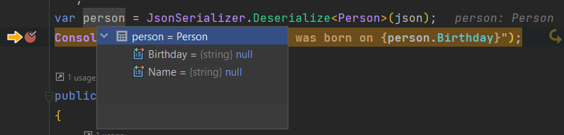

The versatility of [JSON](https://www.json.org/json-en.html) as a data interchange format is that it can represent almost anything, given that ultimately all attributes are strings (or numbers).

Where you might need to do a little bit of work is to map those strings to strongly typed objects in your problem domain.

Take this following example:

```json
{
    "name": "James Bond",
    "birthday": "1950-01-28"
}
```

`Birthday` here, would, in most programming languages, be treated as a [DateTime](https://learn.microsoft.com/en-us/dotnet/api/system.datetime?view=net-7.0), with the time component set to midnight.

.NET has a construct for this - the [DateOnly](https://learn.microsoft.com/en-us/dotnet/api/system.dateonly?view=net-7.0)

So we can model our destination class like this:

```csharp
public class Person
{
    public string Name { get; set; }
    public string Birthday { get; set; }
}
```

```csharp
Finally we can write the code to deserialize the JSON

var json = """
{
    "name": "James Bond",
    "birthday": "1950 01 28"
}
""";
var person = JsonSerializer.Deserialize<Person>(json);
Console.WriteLine($"{person.Name} was born on {person.Birthday}");
```

And ... this fails.



All the properties are set to `null`!

Our problem is that the attributes are **case sensitive**.

We can fix this using the [JsonPropertyName](https://learn.microsoft.com/en-us/dotnet/api/system.text.json.serialization.jsonpropertynameattribute?view=net-7.0) attribute.

We update our class to look like this:

```csharp
public class Person
{
    [JsonPropertyName("name")] 
    public string Name { get; set; }
    [JsonPropertyName("birthday")] 
    public DateOnly Birthday { get; set; }
}
```

If we run this we ... get an error!

```plaintext
Unhandled exception. System.Text.Json.JsonException: The JSON value could not be converted to System.DateOnly. Path: $.birthday | LineNumber: 2 | BytePositionInLine: 28.
 ---> System.FormatException: The JSON value is not in a supported DateOnly format.
```

The problem here is that the deserializer does not know how to handle the value `1950 01 28`.

We need to tell the deserializer how to interpret this value.

This is done by writing a [JsonConverter](https://learn.microsoft.com/en-us/dotnet/api/system.text.json.serialization.jsonconverter-1?view=net-7.0)

```csharp
public class JsonDateOnlyConverter : JsonConverter<DateOnly>
{
    // Define the date format the data is in
    private const string DateFormat = "yyyy MM dd";

    // This is the deserializer
    public override DateOnly Read(ref Utf8JsonReader reader, Type typeToConvert, JsonSerializerOptions options)
    {
        return DateOnly.ParseExact(reader.GetString()!,
            DateFormat);
    }

    // This is the serializer
    public override void Write(Utf8JsonWriter writer, DateOnly value, JsonSerializerOptions options)
    {
        writer.WriteStringValue(value.ToString(
            DateFormat, CultureInfo.InvariantCulture));
    }
}
```

The important part here is the [ParseExact](https://learn.microsoft.com/en-us/dotnet/api/system.dateonly.parseexact?view=net-7.0) method, that is used to define exactly how to convert the `string` to a `date`.

We then create a [JsonSerilializerOptions](https://learn.microsoft.com/en-us/dotnet/api/system.text.json.jsonserializeroptions?view=net-7.0) object and then use this to register our custom converter.

```csharp
var options = new JsonSerializerOptions();
options.Converters.Add(new JsonDateOnlyConverter());
```

Finally we instruct our serializer to use these new options.

```csharp
var person = JsonSerializer.Deserialize<Person>(json, options);
Console.WriteLine($"{person.Name} was born on {person.Birthday}");
```

You should now see the following:

```plaintext
James Bond was born on 28/01/1950
```

Success!

Now the question arises - what if the `birthdate` in the JSON is not always known?

The solution is threefold:
1. Change the property from a `DateOnly` to a nullable `DateOnly`
2. Write the logic to define what constitutes a **null** date
3. Write a new **converter** for this use case.

The converter will now look like this:

```csharp
public class JsonNullableDateOnlyConverter : JsonConverter<DateOnly?>
{
    // Define the date format the data is in
    private const string DateFormat = "yyyy MM dd";

    // This is the deserializer
    public override DateOnly? Read(ref Utf8JsonReader reader, Type typeToConvert, JsonSerializerOptions options)
    {
        var input = reader.GetString();
        if (!string.IsNullOrEmpty(input) && input != "null" && input != "0000 00 00")
            return DateOnly.ParseExact(reader.GetString()!,
                DateFormat);
        else
        {
            return null;
        }
    }

    // This is the serializer
    public override void Write(Utf8JsonWriter writer, DateOnly? value, JsonSerializerOptions options)
    {
        if (value.HasValue)
            writer.WriteStringValue(value.Value.ToString(
                DateFormat, CultureInfo.InvariantCulture));
    }
}
```

Of interest is that our converter can handle null/unknown values expressed in different ways:
- null value
- "null" string
- Magic date "0000 00 00"

Our final program, together with the new wired in converter is as follows:

```csharp
var options = new JsonSerializerOptions();
options.Converters.Add(new JsonNullableDateOnlyConverter());

const string jsonBond = """
{
    "name": "James Bond",
    "birthday": "1950 01 28"
}
""";
const string jsonSalt = """
{
    "name": "Evelyn Salt",
    "birthday": "0000 00 00"
}
""";
const string jsonBourne = """
{
    "name": "Jason Bourne",
    "birthday": "null"
}
""";
const string jsonEnglish = """
{
    "name": "Johnny English",
    "birthday": null
}
""";
var bond = JsonSerializer.Deserialize<Person>(jsonBond, options);
var salt = JsonSerializer.Deserialize<Person>(jsonSalt, options);
var bourne = JsonSerializer.Deserialize<Person>(jsonBourne, options);
var english = JsonSerializer.Deserialize<Person>(jsonEnglish, options);
var agents = new[] { bond, salt, bourne, english };

foreach (var agent in agents)
{
    Console.WriteLine(
        $"{agent.Name} was born on {(agent.Birthday.HasValue ? $"{agent.Birthday.Value:d MMM yyyy}" : " an unknown date")}");
}
```

Our output should be as follows:

```plaintext
James Bond was born on 28 Jan 1950
Evelyn Salt was born on  an unknown date
Jason Bourne was born on  an unknown date
Johnny English was born on  an unknown date
```

The code is in my [Github](https://github.com/conradakunga/BlogCode/tree/master/2022-12-13%20-%20Custom%20DateOnly%20JSON%20Deserializer).

Happy hacking!
