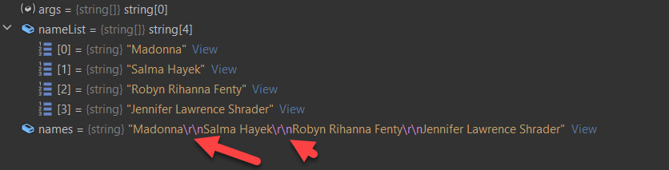
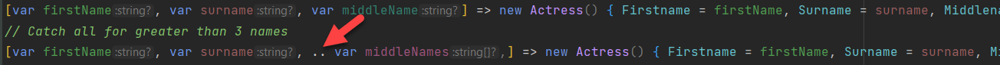

One of the more powerful features introduced in C# 11 is [list](https://learn.microsoft.com/en-us/dotnet/csharp/language-reference/proposals/csharp-11.0/list-patterns) [pattern matching](https://learn.microsoft.com/en-us/dotnet/csharp/language-reference/operators/patterns).

Rather than do a technical explanation, let me use a simple example to illustrate the versatility and elegance list patterns introduce into problem solving.

Suppose we have a string of actresses.

* Madonna
* Salma Hayek
* Robyn Fenty Rihanna
* Jennifer Lawrence Shrader

We want to represent these in a type that looks like this:

```csharp
public record Actress
{
    public string Firstname { get; init; }
    public string Middlenames { get; init; }
    public string Surname { get; init; }
}
```

Our instructions are as follows:

The names are listed as follows:

EITHER:

* `{FirstName}`
* `{FirstName} {Surname}`
* `{FirstName} {Surname} {MiddleName}`

Our first order of business is to get those names into a list.

We can make use of the fact that the names are all separated by a newline.

So we can do this:

```csharp
var nameList = names.Split(Environment.NewLine);
```

We are using `Environment.NewLine` because what that actually is differs from operating system to operating system.

* Windows - `\r\n`
* Linux - `\n`
* MacOS - `\r`

Checking in the debugger shows the following:



(Note the newlines highlighted, running on my Windows PC)

With each item in a list, the next step is to process each name.

The usual approach would be for each name to:

1. Parse the name into separate names
1. Check the length
1. Depending on the length construct the appropriate `Actress` object

The beauty and elegance of list patterns is **it can all be done in one step**.

Our complete program is as follow:

```csharp
var nameList = names.Split(Environment.NewLine);
foreach (var name in nameList)
{
    var person = name.Split(" ") switch
    {
        // Check if the string array has a single element
        [var firstName] => new Actress() { Firstname = firstName },
        // Check if the string array has two elements
        [var firstName, var surname] => new Actress() { Firstname = firstName, Surname = surname },
        // Check if the string array has three elements
        [var firstName, var surname, var middleName] => new Actress() { Firstname = firstName, Surname = surname, Middlename = middleName },
        _ => throw new Exception()
    };
    Console.WriteLine(person);
}
```

The first thing we are doing is taking each name and converting it into an array of strings, using the space as a delimiter.

```csharp
name.Split(" ")
```

Next we are iterating over each of the following possibilities:

1. The name has one element: `[var firstName]`
1. The name has two elements: `[var firstName, var surname]`
1. The name has three elements: `[var firstName, var surname]`
1. Any other condition `_`

Over and above doing the match, we are also assigning the matched elements to variables, which we then use to construct the object.

1. One element: `[var firstName] => new Actress() { Firstname = firstName }` 
1. Two elements: `[var firstName, var surname] => new Actress() { Firstname = firstName, Surname = surname }`
1. Three elements: `[var firstName, var surname, var middleName] => new Actress() { Firstname = firstName, Surname = surname, Middlename = middleName }`

If we run this code, the following should be printed to the console:

```plaintext
Actress { Firstname = Madonna, Middlename = , Surname =  }
Actress { Firstname = Salma, Middlename = , Surname = Hayek }
Actress { Firstname = Robyn, Middlename = Rihanna, Surname = Fenty }
Actress { Firstname = Jennifer, Middlename = Shrader, Surname = Lawrence }
```

Very elegant.

To make things more interesting, suppose we have an actress with more than 3 names.

Julia Louis-Dreyfus Scarlett Elizabeth

Here we can decide that any name that is not a `Firstname` or a `Surname` will be combined into the `Middlename`.

So:

* **Firstname:** Julia
* **Surname:** Louis-Dreyus
* **Middlename:** Scarlett Elizabeth

Can this still be done using list patterns?

Indeed.

The list pattern will be this one:

```plaintext
[var firstName, var surname, .. var middleNames,] => new Actress() { Firstname = firstName, Surname = surname, Middlenames = string.Join(" ", middleNames) },
```

Here we are doing a bunch of things:

1. Assigning the **first** element to `firstName`
1. Assigning the **second** element to `surname`
1. Assigning **the rest of the array** to a **new** string array, and naming that `middleNames`

We then construct our Actress object and:
1. Assign `firstName` to the `Firstname` property
1. Assign `surname` to the `Surname` property
1. Join **all the elements** of the array `middleNames` to a new string, separated by a space `" "` and then assigning that to the `Middlename` property.



Those three dots are important as the tell the compiler that the following variable is an array (range of `string` objects)

The final program looks like this:

```csharp
const string names = """
Madonna
Salma Hayek
Robyn Rihanna Fenty
Jennifer Lawrence Shrader
Julia Louis-Dreyfus Scarlett Elizabeth 
""";

var nameList = names.Split(Environment.NewLine);
foreach (var name in nameList)
{
    var person = name.Split(" ") switch
    {
        // Check if the string array has a single element
        [var firstName] => new Actress() { Firstname = firstName },
        // Check if the string array has two elements
        [var firstName, var surname] => new Actress() { Firstname = firstName, Surname = surname },
        // Check if the string array has three elements
        [var firstName, var surname, var middleName] => new Actress() { Firstname = firstName, Surname = surname, Middlename = middleName },
        // Catch all for greater than 3 names
        [var firstName, var surname, .. var middleNames,] => new Actress() { Firstname = firstName, Surname = surname, Middlename = string.Join(" ", middleNames) },
        _ => throw new Exception()
    };
    Console.WriteLine(person);
}

public record Actress
{
    // Firstname should never be null
    public string Firstname { get; init; } = default!;
    public string? Middlename { get; init; }
    public string? Surname { get; init; }
}
```

Running this program should print the following:

```plaintext
Actress { Firstname = Madonna, Middlename = , Surname =  }
Actress { Firstname = Salma, Middlename = , Surname = Hayek }
Actress { Firstname = Robyn, Middlename = Rihanna, Surname = Fenty }
Actress { Firstname = Jennifer, Middlename = Shrader, Surname = Lawrence }
Actress { Firstname = Julia, Middlename = Scarlett Elizabeth , Surname = Louis-Dreyfus }
```

Note that **Julia Louis-Dreyfus Scarlett Elizabeth** has been correctly parsed and created properly as `Actress` object with a compound middle name.

The code is in my [Github](https://github.com/conradakunga/BlogCode/tree/master/2023-03-28%20-%20How%20To%20Use%20C%23%20List%20Pattern%20Matching).

Happy hacking!