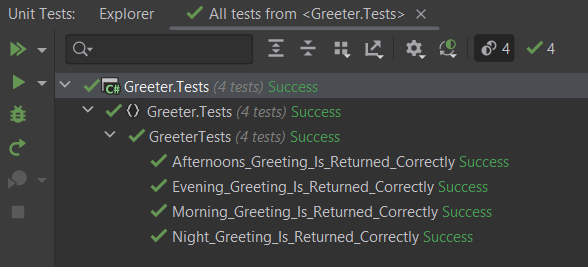

Code that is conditional on time is almost something you are guaranteed to write at some point. Think:

- Calendars
- Alarm clocks
- Bank end of day
- Alerts and notifications
- IoT

Such code, however, presents some problems when it comes to testing because, again, it depends on the time of the day!

Let us look at a simple example: a class that returns a greeting depending on the time of the day.

```csharp
public string Greet()
{
    return DateTime.Now.Hour switch
    {
        >= 0 and < 13 => "Good Morning",
        >= 13 and <= 16 => "Good Afternoon",
        > 16 and <= 20 => "Good Evening",
        _ => "Good Night"
    };
}
```

The logic here is that between midnight and 1PM, you are greeted with "**good morning**". From 1PM to 4PM, "**good afternoon**", from 4PM to 6PM "**good evening**" and anything else, "**good evening**"

Naturally we write tests for this.

```csharp
[Fact]
public void Morning_Greeting_Is_Returned_Correctly()
{
    var greeter = new Logic.Greeter();
    greeter.Greet().Should().Be("Good Morning");
}

[Fact]
public void Afternoons_Greeting_Is_Returned_Correctly()
{
    var greeter = new Logic.Greeter();
    greeter.Greet().Should().Be("Good Afternoon");
}

[Fact]
public void Evening_Greeting_Is_Returned_Correctly()
{
    var greeter = new Logic.Greeter();
    greeter.Greet().Should().Be("Good Evening");
}
[Fact]
public void Night_Greeting_Is_Returned_Correctly()
{
    var greeter = new Logic.Greeter();
    greeter.Greet().Should().Be("Good Night");
}
```

If we run these tests, 3 of them are failing.


Which is expected. As it so happens the current time I am writing this is 10:49AM, so "Good morning" will be returned as it is morning.

All the rest will fail.

So how do we make this testable?

Two things to do:

1. Inject the date and time to the `Greeter` so that it can perform its logic appropriately without determining the date for itself
2. Find a away to tell the main application what the current date and time is.

Let's begin with the easier one: #1.

We can refactor the `Greeter` class like this:

```csharp
public string Greet(DateTime dateTime)
{
    return dateTime.Hour switch
    {
        >= 0 and < 13 => "Good Morning",
        >= 13 and <= 16 => "Good Afternoon",
        > 16 and <= 20 => "Good Evening",
        _ => "Good Night"
    };
}
```
  
Here we are passing the current date as an argument to the `Greet` method.

We can then update the tests like this:

```csharp
[Fact]
public void Morning_Greeting_Is_Returned_Correctly()
{
    var greeter = new Logic.Greeter();
    var oneAm = new DateTime(2023, 1, 1, 1, 0, 0);
    greeter.Greet(oneAm).Should().Be("Good Morning");
}

[Fact]
public void Afternoons_Greeting_Is_Returned_Correctly()
{
    var greeter = new Logic.Greeter();
    var onePm = new DateTime(2023, 1, 1, 13, 0, 0);
    greeter.Greet(onePm).Should().Be("Good Afternoon");
}

[Fact]
public void Evening_Greeting_Is_Returned_Correctly()
{
    var greeter = new Logic.Greeter();
    var sixPm = new DateTime(2023, 1, 1, 18, 0, 0);
    greeter.Greet(sixPm).Should().Be("Good Evening");
}

[Fact]
public void Night_Greeting_Is_Returned_Correctly()
{
    var greeter = new Logic.Greeter();
    var ninePm = new DateTime(2023, 1, 1, 21, 0, 0);
    greeter.Greet(ninePm).Should().Be("Good Night");
}
```

If we run this we see that our tests pass.


Now we switch to our other problem - how do we tell the calling application how to determine the time?

A simple way is to create an mockable interface that we can use to provide two implementations - the current time, and a fake time that we pass to the running system.

So we start with something like this:

```csharp
interface IClock
{
    public DateTime Now { get; }
}
```

We then create an actual implementation for normal use, that uses the system clock.

```csharp
public class SystemClock : IClock
{
    public DateTime Now => DateTime.Now;
}
```

We then create another implementation that we can use for testing, which we provide the time we want.

```csharp
public class FakeClock : IClock
{
    public DateTime Now { get; }

    public FakeClock(DateTime dateTime)
    {
        Now = dateTime;
    }
}
```

If we revisit our `Greeter` class, there is a subtle flaw in it.

Suppose our code is structured like this:

```csharp
var greeter = new Greeter();
Console.WriteLine(greeter.Greet(DateTime.Now));

//
// Long running task
//

Console.WriteLine(greeter.Greet(DateTime.Now));

//
// Another long running task
//

Console.WriteLine(greeter.Greet(DateTime.Now));
```

It becomes a bit annoying to always have to keep passing the current date, plus its an opportunity for bugs as you have to know what date and time you are passing, and why.

For example, if the date and time you are passing to the `Greet` method was in a variable and some time has elapsed, you have to remember that the time in the variable is out of date and needs to be updated.

This code, for instance, would do the wrong thing:

```csharp
var greeter = new Greeter();
var dateTime = DateTime.Now;
Console.WriteLine(greeter.Greet(dateTime));

//
// Long running task
//

Console.WriteLine(greeter.Greet(dateTime));

//
// Another long running task
//

Console.WriteLine(greeter.Greet(dateTime));
```

This is because after the first running task, the current date and time has changed!

We can improve our `Greeter` by passing it the clock directly.

```csharp
public sealed class Greeter
{
    private readonly IClock _clock;
    public Greeter(IClock clock) => _clock = clock;
    public string Greet()
    {
        return _clock.Now.Hour switch
        {
            >= 0 and < 13 => "Good Morning",
            >= 13 and <= 16 => "Good Afternoon",
            > 16 and <= 20 => "Good Evening",
            _ => "Good Night"
        };
    }
}
```

Note here we are passing the **interface**, and not the **implementation**, to the constructor, which we store as a private field.

We have also removed the parameter from the `Greet` method.

Finally we can update our tests.

```csharp
[Fact]
public void Morning_Greeting_Is_Returned_Correctly()
{
    var oneAm = new DateTime(2023, 1, 1, 1, 0, 0);
    var clock = new FakeClock(oneAm);
    var greeter = new Logic.Greeter(clock);
    greeter.Greet().Should().Be("Good Morning");
}

[Fact]
public void Afternoons_Greeting_Is_Returned_Correctly()
{
    var onePm = new DateTime(2023, 1, 1, 13, 0, 0);
    var clock = new FakeClock(onePm);
    var greeter = new Logic.Greeter(clock);
    greeter.Greet().Should().Be("Good Afternoon");
}

[Fact]
public void Evening_Greeting_Is_Returned_Correctly()
{
    var sixPm = new DateTime(2023, 1, 1, 18, 0, 0);
    var clock = new FakeClock(sixPm);
    var greeter = new Logic.Greeter(clock);
    greeter.Greet().Should().Be("Good Evening");
}

[Fact]
public void Night_Greeting_Is_Returned_Correctly()
{
    var ninePm = new DateTime(2023, 1, 1, 21, 0, 0);
    var clock = new FakeClock(ninePm);
    var greeter = new Logic.Greeter(clock);
    greeter.Greet().Should().Be("Good Night");
}
```

If we run our tests we see that they all pass.



If we revisit our earlier sample, now we can get the greeting whenever we want without having to remember the details of the time.

```csharp
var greeter = new Greeter();
Console.WriteLine(greeter.Greet());

//
// Long running task
//

Console.WriteLine(greeter.Greet());

//
// Another long running task
//

Console.WriteLine(greeter.Greet());
```

If we now decided to write a console interface that used our logic, it would look like this:

```csharp
using Greeter.Logic;

var clock = new SystemClock();
var greeter = new Greeter.Logic.Greeter(clock);
Console.WriteLine($"{greeter.Greet()} world!");
```

Depending on the time you write this, this will print the appropriate greeting.

As it is still morning as I am writing this:


You might be seeing some benefits already of using this technique.

But the strength is really apparent when you factor in [dependency injection containers](https://www.dotnettricks.com/learn/dependencyinjection/what-is-ioc-container-or-di-container#:~:text=A%20DI%20Container%20is%20a%20framework%20to%20create%20dependencies%20and,a%20simple%20and%20easy%20way.).

We can update our console app to run in this way by adding the following Nuget packages:

- Microsoft.Extensions.DependencyInjection
- Microsoft.Extensions.Hosting

```csharp
// Configure our host
using var host = Host.CreateDefaultBuilder(args)
    .ConfigureServices(services =>
    {
        // Register the system clock to be returned whenever an IClock is requested
        services.AddSingleton<IClock, SystemClock>();
        // Register our greeter
        services.AddSingleton<Greeter.Logic.Greeter>();
    })
    .Build();

// Get the built in logger from the container
var logger = host.Services.GetRequiredService<ILoggerFactory>().CreateLogger<Program>();
// Get a greeter from the container
var greeter = host.Services.GetRequiredService<Greeter.Logic.Greeter>();
// Perform the business logic
logger!.LogInformation("{Greeting} world!", greeter!.Greet());
```

If you run this you should see the following (depending on what time you run)


This becomes really apparent when we use a [ASP.NET Web API](https://learn.microsoft.com/en-us/aspnet/core/tutorials/first-web-api?view=aspnetcore-7.0&tabs=visual-studio) project that references our `Greeter` project.

This is the entirety of the code that registers our Greeter and injects it into the API request.


If we make a request using [Insomnia](https://insomnia.rest/) (or any such tool) you should get the appropriate response.


**To make this article simpler, I have used `DateTime.Now` for the SystemClock. It should really be DateTime.UTC now.**

**It is perfectly OK as long as your application is only handling a single time zone. Once it doesn't - you have to factor in time zones.**

# Parting Shot

Designing our application around mockable interfaces gives you a lot of flexibility in terms of:
1. **Swapping out implementations**

    We can for example build a new `Clock` that gets the time from a [NTP Server](https://en.wikipedia.org/wiki/Network_Time_Protocol) rather than the system clock, and not have to change the underling code.
1. **Testability**

    It is easier to test with such a design, as we have illustrated
1. **Runtime flexibility**

    We can use logic at runtime to decide which implementation to use without changing the application. 
1. **Ability to compose complex objects from simple ones**

    As seen above, if using a DI container, you do not need to know how to create a `Greeter`. The DI container, however, knows that to create a `Greeter` it needs an `IClock`, and it has been configured to return a `SystemClock` whenever one is requested - so it knows how to construct all the dependencies to construct any registered object that you request.
    
This problem revolving around the `IClock` is in fact a problem many of the Microsoft teams have run into, and each has come up with their own implementations. You can [read the details here](https://github.com/dotnet/aspnetcore/issues/16844) of how this has been a problem for some time.

The good news in in .NET 8 there is an [attempt to come up with a unified solution to this problem](https://github.com/dotnet/runtime/issues/36617).

The code is in my Github.

Happy hacking!


