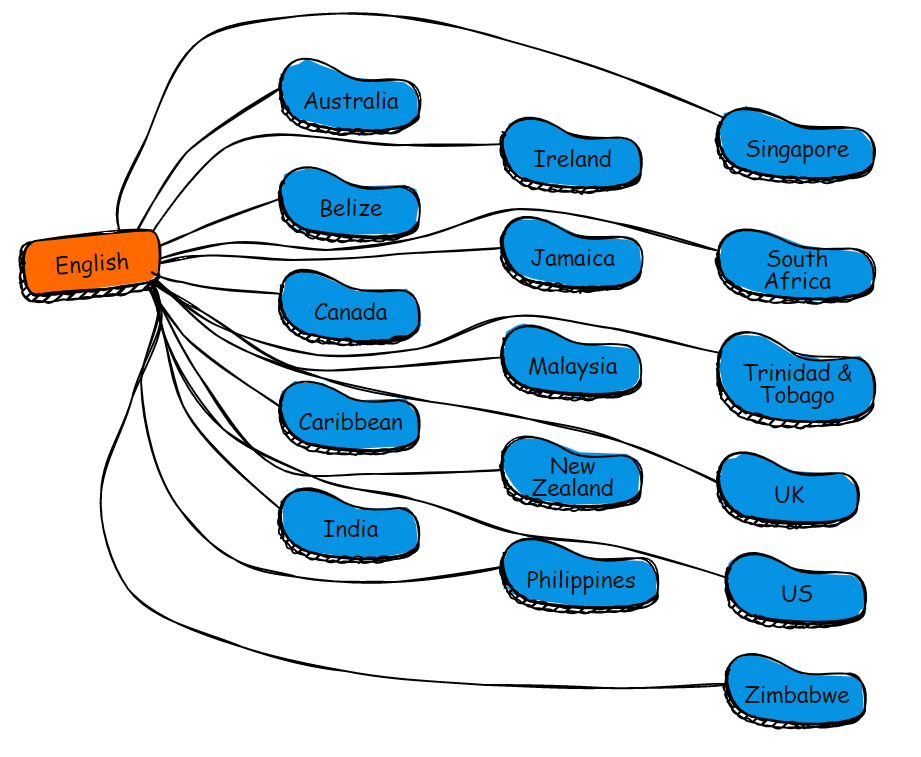
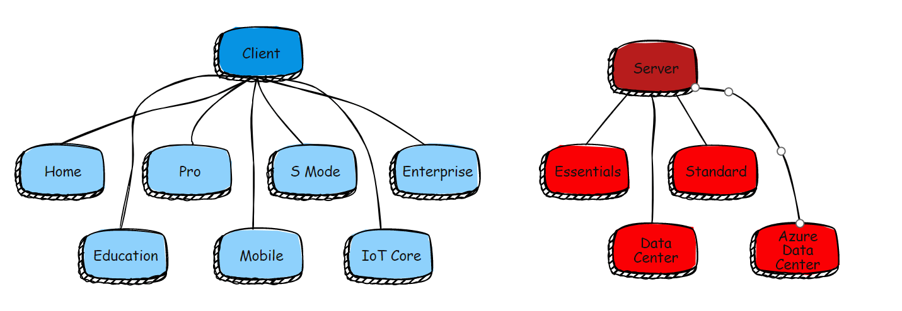
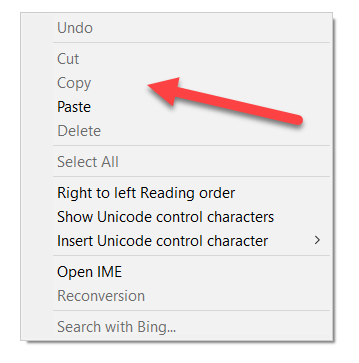
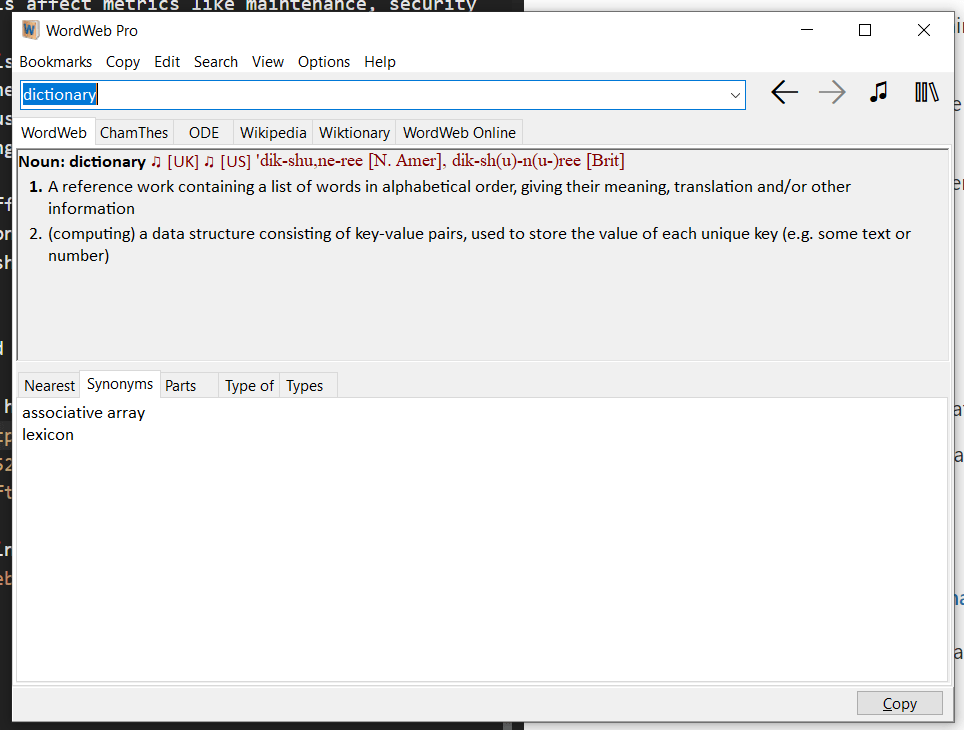

"Why," a CEO friend of mine asked one day in exasperation "doesn't Windows have a dictionary?"

"A dictionary?" I asked.

"Yes." She pushed back her laptop in visible frustration. "You know - right click a word and it gives me the definition. Like my iPhone does. How hard can it be?"

If there's one thing I know for a fact is that "How hard can it be" is a dangerous, dangerous sentiment.

"I don't know, to be honest. But I am 100% sure at some point someone thought about it, put int on the group to-do list and wanted to do it and then ran into some challenges."

"What sort of challenges?"

"The first one is very simple. Which dictionary are you going to include?"

"English I guess. You can detect which version of Windows someone is using and then just use the corresponding language."

"So which English? US? UK? Australia?"

"Oh. I guess you can be asked which one the first time you launch."

"Which means you either have to download them all and then chose on launch, or you choose and then download."

"Yes."

"It may interest you to know that Windows supports, directly or indirectly, some 16 English 'dialects'".

"Now that I didn't know."

"If you have them all downloaded, customers are going to complain about "bloated" OS. But if you download on selection - what happens if there is no internet? Or it is offline? Or unreliable? Plus you have just added complexities to the operating system, not to mention increased the volume of support calls and emails"

"Oh my!"

"And we've just been talking about English. What about other languages? French? German? Spanish? Dutch? Swahili?"

"Yes, that sounds like fun."

"You then have a second problem - you have to maintain dictionaries for several languages and dialects. Which in itself is a lot of work. But how do you update them?"

"Update them?"

"Language is fluid. So words are being added all the time. [Selfie](https://www.oed.com/viewdictionaryentry/Entry/390063;jsessionid=16BED3E15F1FEE88514BDF0D4CDA3962#:~:text=A%20photograph%20that%20one%20has,and%20shared%20via%20social%20media.) just became an official English word the other day.

Assuming you have cracked the problem of keeping track of these changes and updating your databases, how do you get these out to users?"

"Ah. Gotcha. I guess there will need to be machinery to keep track of all these additions to all these databases and maybe using Windows Update or something push out the changes?"

"Correct. And remember you're doing this for English, French, Japanese, Spanish, German, etc."

"Whoa. OK."

"And now you have just made life more difficult for the guys who maintain the Windows Update process, not to mention increasing the download size and bandwidth usage."

"I hadn't thought of that."

"You also have the question of whether you currently have the capacity at all to be managing dictionaries for [about 46 languages](https://learn.microsoft.com/en-us/windows-hardware/manufacture/desktop/available-language-packs-for-windows?view=windows-10). You probably don't. So you have two choices:

1. Hire dedicated resources for this. A team and infrastructure to support said team. Which costs money
2. License from companies that do this as their bread and butter. Which costs money.

Especially in this current recessionary environment, who is looking to raise their costs?"

"Makes sense", my friend said thoughtfully.

"Then there is the question of where this feature is to be deployed."

"Pardon?"

"Well, you were asking about Windows. What version of Windows do you have on your laptop?"

"Windows 10." She said.

"Well, it might surprise you to know that there are 8 versions of Windows 10:

- Windows 10 Home
- Windows 10 Professional
- Windows 10 S Mode
- Windows 10 Enterprise (E3 & E5)
- Windows 10 Enterprise 2015 LTSB
- Windows 10 Education
- Windows 10 Mobile & Mobile Enterprise
- Windows 10 IoT Core

So, which ones will include the dictionary?"

"Maybe all of them except Windows Home and Windows IoT."

"Why not Windows Home?" I asked, curious.

"To make the other versions that much more attractive."

"Interesting. But wouldn't home users need a dictionary more? Anyway. Let's say you didn't include that. What will happen is Windows support will be inundated with tickets  from Windows Home users saying one of these:

1. 'Why doesn't the dictionary work?'
1. 'It really sucks that Windows Home doesn't have a dictionary. Why not?'

"Precisely. It is now someone's problem to decide which version have this dictionary, and presumably there are people responsible for each version - for whom now it is a new operational, cost and logistical problem that they didn't have before."

"OK, this is getting a bit complicated."

"It is. And we have just discussed the client OS. What about the server operating systems. Should they have the dictionary as well?"

"Er ... I suppose. Don't administrators want to know the meaning of words too?"

"Undoubtedly. 

But now you have a similar problem. The most current version of Windows Sever is 2022 of which there are 4 editions:

- Essentials
- Standard
- DataCenter
- Azure DataCenter

Which ones will include this?

So if you add that to the server operating system that means they have yet another thing to include in their build. Which means:

1. Increased size
1. Potential increased attack surface
1. Update implications (larger updates because they now include dictionaries, and must be coordinated with other teams)
1. Increased (albeit slight) maintenance
1. More complicated build process for releases and updates

In short, increased costs, increased bother, increased complexity and increased risk."

"Er... OK. But why doesn't Apple have this problem with OSX?"

"Well, OSX has only two versions - OSX and OSX Server, and they have [discontinued the latter](https://support.apple.com/en-us/HT208312). So there is only one place to maintain."

"Were you thinking about the dictionary as a standalone app or as a thing available across the system? I imagine the latter."

"Yes."

"Then that means this dictionary is something that the operating system will offer as a service. Which is the logical way to approach this. That means all user apps, old and new, can take advantage of it."

"That's right."

"So now you have added work to the operating systems team, who have to accommodate this in the core operating system."

"Oh"

"You also have to get them to offer APIs so that third party applications can access this as a service."

"APIs?".

"Yes. You know how in whatever application you are in if you right click the menu there has Cut, Copy & Paste? That is a operating system level service."

That now has to be done to accommodate the dictionary. You have to get the guys who do the various Windows SDKs to update them with wrappers to these APIs. 

You also need to get the documentation guys to update all the manuals and training materials with this new feature."

"Oh!"

In summary these are the problems this will introduce:

1. Who will be responsible and take ownership of the development, support and maintenance of this?
1. Who will be responsible for the continuous improvement of this?
1. How will the development, support and maintenance of this be staffed?
1. How will the development, support and maintenance of this be funded?
1. How will this affect current and future product development?
1. How will this affect metrics like maintenance, security and risk?
1. How will this affect user experience and expectations?
1. What will the the effect on this operationally on other parts of the business
    1. Marketing & sales
    1. Finance
    1. HR (staffing)
    1. Operations (Windows Update, etc.)
    1. Partnerships (e.g Oxford, Cambridge, etc.)
    
Ultimately, it boils down to this question:

> What is the strategic return of this vis-à-vis the bother, cost, manpower, bandwidth and risk?
    
Until this can be answered in the affirmative, the dictionary will remain on the to-do list.

But having said that:

[Microsoft Edge](https://www.microsoft.com/en-us/edge?form=MA13FJ&exp=e00) has it's own [inbuilt dictionary](https://social.technet.microsoft.com/wiki/contents/articles/52184.windows-10-how-to-use-built-in-dictionary-of-microsoft-edge.aspx).

The closest thing to a system wide dictionary is software made by [WordWeb](https://wordweb.info/). There is a free and a paid version. The dictionary is activated by `Ctrl` + `Click` on any word in any application.

