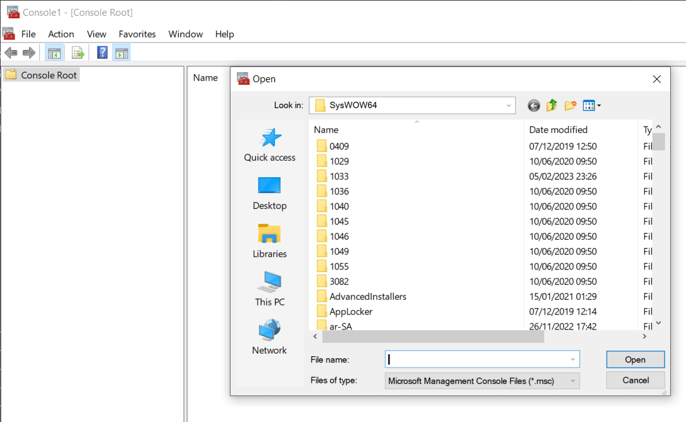

Once in a while you might need to access the SQL Server Configuration Manager.

If it is not in your Start menu, you can access it as follows:

1. Hit **Windows + R**

    
    
1. Enter `mmc` as the command to open

    

1. The [Microsoft Management Console](https://learn.microsoft.com/en-us/troubleshoot/windows-server/system-management-components/what-is-microsoft-management-console) will launch.

    
    
1. On the menu go to **File > Open**

    
    
    
    
1. Depending on your version of SQL Server, paste the location below into the dialog

    | SQL Server Version | Location       |
    |--------------------|----------------|
    | SQL Server 2022     | C:\Windows\SysWOW64\SQLServerManager16.msc |
    | SQL Server 2019     | C:\Windows\SysWOW64\SQLServerManager15.msc |
    | SQL Server 2017     | C:\Windows\SysWOW64\SQLServerManager14.msc |
    | SQL Server 2016     | C:\Windows\SysWOW64\SQLServerManager13.msc |
    | SQL Server 2014 (12.x)     | C:\Windows\SysWOW64\SQLServerManager12.msc |
    | SQL Server 2012 (11.x)     | C:\Windows\SysWOW64\SQLServerManager11.msc |

1. You should see the management console loaded

    
    
Happy hacking!