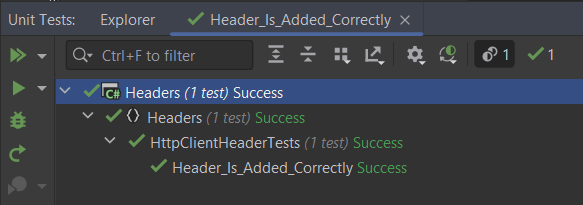
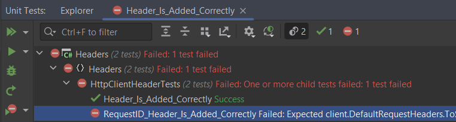
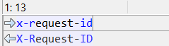

When working with a [HttpClient](https://learn.microsoft.com/en-us/dotnet/api/system.net.http.httpclient?view=net-7.0), this is how you add a request header to each request:

```csharp
var client = new HttpClient();
client.DefaultRequestHeaders.Add("test-header", "foo");
```

Pretty straightforward.

We can verify this with a unit test, using the `Should()` method from the [FluentAssertions](https://fluentassertions.com/) library.


```csharp
[Fact]
public void Header_Is_Added_Correctly()
{
    var client = new HttpClient();
    client.DefaultRequestHeaders.Add("test-header", "foo");
    client.DefaultRequestHeaders.ToString().Should().StartWith("test-header: foo");
}
```

Here we are using `StartsWith` because there is actually a newline at the end of the header.

This passes successfully.



An interesting thing happens when you pass in the header `x-request-id`.

```csharp
[Fact]
public void RequestID_Header_Is_Added_Correctly()
{
    var client = new HttpClient();
    client.DefaultRequestHeaders.Add("x-request-id", "foo");
    client.DefaultRequestHeaders.ToString().Should().StartWith("x-request-id: foo");
}
```

This test fails!



The error is as follows:

```csharp
Expected client.DefaultRequestHeaders.ToString() to start with "x-request-id: foo", but "X-Request-ID: foo
" differs near "X-R" (index 0).
```

If we diff, the difference becomes clear



The `HttpClient` has changed the case of the header!

The rationale here is that as HTTP headers are meant to be case-insensitive so the `HTTPClient` performs some [optimizations](https://github.com/microsoft/referencesource/blob/master/System/net/System/Net/Http/Headers/HttpHeaders.cs) when adding headers to the collection.


This is a problem for me, because I am interfacing with a system beyond my control that expects that particular header to be lowercase.

The solution to this is to **sneak in this header inside another**.

Like this:

```csharp
var client = new HttpClient();
client.DefaultRequestHeaders.TryAddWithoutValidation("dummy", "dummy\nx-request-id: foo");
await client.GetAsync("http://localhost:5168");
```

Note that the **value** for the `dummy` attribute contains both the **key** and **value** of the header we want to add, `x-request-id`.

You need to use [TryAddWithoutValidation](https://learn.microsoft.com/en-us/dotnet/api/system.net.http.headers.httpheaders.tryaddwithoutvalidation?view=net-7.0) because using [Add](https://learn.microsoft.com/en-us/dotnet/api/system.net.http.headers.httpheaders.add?view=net-7.0) will validate both key and value and reject any values containing a newline at runtime.

You can verify this works with a simple Web API application that simply prints the headers.


```csharp
var builder = WebApplication.CreateBuilder(args);
var app = builder.Build();
var logger = LoggerFactory.Create(config =>
{
    config.AddConsole();
}).CreateLogger("Program");

app.MapGet("/", (HttpRequest req) =>
{
    // A simple counter to enumerate the headers
    var counter = 1;
    // Loop through each header and print the counter, key and value
    foreach (var header in req.Headers)
    {
        logger.LogInformation("{Counter} - {Key}:{Value}", counter++, header.Key, header.Value);
    }
});

app.Run();
```

This should print the following:

```plaintext
info: Program[0]
1 - Host:localhost:5168
info: Program[0]
2 - dummy:dummy
info: Program[0]
3 - x-request-id:foo
```

So our final passing test looks like this:

### Note

This works for .NET 8 Preview (as at the time of writing this) and .NET 7.

It also works for .NET 6 PROVIDED that you do not attempt to access the [DefaultRequestHeaders](https://learn.microsoft.com/en-us/uwp/api/windows.web.http.httpclient.defaultrequestheaders?view=winrt-22621) property of the `HttpClient`. Doing this **will silently remove them**.

The code is in my [Github](https://github.com/conradakunga/BlogCode/tree/master/2023-07-22%20-%20Request%20Headers).

Happy hacking!