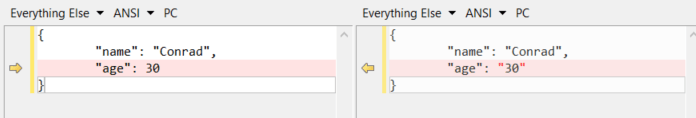
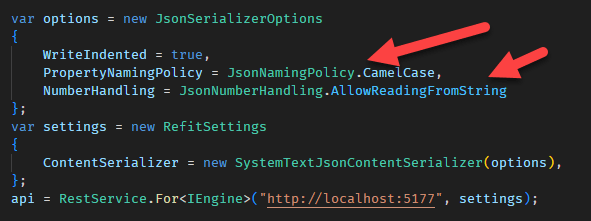
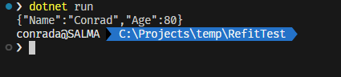

[Refit](https://github.com/reactiveui/refit/tree/main) is an excellent library that makes it very easy to call APIs are convert the responses to typed objects.

Suppose you have the following endpoint:

```csharp
var builder = WebApplication.CreateBuilder(args);
var app = builder.Build();

app.MapGet("/{idNumber}", (string idNumber) => new Person { Name = "Conrad", Age = "80" });

app.Run();
```

You can write a very quick application that can consume this.

First you define an interface of what you want to achieve:

```csharp
public interface IEngine
{
    [Get("/{idNumber}")]
    Task<Person> GetPerson(string idNumber);
}
```

The person class is as follows:

```csharp
public record Person
{
    public string Name { get; set; }
    public int Age { get; set; }
}
```

Next you write a simple class that encapsulates your logic:

```csharp
public class Engine
{
    IEngine api;
    public Engine()
    {
        // Set the url to the endpoint you want
        api = RestService.For<IEngine>("http://localhost:5177");
    }
    public async Task<Person> GetPerson(string idNumber)
    {
        // Call the API
        var res = await api.GetPerson(idNumber);
        return res;
    }
}
```

You can now invoke your API like this:

```csharp
var engine = new Engine();
var response = await engine.GetPerson("3234");
```

Very easy.

Refit achieves this using the magic of [Roslyn source generators](https://learn.microsoft.com/en-us/dotnet/csharp/roslyn-sdk/source-generators-overview)

Now suppose the API changes its contract and now sends the `Age` as a `string`, rather than as an `int`.

You will get the following error:

```plaintext
Unhandled exception. Refit.ApiException: An error occured deserializing the response.
 ---> System.Text.Json.JsonException: The JSON value could not be converted to System.Byte. Path: $.age | LineNumber: 0 | BytePositionInLine: 27.
 ---> System.InvalidOperationException: Cannot get the value of a token type 'String' as a number.
```

This is because the payloads are different:



Now an obvious solution is to update the class on the client side and change the type of `Age` to `string`.

But that is not always possible, or desirable.

Another solution around this is to customize the deserialization Refit does.

You can achieve this using two classes:

1. [JsonSerlializerOptions](https://learn.microsoft.com/en-us/dotnet/api/system.text.json.jsonserializeroptions?view=net-7.0) - this controls the underlying `System.Text.Json` serializer.
1. [RefitSettings](https://github.com/reactiveui/refit/blob/main/Refit/RefitSettings.cs) - this controls the `Refit` instance.

First, create and configure the `JsonSerlializerOptions`

```csharp
var options = new JsonSerializerOptions
{
    WriteIndented = true,
    PropertyNamingPolicy = JsonNamingPolicy.CamelCase,
    NumberHandling = JsonNumberHandling.AllowReadingFromString
};
```

Of note here is the [NumberHandling](https://learn.microsoft.com/en-us/dotnet/api/system.text.json.serialization.jsonnumberhandling?view=net-7.0) `enum` that controls how the serializer treats numbers.



Also, **you have to put** the [PropertyNamingPolicy](https://learn.microsoft.com/en-us/dotnet/api/system.text.json.jsonserializeroptions.propertynamingpolicy?view=net-7.0#system-text-json-jsonserializeroptions-propertynamingpolicy) of you will find your objects return as `null`!

Next we pass this to the `RefitSettings`

```csharp
var settings = new RefitSettings
{
    ContentSerializer = new SystemTextJsonContentSerializer(options),
};
```

Finally we construct our `Refit` service.

```csharp
api = RestService.For<IEngine>("http://localhost:5177", settings);
```

You should be able to successfully call your API now.



The code is in my Github.

Happy hacking!