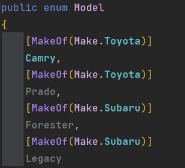

Suppose you had the following `enum`

```csharp
public enum Make
{
    Toyota,
    Subaru
}
```
And suppose you also had the following `enum`

```csharp
public enum Model
{
    Camry,
    Prado,
    Forester,
    Legacy
}
```

Finally suppose a `Vehicle` was defined as follows:

```csharp
public class Vehicle
{
    public Make Make {get; init;}    
    public Make Model {get; init;}    
}
```
Looks straightforward enough.

```csharp
var vehicle = new Vehicle
{
    Make = Make.Subaru,
    Model = Model.Legacy
}
```

The problem is that you also can do this:

```csharp
var vehicle = new Vehicle
{
    Make = Make.Toyota,
    Model = Model.Legacy
}
```
Which is invalid.

If this was a relational database, we would have solved this by storing the `Model` alone, then deriving the make from that from a foreign key relationship.

This is not possible in C#. At least, not directly.

One way to approach this would be to make use of [Attributes](https://learn.microsoft.com/en-us/dotnet/csharp/advanced-topics/reflection-and-attributes/), with which we can decorate our `enum` values.

We start off by creating an attribute like this:

```csharp
[AttributeUsage(AttributeTargets.Field)]
public class MakeOfAttribute : Attribute
{
    public Make Make { get; }
    public MakeOfAttribute(Make make)
    {
    	Make = make;
    }
}
```

The line `[AttributeUsage(AttributeTargets.Field)]` indicates that the attribute is meant to be applied to a `Field`, of which an `enum` value is.

We are indicating the attribute takes as a parameter the `Make` of the `Vehicle`.

We can then update our `Model` `enum` as follows:

```csharp
public enum Model
{
    [MakeOf(Make.Toyota)]
    Camry,
    [MakeOf(Make.Toyota)]
    Prado,
    [MakeOf(Make.Subaru)]
    Forester,
    [MakeOf(Make.Subaru)]
    Legacy
}
```

Thus you can tell by looking what `Model` applies to which `Make`.



We can further make use of this to enforce the connection.

We need to write some code that, given the `Model`, will get for us the `Make` specified as an attribute.

We can make us of .NET [reflection](https://learn.microsoft.com/en-us/dotnet/csharp/advanced-topics/reflection-and-attributes/accessing-attributes-by-using-reflection) for this purpose.

We can remove `Make` from the `Vehicle` class directly and retrieve it as follows:

```csharp
public class Vehicle
{
    readonly Model _model;
    public Make Make
    {
        get
        {
            return _model.GetType() // Retrieve the type
                .GetMember(_model.ToString()) //Get the member info for the passed field (Camry)
                .First() // Retrieve the first item
                .GetCustomAttribute<MakeOfAttribute>()! // Get the attribute specified
                .Make; // Get the make and return it
        }
    }
    public Model Model => _model;
    
    public Vehicle(Model model)
    {
        _model = model;
    }
}
```

Of particular emphasis here is that the `Make` property is completely derived from the `Model`, and therefore it is not at the discretion of the developer to set it.

Our final program will look like this:

```csharp
var vehicle = new Vehicle(Model.Camry);
Console.WriteLine($"Model: {vehicle.Model}");
Console.WriteLine($"Make: {vehicle.Make}");
```

This should print the following to your console:

```plaintext
Model: Camry
Make: Toyota
```

The code is in my [Github](https://github.com/conradakunga/BlogCode/tree/master/2023-08-18%20-%20Defining%20Relationships%20With%20Enum%20Attributes%20For%20Enum%20Values).

Happy hacking!