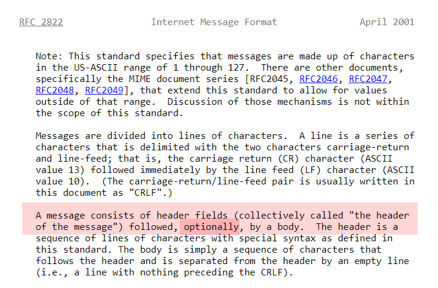

The other day while working with one of our internal libraries for sending email, I ran into an error where it complained about a missing body.

I was curious to see if the specification for electronic mail had any such restrictions.

So I looked for the appropriate RFC - [2882](https://www.rfc-editor.org/rfc/rfc2822)

It turns out that indeed, **the body of an email is optional**

Here is the relevant passage:

Where would you use an email without a body?

A common use case is a scenario where the email's purpose is purely to send one or more attachments, in which case you don't need a body.

Happy hacking!