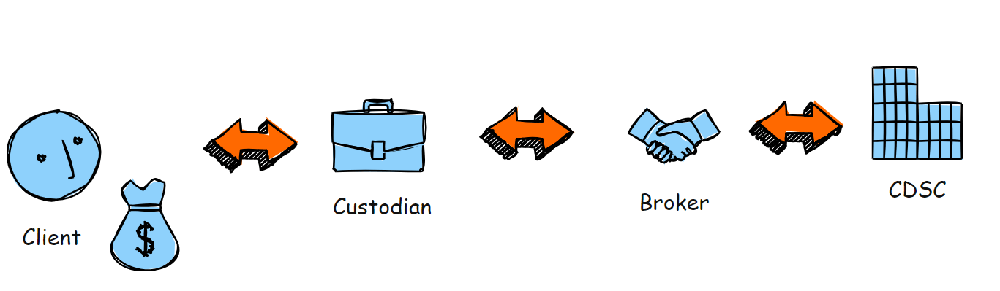
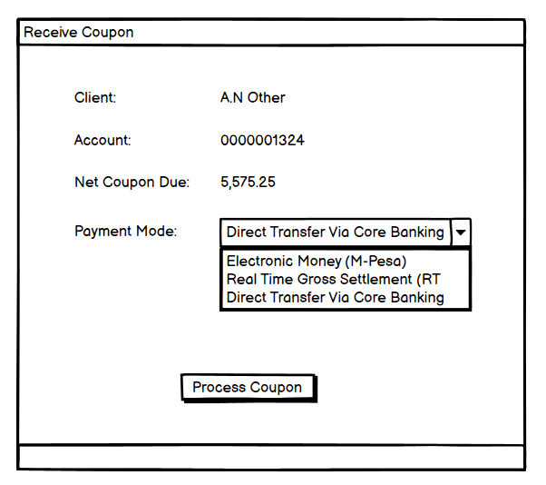
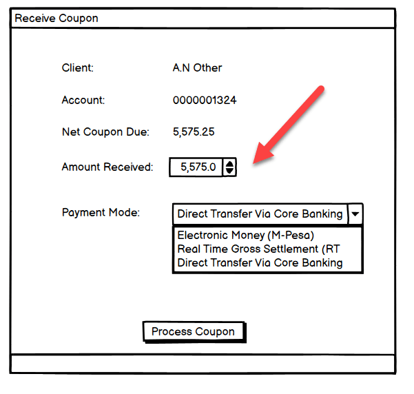
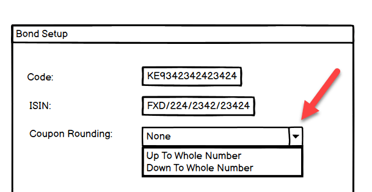
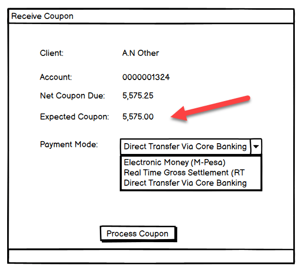
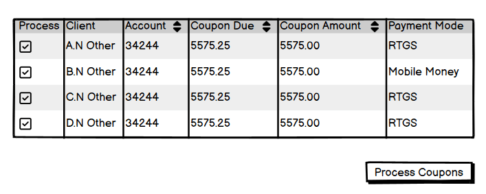

In case you haven't yet learned - [building]() [software]() [is]() [hard]()

I have been designing and building [capital markets solutions](https://www.innova.co.ke/) for some 15 years and as of today have some 50+ clients spread across 14 countries in Africa.

This means that not only is there 15 years of knowledge in building capital market solutions, there are also 15 years of lessons from 50 different customers.

Growing and evolving the various solutions is also [surprisingly difficult](), and whenever we get a request to add a feature / change functionality, a process has to take place where the following issues need to be interrogated:

1. Does the feature, in itself, make sense?
1. What exactly is the problem we are trying to address? And is the proposal the best way of resolving the same?
1. Does this feature make strategic sense for the product? Does it increase the value proposition of the software?
1. Does this feature make operational sense for the product?
1. A new feature invariably introduces complexity. Is this complexity worth the value that the feature has introduced?
1. Does it make financial sense to develop this feature, in terms of engineering, QA, project management and time?
1. Is there bandwidth within the organization to implement the feature?

All these are complete posts in themselves that I will get around to in good time.

But today let me tackle the first one:

> Does the feature, in itself, make sense?

A good number of requests fail at this stage, and it is important to understand why.

Many requests come in the context of an **existing** process. This might be a process specific to the user, or to the department, or to the company, or to the jurisdiction, or to the industry as a whole.

To build solutions within this space you need a firm grasp of all these, but you also need the ability to step outside all of this and look at the request holistically.

We frequently find ourselves in the position of automating a process that should not, in fact, be automated. Perhaps it is an inefficiency, perhaps it is not worth the effort (financial and bandwidth), or it might even be bad for the ecosystem.

Let me take a few examples.

One of our solutions is a custody solution. In brief, a custodian is responsible for the safekeeping of assets (stocks, deposits, bonds, bills, etc) on behalf of customers.

This means that they are responsible for tracking monies received from the customer, purchase and sale of assets, their position and any additional inflows (for example dividends and corporate action).

It is also important to know that in all markets there is an entity that interfaces with customers, custodians and brokers who is responsible for the actual clearing, settlement and record keeping. This is called a depository, and in Kenya that institution is the [CDSC](https://www.cdsckenya.com/)

In other words when you buy or shares, this takes place.

1. Client requests the custodian to make the trade (buy/sell)
1. Client remits the money (usually custodian has access to the client's account)
1. Custodian gives instructions to the broker
1. Broker carries out the trade
1. CDSC settles the trade
1. Broker and custodian are notified

So at the end of this process two sets of records exist - those of the custodian and those at the CDSC.

The #1 request we get from custodians is this:

> Why can't we just import the position from the CDSC?

We invariably reply with a hard NO for these reasons:

1. Firstly, and most importantly, it is the responsibility of a custodian to maintain their own records independently of the other players so as to have an independent view of the positions.
1. There have been isolated cases where the depository position has been incorrect - for example a corporate action has not been effected, or there is a delay in updating the data. Or you were eligible for dividends but liquidated your stocks, in which case there won't be a position at all.
1. You cannot key in trades and then get the position externally. For instance, given these developments:
    
    Trades

    | Date       | Description | Quantity |
    |------------|-------------|----------|
    | 1 Jan 2023 | Buy         | 100      |
    | 1 Jan 2023 | Buy         | 100      |
    | 1 Jan 2023 | Buy         | 100      |
    
    Position
    
    | Date       | Balance |
    |------------|-------------|
    | 1 Jan 2023 | 300 |
    
    In theory, the depository position should match.
    
    But what if it doesn't
    
    
    | Date       | Balance |
    |------------|-------------|
    | 1 Jan 2023 | 200 |
    
    We now have an invalid state where there have been purchases worth 300 but the balance is 200.
    
1. Getting the position externally is a hard dependency that you cannot control. If for whatever reason you cannot obtain the position from the depository at the start of business, how can you operate?

But having said that, it is important for the custodian to know the position at the CDSC because that is what matters at the end of the day.

So we do in fact import that position. But we do not overwrite the system position. Instead we generate a report and send an alert.

| Date           | Account        | Stock | System Position | CSDC Position | Variance |
|----------------|----------------|-------|-------|-------|-------|
| 1 Jan 2023 | 00000001 |  SAFARICOM     | 100 | 90 | (10) |

The custodian then knows at start of business that there is a difference of 10 and should investigate why that is the case, because there might be an error from either side.

Even with this explanation, there are clients who fight the good fight to get us to import the position anyway.

The second example is a situation custodians face when interfacing with central banks.

Assume a bond has been issued and clients have purchased said bond.

The system will on a daily basis compute the clean price, dirty price, gross coupon payable, tax on coupon, gross discount, tax in discount as well as the gross value and net value of the bond.

So on the coupon date the position will be as follows:

| Date           | Face Value     | Daily Discount | Total Discount | Daily Coupon | Total Coupon | Market Value |
|----------------|----------------|----------------|
| 31 Dec 2023 | 100,000 | 3.11 | 3,333.13 | 5.01 | 5,242.25 | 105,575.37 |

Assuming that the 31st is a coupon date, the CBK should wire 5,232.12 to the custodian to disburse to the client.

Our solution therefore has a screen like this to process the receipt and disburse the money to the client in whatever way they specify, as we have implemented full integration with MPesa and most of the core banking systems in use in Kenya (Finacle, FlexCube, BankFusion, etc).

But things are never this simple in life.

We invariably get the following request:

> We need to make the coupon amount received editable.

And there is a good reason for this. The Central Bank, for whatever reason rounds off the amount they send.

So much as 5,575.25 is due, what actually got wired is 5,575.00

Your first idea would therefore be to round off the amount on the processing screen.

After investigating further you learn the following:

> There is no consistency in the rounding used. Sometimes it is up, and other times it is down.

So the proposed solution is to allow the actual receipt amount to be specified.

The trouble with this approach is you have to put in place a lot of infrastructure to support this - tables, validations, reports, security restrictions as to who / how much the amount can be edited, etc.

You also create a lot of work for the team processing these coupons as they have to painstakingly open each payment and key in the amount against the SWIFT instruction from CBK. This makes coupon processing monotonous, inefficient, error prone and takes a lot of time.

The solution to this problem is not technical, at least not purely.

Ideally the custodians as an industry should approach the central bank with a proposal around the rules for the rounding; such as:

1. Rounding should always be up / down
1. The rounding should be a function of the bond
1. There should be no rounding at all

The system then could be configured at country / issuer / bond level as follows:

Which would make the processing screen like so:

With this in place we can make coupon processing even easier:

Such a solution addresses the **disease**, and not the **symptoms**. And the end result is a more efficient capital market for all the stakeholders - issuers, custodians, fund managers and clients.
    