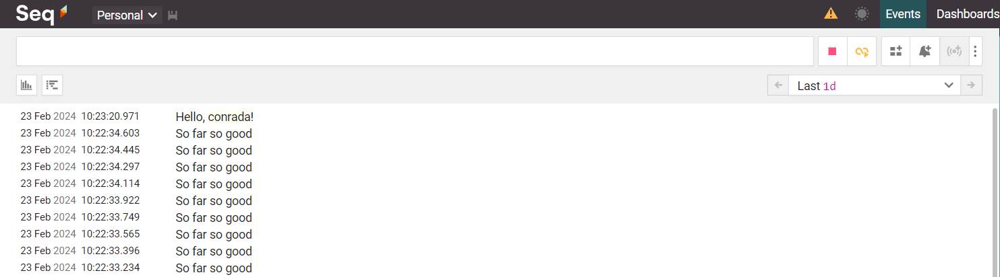
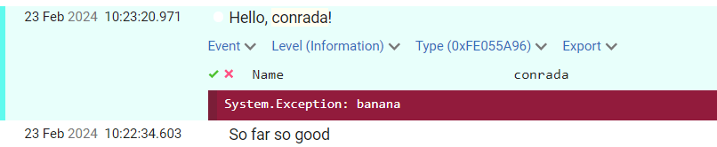
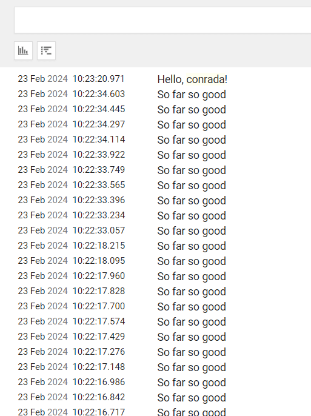
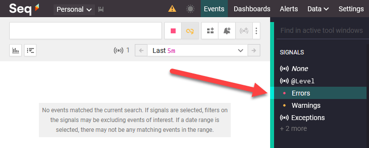
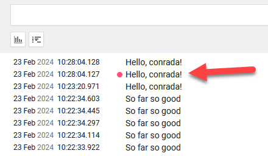
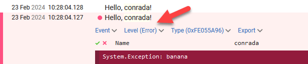
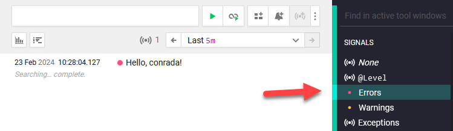

When it comes to logging, many [ILogger](https://learn.microsoft.com/en-us/dotnet/api/microsoft.extensions.logging.ilogger?view=dotnet-plat-ext-8.0) implementations allow you to log errors [like this](https://learn.microsoft.com/en-us/dotnet/api/microsoft.extensions.logging.loggerextensions.loginformation?view=dotnet-plat-ext-8.0#microsoft-extensions-logging-loggerextensions-loginformation(microsoft-extensions-logging-ilogger-system-exception-system-string-system-object())):

```csharp
Log.LogException(Exception ex, string message)
```

And it works.

Take this code using [Serilog](https://serilog.net/):

```csharp
Log.Logger = new LoggerConfiguration()
    // Log to the console
	.WriteTo.Console()
	// Log to Seq
	.WriteTo.Seq("http://localhost:5341")
	.CreateLogger();

var ex = new Exception("banana");

Log.Information(ex, "Hello, {Name}!", Environment.UserName);
```

If I open the [Seq](https://datalust.co/seq) console (which you should be using for development, it's free!), I see the following:



And I can expand to see the exception.



What's the problem?

You cannot tell by looking where the problem is:



You also can't filter for the errors:



This makes it difficult to find problems after the fact.

The correct way to do this is to use the correct method: [LogError](https://learn.microsoft.com/en-us/dotnet/api/microsoft.extensions.logging.loggerextensions.logerror?view=dotnet-plat-ext-8.0).

Change your code to introduce the new method as follows:

```csharp
Log.Logger = new LoggerConfiguration()
	.WriteTo.Console()
	.WriteTo.Seq("http://localhost:5341")
	.CreateLogger();

var ex = new Exception("banana");

Log.Error(ex, "Hello, {Name}!", Environment.UserName);
Log.Information(ex, "Hello, {Name}!", Environment.UserName);
```

If we go to [Seq](https://datalust.co/seq) we should see the following; and we can tell by looking where there is a problem.



We can further drill down to see the details.



And best of all, you can filter to quickly see your errors only:



Which is VERY helpful in production.

Happy hacking!

