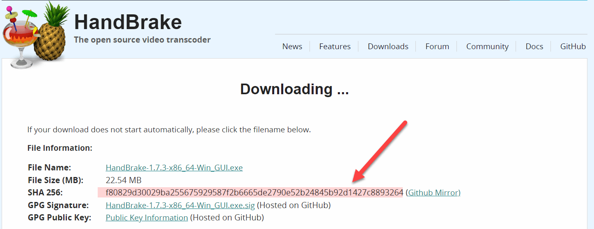

A couple of years back, I wrote a post on [how to get the hash of a file natively]() in [PowerShell](https://learn.microsoft.com/en-us/powershell/) in situations where you need to verify a download, like this one:

(You ARE using `PowerShell`, aren't you? It's **brilliant** and is cross-platform so you can use the same knowledge in Windows, Linux and OSX)

All you need to do is run the cmdlet [Get-FileHash](https://learn.microsoft.com/en-us/powershell/module/microsoft.powershell.utility/get-filehash?view=powershell-7.4&ref=troyhunt.com)

If you need to use a different algorithm, you can provide that as a switch:

In that version of the post, I was using PowerShell 5, which supported the following algorithms:

| Algorithm      |
|----------------|
| MACTripleDES |
| MD5 |
| RIPEMD160 |
| SHA1 |
| SHA256 |
| SHA384 |
| SHA512 |

The latest version of PowerShell, 7.4 (LTS) as at the time I am writing this, supports the following:

| Algorithm      |
|----------------|
| MD5 |
| SHA1 |
| SHA256 |
| SHA384 |
| SHA512 |

The following, it would appear, have been deprecated:

* MACTripleDES
* RIPEMD160

Happy hacking!