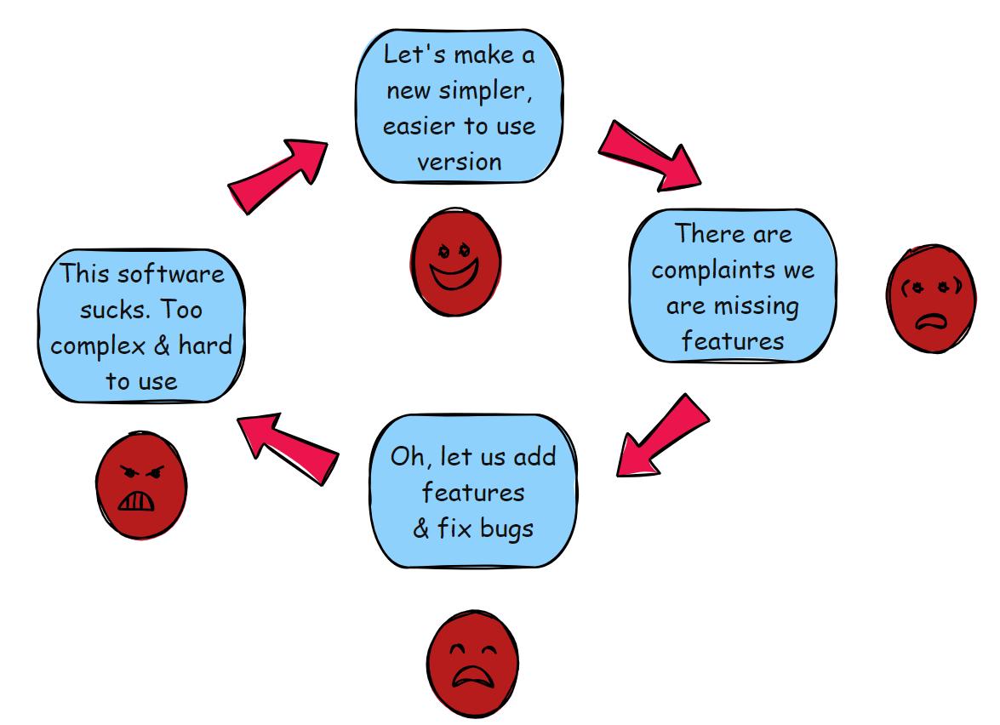

Take any software in popular use:
- [Windows 10](https://en.wikipedia.org/wiki/Windows_10)
- [Apple OSX](https://www.apple.com/macos/sonoma/)
- [Android](https://www.android.com/)
- [Teams](https://www.microsoft.com/en-us/microsoft-teams/group-chat-software)
- [Oracle Database](https://www.oracle.com/database/)
- [Salesforce](https://www.salesforce.com/)
- [Ubuntu Linux](https://ubuntu.com/)
- [Excel](https://www.microsoft.com/en-us/microsoft-365/excel)
- etc

I can bet you have heard someone say the following about any of these:

> "This software sucks. Its too bloated and difficult to use. There needs to be something lighter weight and easier to use"

You probably have said it yourself!

There is nothing *wrong* per se with this statement. However it is important to reflect a little on how we got here and take some lessons from it.

I have in the past talked about [software bloat]() as well as how [the simple decision to release and improve software can quickly balloon into a monstrosity]().

Software is hard.

But at the same time wanting to improve things is not a bad thing. That is how innovation and progress happens.

But what is important to ask yourself when it comes to the sentiment "this is too complicated and difficult to use" is this - **do you not think Microsoft / Apple / Oracle / Google etc. appreciate this**?

The teams behind that software obviously read support tickets / blogs / tweets from users voicing that sentiment about complexity.

Why do they not change the thing?

Because how they got there is very simple:

That complexity, more often than not, is [features and improvements](). And bug fixes.

It is also due to [operational and strategic decisions]() for the organization.

And such is the nature of this business.

Which is not to say that we should stop looking to how to improve. But we should be cognisant of how we got here.

Happy hacking!

