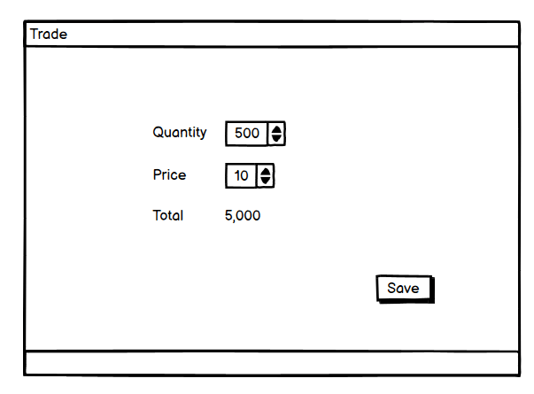
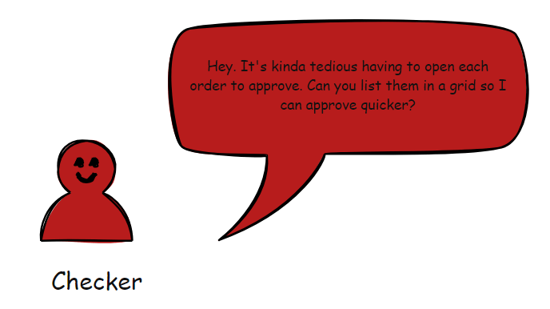

If you have not already, you will inevitably run into a system that has a concept of a maker and a checker.

The concept is pretty simple:

1. The maker initiates a transaction
1. The checker verifies the details and approves the transaction for posting. Alternatively, they may reject it.

The maker, typically, will get a screen like this:

The maker is free to edit the trade, as long as the checker has not approved it.

The checker then is responsible for checking and approving the trade.

If you notice, the checker is not able to amend the trade transaction details. They can only either approve or reject the trade.

In this fashion, there is a [Chinese Wall](https://en.wikipedia.org/wiki/Chinese_wall) between the maker and the checker, and both will take responsibility for the posted trade.

At least, that is the intent.

In theory, things should work like this:

1. The maker receives an order (via email, vocally, system posting, etc)
1. The maker proceeds to key in said order to the system
1. The checker sees the order
1. The checker retrieves the original customer order
1. The checker compares those details against what the maker keyed in.
1. If satisfied, approve. If not, reject and give reasons

Then requests start to come like this:

This is accompanied by a mock-up.

They want to approve each trade easily without having to open each trade to confirm the details. A button next to each trade makes sense.

Fair enough. This is implemented.

Within a few days, a follow up request comes:

The mock-up is not far behind.

Sound reasonable. They want to check each trade for approval and then approve them as a batch.

Then another request comes.

They want a button that will conveniently select all the trades for a single posting, saving the time to check each trade.

In this scenario, whether there is one trade one hundred, approval can be done in exactly two button clicks.

At this point, the carefully prepared process of maker and checker has gone out the window.

What is, in fact, happening is the following:

This is just human nature at work - people will always optimize for the least effort and will overestimate their ability to spot problems. Especially if skimming through potential issues.

I am reminded of an infamous "[typing error](https://www.reuters.com/article/idUSL81042555/)" that affected Kenya's budget some years back:

This means all the clerks, line managers, and senior managers going all the way to the top failed to flag this error because "the speech kinda looks OK to me!"

Other than (tactfully) refusing to implement these features, is there a way to incentivize the right behaviour in scenarios such as these? And is there even a guarantee that if you forced users to open the forms and read the trade details that they would, in fact, read them from the original email or order?

You can email me your ideas and suggestions!

conradakunga -at- gmail.com

Happy hacking!