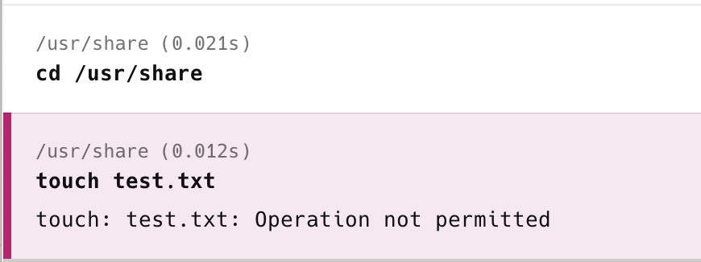

Suppose, for whatever reason, you need to store some data such as data files in a specific location on the operating system, and populate them at runtime / initialization.

Which would be the best place to put them?

This is a common problem in most operating systems, and has been solved at the OS level where by default there exist a number of locations dedicated to the storage of user data.

There is a .NET API to interrogate these the [Environment.GetSpecialFolders](https://learn.microsoft.com/en-us/dotnet/api/system.environment.specialfolder?view=net-9.0) that passes an enumeration of the folder that you want, [Special Folders](https://learn.microsoft.com/en-us/dotnet/api/system.environment.specialfolder?view=net-9.0).

For our case there are 3 candidates:

- ApplicationData
- Common Applicaiton Data
- Local Application Data

What is the difference between these three?

| Folder                  | Description |
| ----------------------- | ----------- |
| Application Data        | The directory that serves as a common repository for application-specific data for the current roaming user. A roaming user works on more than one computer on a network. A roaming user's profile is kept on a server on the network and is loaded onto a system when the user logs on. |
| Common Application Data | The directory that serves as a common repository for application-specific data that is used by all users. |
| Local Application Data | The directory that serves as a common repository for application-specific data that is used by the current, non-roaming user. |

This code will output these locations to the cosole

```csharp
Console.WriteLine(Environment.GetFolderPath(SpecialFolder.ApplicationData));

Console.WriteLine(Environment.GetFolderPath(SpecialFolder.LocalApplicationData));

Console.WriteLine(Environment.GetFolderPath(SpecialFolder.CommonApplicationData));
```

On my Windows 11 machine I get the following output:

```plaintext
C:\Users\rad\AppData\Roaming
C:\Users\rad\AppData\Local
C:\ProgramData
```

On my Mac OSX 14.7.1, I get the following:

```plaintext
/Users/rad/Library/Application Support
/Users/rad/Library/Application Support
/usr/share
```

Upon looking closer, `ApplicationData` and `LocalApplicaitonData` appear to be user specific i.e. are for a current user, factoring in whether the profile is local or [roaming](https://www.techtarget.com/searchvirtualdesktop/answer/How-does-a-roaming-user-profile-work)

So the best option is `Common Application Data`

You'd think this would be the end of it.

Not so fast.

For OSX, the location for common application data, `/usr/share` is not writeable by the current user!



So you cannot do things like transparently write to that location.

The other locations, however, are legitimate locations to write to.

Happy hacking!