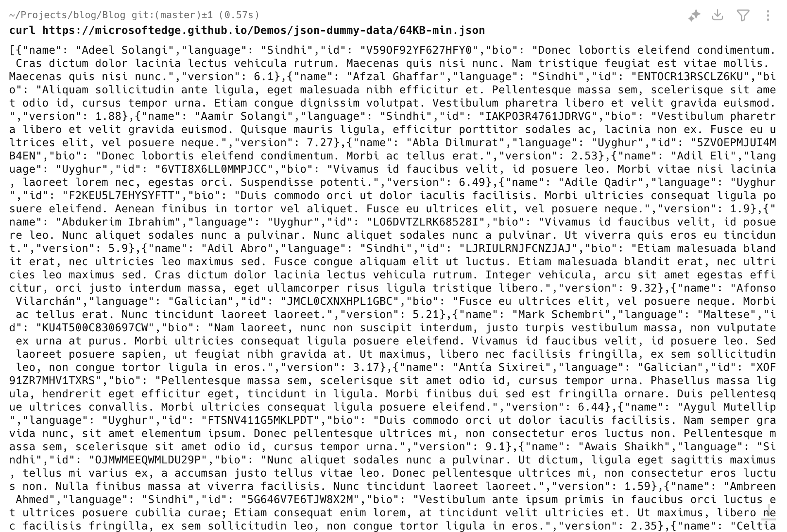
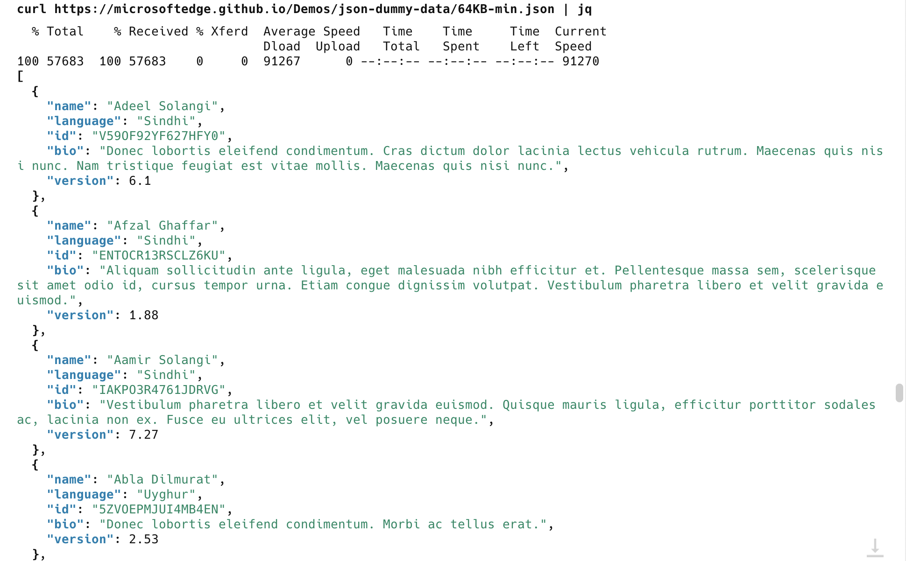
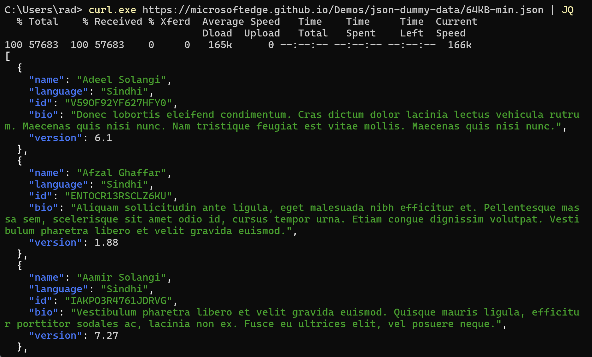

In the spirit of the last post about [formatting unformatted JSON]() there are occasions where you need to process and format JSON in a hurry on a non developer machine.

Take the following example, which uses the [excellent service that generates test JSON](https://microsoftedge.github.io/Demos/json-dummy-data/) via an API endpoint

Using your favourite command line tool, fetch the JSON from the following url [https://microsoftedge.github.io/Demos/json-dummy-data/64KB-min.json](https://microsoftedge.github.io/Demos/json-dummy-data/64KB-min.json)

On my machine, I run the following request using [curl](https://curl.se)

```bash
curl https://microsoftedge.github.io/Demos/json-dummy-data/64KB-min.json
```

The response is as follows:



*Note: don't use [httpie](https://httpie.io) for the purposes of this demo - `httpie` will format the json for you!*

Also, If you are on Windows on [PowerShell](https://learn.microsoft.com/en-us/powershell/), run the command as follows:

```bash
curl.exe https://microsoftedge.github.io/Demos/json-dummy-data/64KB-min.json
```

Note this is `curl.exe` and not `curl`. In Powershell, `curl` is an alias for [Invoke-WebRequest](https://learn.microsoft.com/en-us/powershell/module/Microsoft.PowerShell.Utility/Invoke-WebRequest?view=powershell-5.1)

To format the json, [pipe](https://www.geeksforgeeks.org/piping-in-unix-or-linux/) it to the very useful [jq](https://jqlang.github.io/jq/) program.

`jq` is not installed by default, so install it using your favorite method ([winget](https://learn.microsoft.com/en-us/windows/package-manager/winget/) or [chocolatey](https://chocolatey.org/) on Windows, [homebrew](https://brew.sh/) on OSX, [apt](https://en.wikipedia.org/wiki/APT_(software)) on Linux)

```bash
curl https://microsoftedge.github.io/Demos/json-dummy-data/64KB-min.json | jq
```
You should see something like this on OSX:



And something like this on Windows



Happy hacking!
