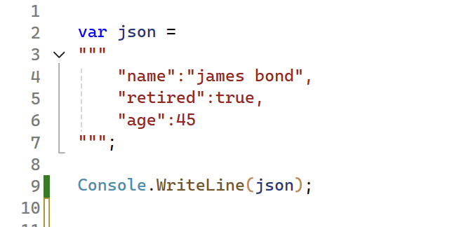
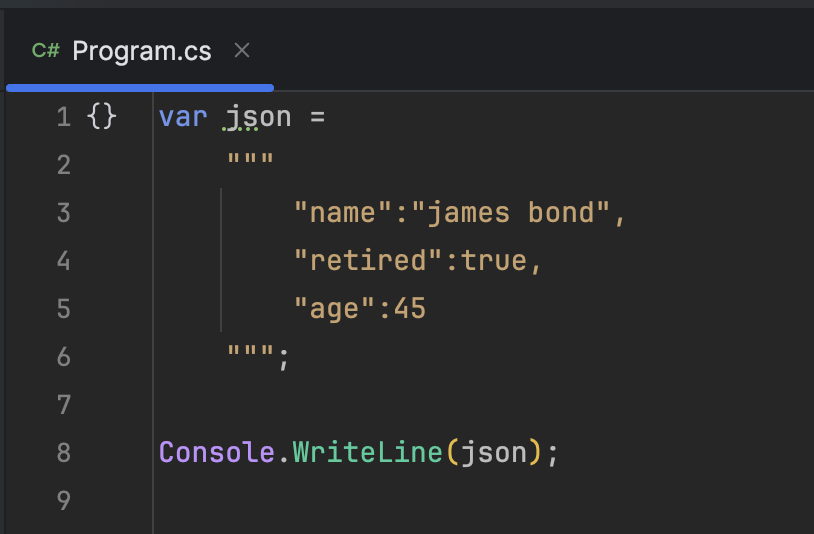
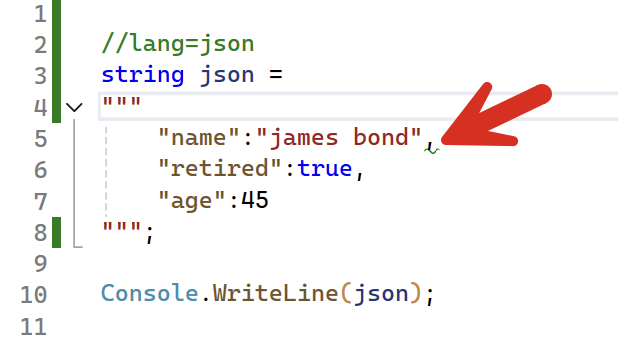
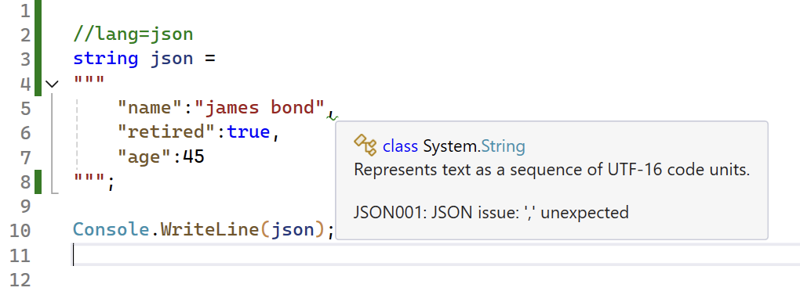
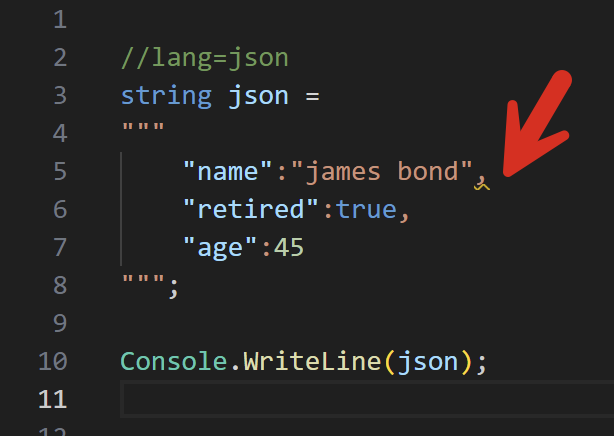
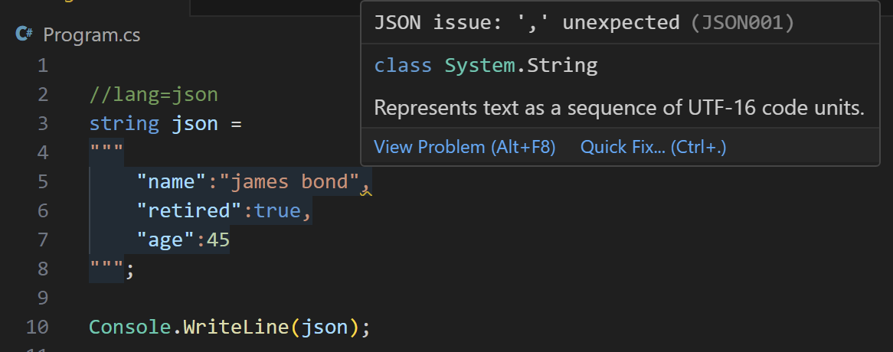
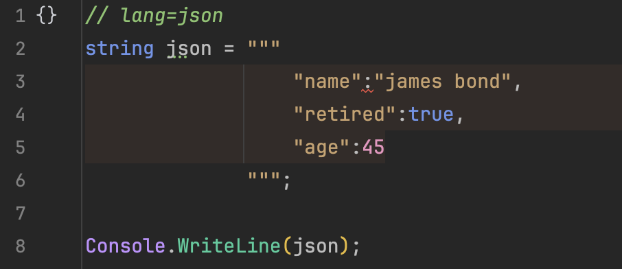
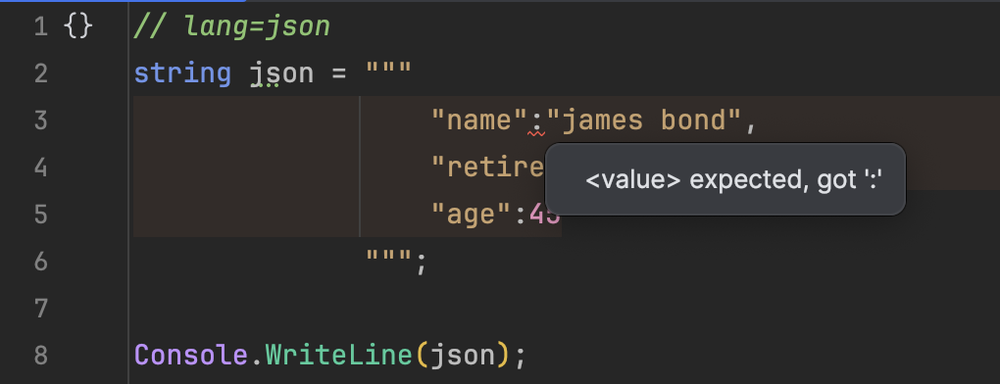

Suppose you had a program with the following code:

```csharp
var json =
"""
    "name":"james bond",
    "retired":true,
    "age":45
""";

Console.WriteLine(json);
```

It looks like this on [Visual Studio](https://visualstudio.microsoft.com)



And like this on [Visual Studio Code](https://code.visualstudio.com)


And like this on [Rider](https://www.jetbrains.com/rider/)



Very straightforward.

Did you know it is possible to tell your IDE that the string is `json`?

Do that by adding the following comment just before the string

```csharp
//lang=sql
var json =
"""
    "name":"james bond",
    "retired":true,
    "age":45
""";
```

It will look like this in **Visual Studio**, with a squiggly indicator. Notice also the syntax highlighting



If you hover your mouse over that you see the following:



It is basically saying that the `json` is invalid (no opening and closing curly braces!)

The same thing for **Visual Studio Code**



And if you hover your mouse ...



This also works with **Rider**



If you mouse over ...



This also works for a few other domain specific languages:

1. Regular Expressions
2. SQL
3. XML
4. Javascript
5. CSS
6. HTML

Happy hacking!