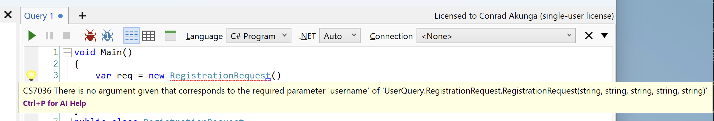
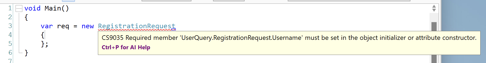
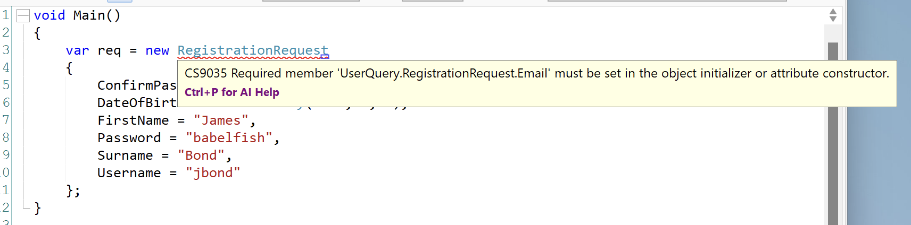
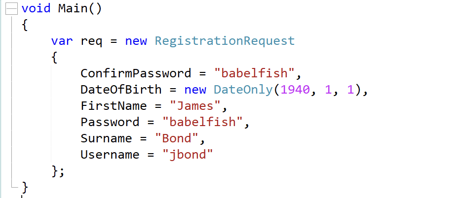

One of the realities of writing software is dealing with objects, and how to not only communicate intent, but also helping developers fall into the pit of success. This is especially an issue when you are writing software or code that is meant to be used by other developers, perhaps in an SDK or some sort of API.

Take for example this problem:

> Users are required to register and provide the following:
> - Username
> - Password
> - First name
> - Surname
> - Date of Birth
>

The first attempt would be to create a class like this:

```csharp
public class RegistrationRequest
{
	public string Username { get; set; }
	public string Password { get; set; }
	public string FirstName { get; set; }
	public string Surname { get; set; }
	public DateTime DateOfBirth { get; set; }
}
```

Given we want to ensure that the user has not inadvertently put a typo in their password, we can ask for a confirmation of the password

```csharp
public class RegistrationRequest
{
	public string Username { get; set; }
	public string Password { get; set; }
	public string ConfirmPassword { get; set; }
	public string FirstName { get; set; }
	public string Surname { get; set; }
	public DateTime DateOfBirth { get; set; }
}
```

Given the date of birth is actually a date, we don't care about the time componet. So we can use the [DateOnly](https://learn.microsoft.com/en-us/dotnet/api/system.dateonly?view=net-9.0) type instead.

```csharp
public class RegistrationRequest
{
	public string Username { get; set; }
	public string Password { get; set; }
	public string ConfirmPassword { get; set; }
	public string FirstName { get; set; }
	public string Surname { get; set; }
	public DateOnly DateOfBirth { get; set; }
}
```

So now the developer for the SDK can create a request as follows:

```csharp
var req = new RegistrationRequest()
	{
		ConfirmPassword = "babelfish",
		DateOfBirth = new DateOnly(1940, 1, 1),
		FirstName = "James",
		Password = "babelfish",
		Surname = "Bond",
		Username = "jbond"
	};
```

The problem with doing it this way is that the developer can also do this:

```csharp
var req = new RegistrationRequest()
{
};
```

Here the object created will only have default values.

One way around this issue is to create a constructor, this forcing the developer to provide all the values.

```csharp
public class RegistrationRequest
{
    public string Username { get; set; }
    public string Password { get; set; }
    public string ConfirmPassword { get; set; }
    public string FirstName { get; set; }
    public string Surname { get; set; }
    public DateOnly DateOfBirth { get; set; }

    public RegistrationRequest(string username, string password, string confirmPassword, string firstName,
        string surname)
    {
        Username = username;
        Password = password;
        ConfirmPassword = confirmPassword;
        FirstName = firstName;
        Surname = surname;
    }
}
```

With this update the developer will get a compiler error  is forced to pass all the values to the constructor.



We can further improve the class by making the properties immutable by removing the setters.

```csharp
public class RegistrationRequest
{
	public string Username { get; }
	public string Password { get; }
	public string ConfirmPassword { get; }
	public string FirstName { get; }
	public string Surname { get; }
	public DateOnly DateOfBirth { get; }

	public RegistrationRequest(string username, string password, string confirmPassword, string firstName,
		string surname)
	{
		Username = username;
		Password = password;
		ConfirmPassword = confirmPassword;
		FirstName = firstName;
		Surname = surname;
	}
}
```

The code to create a `RegistrationRequest` now looks like this:

```csharp
var req = new RegistrationRequest("jbond", "bablelfish", "babelfish", "James", "Bond");
```

This solves the problem, but presents a different challenge.

Quick, can you tell by looking what exactly is being passed here, without using an IDE to help you with intellisense?


A good solution to this problem is to make use of some modern C# features - the [required](https://learn.microsoft.com/en-us/dotnet/csharp/language-reference/keywords/required) and the [init](https://learn.microsoft.com/en-us/dotnet/csharp/language-reference/keywords/init) modifiers.

The type now looks like this:

```csharp
public record RegistrationRequest
{
	public required string Username { get; init; }
	public required string Password { get; init; }
	public required string ConfirmPassword { get; init; }
	public required string FirstName { get; init; }
	public required string Surname { get; init; }
	public required DateOnly DateOfBirth { get; init; }
}
```

We have removed the constructor and implemented the required and init modifiers.

Now to create a request, the code looks like this:

```csharp
var req = new RegistrationRequest
	{
		ConfirmPassword = "babelfish",
		DateOfBirth = new DateOnly(1940, 1, 1),
		FirstName = "James",
		Password = "babelfish",
		Surname = "Bond",
		Username = "jbond"
	};
```

This looks a lot like our initial code, and indeed, it is exactly the same.

The difference is if you forget to set one, or more properties, you get this:



The compiler will complain about every missing property until you provide them all.

The beauty of this is if you subsequently add a new poperty to your type:

```csharp
public record RegistrationRequest
{
	public required string Username { get; init; }
	public required string Password { get; init; }
	public required string ConfirmPassword { get; init; }
	public required string FirstName { get; init; }
	public required string Surname { get; init; }
	public required DateOnly DateOfBirth { get; init; }
	public required string Email { get; init; }
}
```

You will immediately get a compiler error wherever you are creating a `RegistrationRequest`



Excellent.

This also solves the previous problem around ability to understand what the code is doing by reading it.

This:



Is much easier to glean than this:


In conclusion, this refactoring has yieled the following benefits:

1. Easier to **read** code
2. Easier to **maintain** code - there is less of it, and it is doing less
3. Type protection at **compiler** level

**Remember, the primary consumer of source code is software developers!**

Now, it can be argued that a benefit of using a constructor is that you can validate the inputs. For example, if you want to ensure that the `DateOfBirth` is in the past, the code would look like this:

```csharp
public class RegistrationRequest
{
	public string Username { get; }
	public string Password { get; }
	public string ConfirmPassword { get; }
	public string FirstName { get; }
	public string Surname { get; }
	public DateOnly DateOfBirth { get; }

	public RegistrationRequest(string username, string password, string confirmPassword, string firstName,
		string surname)
	{
		if (DateOfBirth > DateOnly.FromDateTime(DateTime.Now))
			throw new ArgumentException("You cannot be born in the future!");

		Username = username;
		Password = password;
		ConfirmPassword = confirmPassword;
		FirstName = firstName;
		Surname = surname;
	}
```

You can still achieve this using our new approach but you will have to do a little more work.

```csharp
public record RegistrationRequest
{
    public required string Username { get; init; }
    public required string Password { get; init; }
    public required string ConfirmPassword { get; init; }
    public required string FirstName { get; init; }
    public required string Surname { get; init; }

    private DateOnly _dateOfBirth;

    public required DateOnly DateOfBirth
    {
        get => _dateOfBirth;
        init
        {
            if (value >= DateOnly.FromDateTime(DateTime.Today))
                throw new ArgumentException("Date of Birth must be earlier than today.");
            _dateOfBirth = value;
        }
    }
}
```

Here we no longer use automatic properties and manage the private field for the `DateOfBirth` property ourselves.

However, personally I would not use this approach at all. I prefer to have a single external concern responsible for the validation for a couple of reasons:

1. When this request is received by the server API, it will still need to perform the exact same validations. You have no reason to trust user inputs.
2. If the validation is a single concern, it can be re-used across application layers as well as across applications.
3. Validations might be more complex, requiring database access or API access. Having these dependencies on a plain class is an overkill. Also, having such complex logic in a constructor is a code smell.
4. Having all validation in a central place is better for understading and maintenance.

I would do this using the [FluentValidation](https://docs.fluentvalidation.net/en/latest/) library and write a validator like this:

```csharp
public class RegistrationRequestValidator : AbstractValidator<RegistrationRequest>
{
	public RegistrationRequestValidator()
	{
		RuleFor(x => x.Username).NotEmpty();
		RuleFor(x => x.FirstName).NotEmpty();
		RuleFor(x => x.Password).NotEmpty();
		RuleFor(x => x.ConfirmPassword).NotEmpty();
		// Check passwords match
		RuleFor(x => x.Password).Equal(x => x.ConfirmPassword);
		RuleFor(x => x.DateOfBirth).LessThanOrEqualTo(DateOnly.FromDateTime(DateTime.Today));
	}
}
```

It is then used like this, for example, on the client side:

```csharp
var validator = new RegistrationRequestValidator();
var result = validator.Validate(req);
if (!result.IsValid)
{
  foreach (var error in result.Errors)
  {
    Console.WriteLine($"{error.PropertyName} '{error.AttemptedValue}' has error - {error.ErrorMessage}");

  }
}
```

If there were any errors, they would be listed like so:

```plaintext
Password 'babelfishy' has error - 'Password' must be equal to 'babelfish'.
```

This validator can then be used both by the server side API as well as the developer.

Happy hacking!

