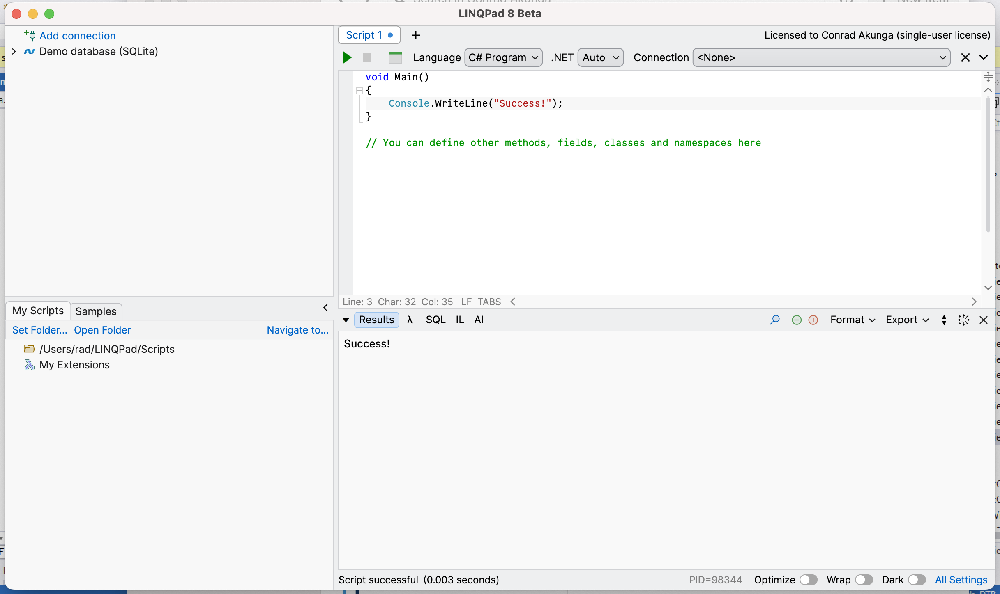
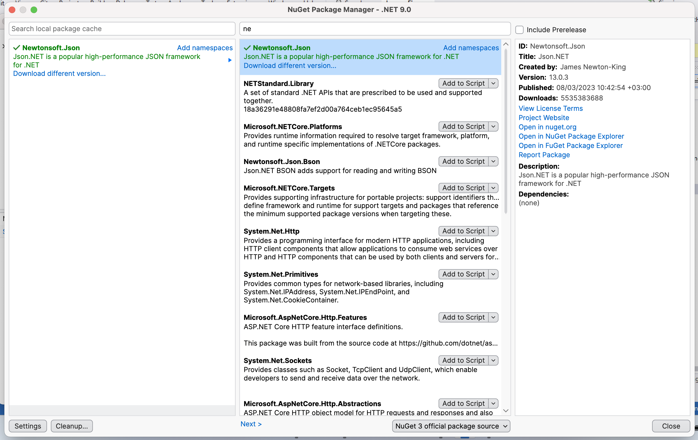
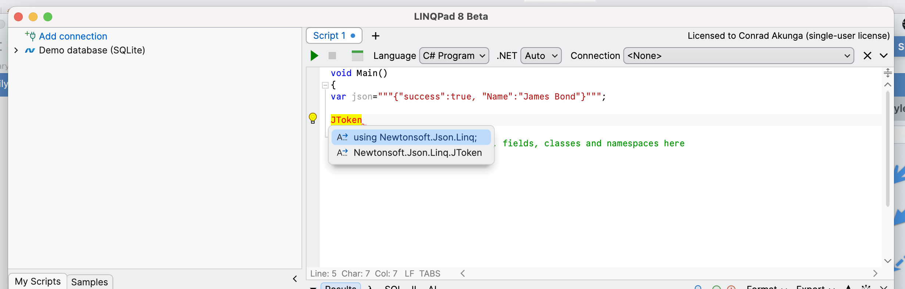
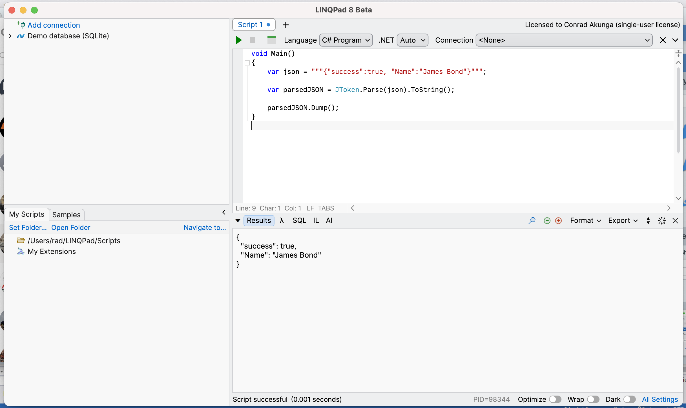

I have been using a [MacBook Pro (M3)](https://www.apple.com/ke/macbook-pro/) as my primary development machine for almost 6 months. I use [JetBrains Rider](https://www.jetbrains.com/rider/) as my primary IDE, and occasionally, I use [VS Code](https://code.visualstudio.com).

This arrangement works perfectly as .NET is a [first-class citizen on OSX](https://learn.microsoft.com/en-us/dotnet/core/install/macos), and Rider is a brilliant IDE.

For software like databases ([PostgreSQL](https://www.postgresql.org), [SQL Server](https://learn.microsoft.com/en-us/sql/linux/quickstart-install-connect-docker?view=sql-server-ver16&tabs=cli&pivots=cs1-bash)) and the usual tools like [Redis](https://redis.io), [RabbitMQ](https://www.rabbitmq.com), [Seq](https://datalust.co/seq), [ElasticSearch](https://www.elastic.co/elasticsearch) and [Kibana](https://www.elastic.co/kibana), I run these on [Docker](https://www.docker.com) via the excellent [OrbStack](https://orbstack.dev).

The biggest pain point has been when I needed to write some [C#](https://learn.microsoft.com/en-us/dotnet/csharp/) or [F#](https://learn.microsoft.com/en-us/dotnet/fsharp/) quickly to experiment or prototype without launching a full IDE and going through the edit - compile - run cycle.

I should also point out that I have used a Mac as my primary machine for over 10 years, but my primary development was on a Windows Virtual Machine.

I am also running a [Windows 11 ARM](https://www.microsoft.com/en-us/windows/windows-11) virtual machine on [Parallels](https://www.parallels.com), on which I run [Visual Studio 2022](https://visualstudio.microsoft.com/vs/) for some legacy maintenance work. On that VM, I run [LinqPad](https://www.linqpad.net) for quick prototyping and experimentation.

`LinqPad` is not available on OSX, and the closest thing I have found is [NetPad](https://github.com/tareqimbasher/NetPad), which tries but lacks a lot of the polish and convenience of LinqPad.

Until today, that is, when a [pre-release beta](https://www.linqpad.net/LINQPad8Mac.aspx) was released.

It looks very promising.

This is the main screen showing the basic UI.

It fully supports acquiring and using NuGet packages.

It has the expected intellisense support.

And it seems to run OK.

Naturally, it is a pre-release beta and has a few elements that are still [works in progress](https://www.linqpad.net/LINQPad8Mac.aspx), to whit:

- Integrated Debugger (high priority)
- Results to Data Grids (high priority)
- Multi-monitor support
- The Roslyn Syntax Tree visualizer
- The static EF Core driver (for connecting to your own DbContexts)
- Support for third-party data context drivers and samples
- The password expiry update dialog in the LINQ-to-SQL driver
- Charting
- The lprun command-line tool (requires a new C++ CLR host)
- ILSpy integration
- F# support
- Reordering queries in folders
- File path autocompletion
- Custom style sheet support for results styling
- Offline Activations
- Undo buffer restoration between sessions
- Syntax highlighting in JSON/XML output

But what has been done so far looks good.

I will be extensively using it and providing feedback to [the author](https://www.albahari.com). And so should you!

Happy hacking!
