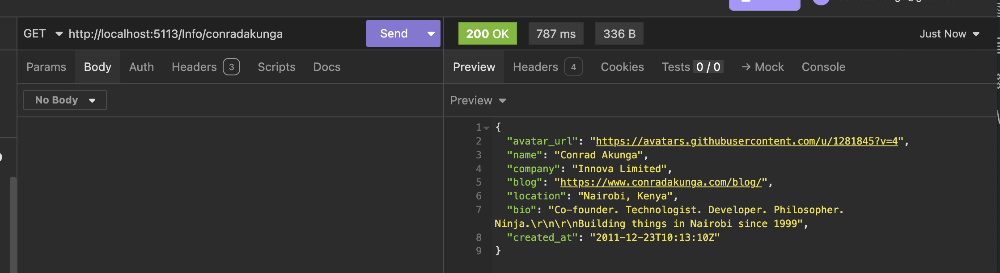
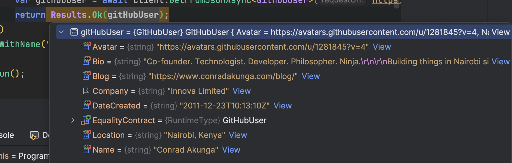
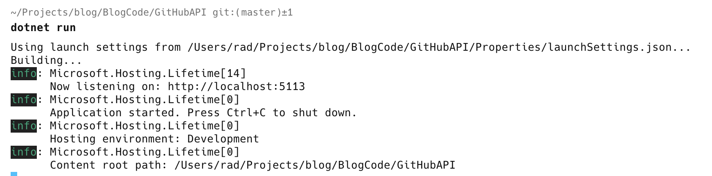
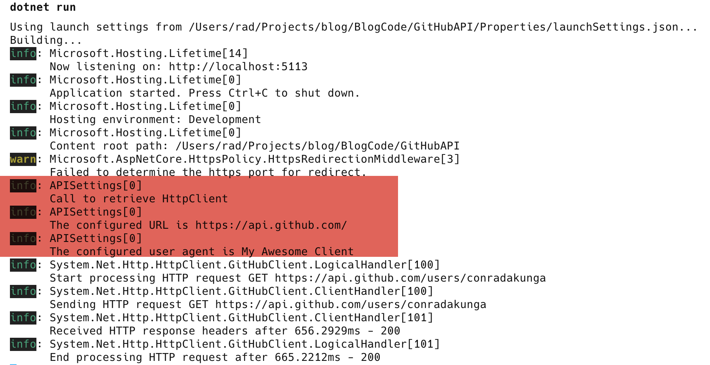
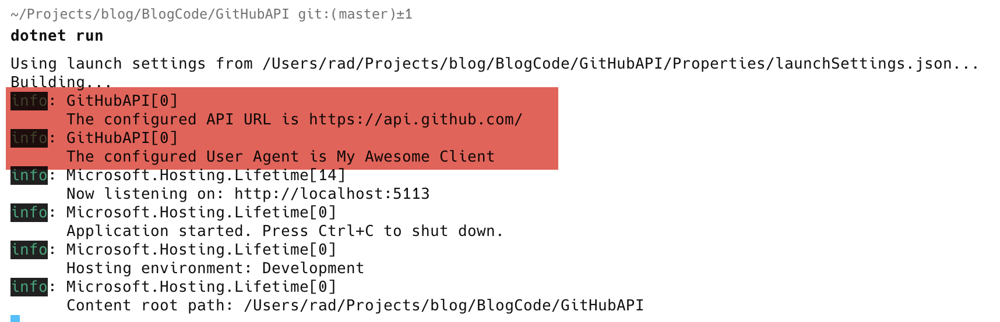

In the course of your .NET application you will invariably require to access and use settings in the course of your application's operations to configure services that your application is going to require in the course of the running of your application.

Let us take the simple of example where I want to build an endpoint to get my profile information from Github.

To get this, send a request to the url `https://api.github.com/users/[USERNAME]`

For example, to get my profile I would go to `https://api.github.com/users/conradakunga`

The following JSON would be returned

```json
{
  "login": "conradakunga",
  "id": 1281845,
  "node_id": "MDQ6VXNlcjEyODE4NDU=",
  "avatar_url": "https://avatars.githubusercontent.com/u/1281845?v=4",
  "gravatar_id": "",
  "url": "https://api.github.com/users/conradakunga",
  "html_url": "https://github.com/conradakunga",
  "followers_url": "https://api.github.com/users/conradakunga/followers",
  "following_url": "https://api.github.com/users/conradakunga/following{/other_user}",
  "gists_url": "https://api.github.com/users/conradakunga/gists{/gist_id}",
  "starred_url": "https://api.github.com/users/conradakunga/starred{/owner}{/repo}",
  "subscriptions_url": "https://api.github.com/users/conradakunga/subscriptions",
  "organizations_url": "https://api.github.com/users/conradakunga/orgs",
  "repos_url": "https://api.github.com/users/conradakunga/repos",
  "events_url": "https://api.github.com/users/conradakunga/events{/privacy}",
  "received_events_url": "https://api.github.com/users/conradakunga/received_events",
  "type": "User",
  "user_view_type": "public",
  "site_admin": false,
  "name": "Conrad Akunga",
  "company": "Innova Limited",
  "blog": "https://www.conradakunga.com/blog/",
  "location": "Nairobi, Kenya",
  "email": null,
  "hireable": null,
  "bio": "Co-founder. Technologist. Developer. Philosopher. Ninja.\r\n\r\nBuilding things in Nairobi since 1999",
  "twitter_username": null,
  "public_repos": 121,
  "public_gists": 15,
  "followers": 40,
  "following": 4,
  "created_at": "2011-12-23T10:13:10Z",
  "updated_at": "2024-11-18T04:40:14Z"
}
```

Now, most of this information is unnecessary for my simple API. So let us pick only what we consider important:

- avatar_url
- name
- company
- blog
- location
- bio
- created_at

The first thing is to create a type to represent this entity, and for this, we can use a record to make its properties immutable using the `init` modifier. We also make the properties `required`.

```csharp
public sealed record GitHubUser
{
    public required string avatar_url { get; init; }
    public required string name { get; init; }
    public required string company { get; init; }
    public required string blog { get; init; }
    public required string location { get; init; }
    public required string bio { get; init; }
    public required DateTime created_at { get; init; }
}
```

To make this more maintainable, it is probably better to rename the properties and let the [JsonSerlializer](https://learn.microsoft.com/en-us/dotnet/api/system.text.json.jsonserializer?view=net-9.0) know to preserve the original names.

We achieve this using the [JsonPropertyName](https://learn.microsoft.com/en-us/dotnet/api/system.text.json.serialization.jsonpropertynameattribute?view=net-9.0) attribute.

```csharp
public record GitHubUser
{
    [JsonPropertyName("avatar_url")] public required string Avatar { get; init; }
    [JsonPropertyName("name")] public required string Name { get; init; }
    [JsonPropertyName("company")] public required string Company { get; init; }
    [JsonPropertyName("blog")] public required string Blog { get; init; }
    [JsonPropertyName("location")] public required string Location { get; init; }
    [JsonPropertyName("bio")] public required string Bio { get; init; }
    [JsonPropertyName("created_at")] public required string DateCreated { get; init; }
}
```

With our model ready, we can implement the API endpoint.

```csharp
app.MapGet("/Info/{username}", async (string username) =>
    {
        // Create a HttpClient
        var client = new HttpClient();
        // Add a user agent header, or the request will fail as Github will reject it
        client.DefaultRequestHeaders.Add("User-Agent", "My Awesome Client");
        // Deserialize the returned user
        var gitHubUser = await client.GetFromJsonAsync<GitHubUser>($"https://api.github.com/users/{username}");
        return Results.Ok(gitHubUser);
    })
    .WithName("GetUserInfo");
```

You must set the `User-Agent` header or GitHub will respond with a 403 (Forbidden) response

When I run this in [Insomnia](https://insomnia.rest/) I get the following response:



If I view the response in the debugger I can see the properties have been correctly serialized to an object with the names I have specified.



So far, so good.

A couple of improvements need to be made.

1. It is not performant to initialise and use a `HttpClient` with every request
2. Hard coding the URL for Github will be difficult to maintain should they decide to change the URL
3. It is probably best to specify our `User-Agent` as a setting as well.

To this end, we can start by creating a class to store our settings as follows:

```csharp
public sealed record APISettings
{
    public string GitHubAPI { get; set; }
    public string UserAgent { get; set; }
}
```

You might notice that this class is NOT immutable - the values can be changed. This is important because the mechanism to bind settings to this class actually mutates the object.

We then specify the values for these settings in the `appSettings.json` file.

```json
{
  "Logging": {
    "LogLevel": {
      "Default": "Information",
      "Microsoft.AspNetCore": "Warning"
    }
  },
  "AllowedHosts": "*",
  "APISettings": {
    "GitHubAPI": "https://api.github.com/",
    "UserAgent": "AwesomeClient"
  }
}
```

The next step is to register our settings with the container. This is done as follows:

```csharp
// Register the binding of the APISettings object to the relevant section in appSettings.json
builder.Services.Configure<APISettings>(builder.Configuration.GetSection(nameof(APISettings)));
```

We are using `nameof(APISettings)` rather than just typing "APISettings" because steering away from "stringly typed" values makes it easier to refactor the settings without having to remember to go and change strings.

With the settings registered, the next step is to configure the injectable [HttpClient](https://learn.microsoft.com/en-us/dotnet/api/system.net.http.httpclient?view=net-9.0) via a [HttpClientFactory](https://learn.microsoft.com/en-us/dotnet/api/system.net.http.ihttpclientfactory?view=net-9.0-pp)

This is done as follows:

```csharp
// Create a constant to store the name for the HttpClient
const string httpClientName = "GitHubClient";
// Register the HttpClient
builder.Services.AddHttpClient(httpClientName, (provider, client) =>
{
    // Get the settings from the DI container
    var settings = provider.GetRequiredService<IOptions<APISettings>>().Value;
    // Set the base address with the configured settings
    client.BaseAddress = new Uri(settings.GitHubAPI);
    // Set the user agent to be added by default to all requests
    client.DefaultRequestHeaders.Add("User-Agent", settings.UserAgent);
});
```

Finally, we inject a `IHttpClientFactory` into our Minimal API EndPoint

Our API now looks like this:

```csharp
app.MapGet("/Info/{username}", async (string username, IHttpClientFactory factory) =>
    {
        // Retrieve our client from the DI container
        var client = factory.CreateClient(httpClientName);
        // Deserialize the returned user
        var gitHubUser = await client.GetFromJsonAsync<GitHubUser>($"/users/{username}");
        return Results.Ok(gitHubUser);
    })
    .WithName("GetUserInfo");
```

If we make a request, it still returns my details as before.

Let us revisit this section of code:

```csharp
builder.Services.AddHttpClient(httpClientName, (provider, client) =>
{
    // Get the settings from the DI container
    var settings = provider.GetRequiredService<IOptions<APISettings>>().Value;
    // Set the base address with the configured settings
    client.BaseAddress = new Uri(settings.GitHubAPI);
    // Set the user agent to be added by default to all requests
    client.DefaultRequestHeaders.Add("User-Agent", settings.UserAgent);
});
```

It is very important to note that **this code does not run when the application starts - it runs when the HttpClient is *requested***.

This is called **IOptions or Lazy Binding**.

In other words, this call:

```csharp
var client = factory.CreateClient(httpClientName);
```

is what will cause the request to the DI container for the `HttpClient` to be constructed and returned, and for that configuration code to run and carry out those actions.

You can verify this by changing that code and adding this:

```csharp
builder.Services.AddHttpClient(httpClientName, (provider, client) =>
{
    // Get a logger from the DI contaoner
    var logger = provider.GetRequiredService<ILogger<APISettings>>();
    // Log some information
    logger.LogInformation("Call to retrieve HttpClient");
    // Get the settings from the DI container
    var settings = provider.GetRequiredService<IOptions<APISettings>>().Value;
    logger.LogInformation("The configured URL is {URL}", settings.GitHubAPI);
    logger.LogInformation("The configured user agent is {UserAgent}", settings.UserAgent);
    // Set the base address with the configured settings
    client.BaseAddress = new Uri(settings.GitHubAPI);
    // Set the user agent to be added by default to all requets
    client.DefaultRequestHeaders.Add("User-Agent", settings.UserAgent);
});
```

If we start the app, we won't actually see anything logged to the console:



However, if we make a request, we see our logging code now fires:



Most of the time, this will be good enough for your needs.

However, you sometimes require the settings values very early in the application pipeline.

In this case you will need to do things a bit differently by requesting the application to bind a section of the settings to a custom instance of the `APISettings` class.

This is done like this:

```csharp
//Fetch the API settings and bind them to a custom object
var apiSettings = new APISettings();
builder.Configuration.GetSection(nameof(APISettings)).Bind(apiSettings);

// Build the web application
var app = builder.Build();

// Use the app's logger to print information
app.Logger.LogInformation("The configured API URL is {URL}", apiSettings.GitHubAPI);
app.Logger.LogInformation("The configured User Agent is {UserAgent}", apiSettings.UserAgent);
```

This approach is called **Direct or Manual Binding**, and you should only do this if you need the settings values **BEFORE** the application starts.

Running this code shows the API configuration information is printed immediately after the app actually starts.




If you need to log **before** the application starts, you cannot use the `Logger` from the `app` object as it has not been created yet.

In such a case, the simplest way is to create and use your own [Logger](https://learn.microsoft.com/en-us/dotnet/api/microsoft.extensions.logging.ilogger?view=net-9.0-pp). There are many libraries for this; my go-to is [Serilog](https://serilog.net/), particularly the [Console sink](https://github.com/serilog/serilog-sinks-console).

```bash
dotnet add package Serilog.Sink.Console
```
If you want to log somewhere else, perhaps [Seq](https://github.com/datalust/serilog-sinks-seq) or [ElasticSearch](https://www.elastic.co/guide/en/ecs-logging/dotnet/current/serilog-data-shipper.html), you can use the appropriate sink or one of the [many other available ones](https://github.com/serilog/serilog/wiki/provided-sinks).

Then, you create and configure the logger 

```csharp
// Create our own logger to use before the
// application one can be spun up
Log.Logger = new LoggerConfiguration()
    .WriteTo.Console()
    .CreateLogger();
```

Finally, we can use it whenever we need it, even before the application's own `Logger` is available.

```csharp
//Fetch the API settings and bind them to a custom object
var apiSettings = new APISettings();
builder.Configuration.GetSection(nameof(APISettings)).Bind(apiSettings);

Log.Information("Custom logger reports the URL is {URL}", apiSettings.GitHubAPI);
```

In conclusion:

1. If you need the settings immediately the app starts, bind directly from the configuration
2. If you need the settings only in the context of configuring a service during DI, retrieve the settings from the container.

The code is in my [Github](https://github.com/conradakunga/BlogCode/tree/master/2024-12-11%20-%20Loading%20%26%20Using%20Application%20Settings).

Happy hacking!
