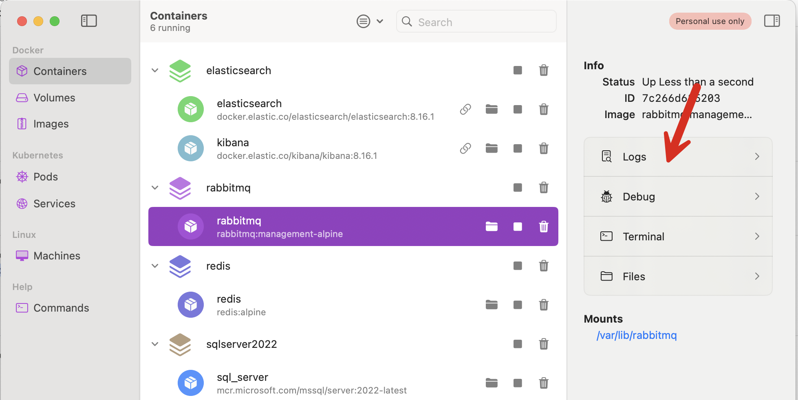
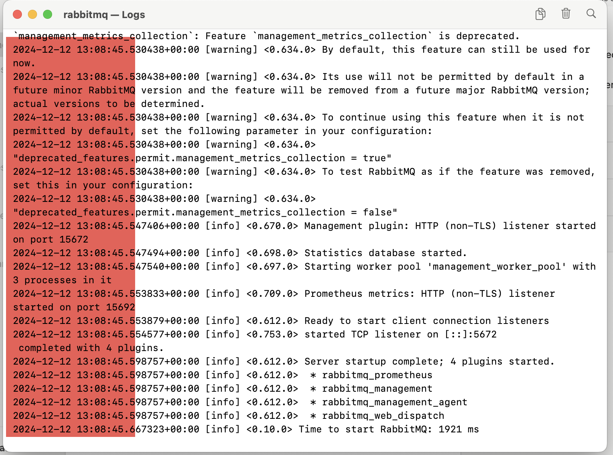
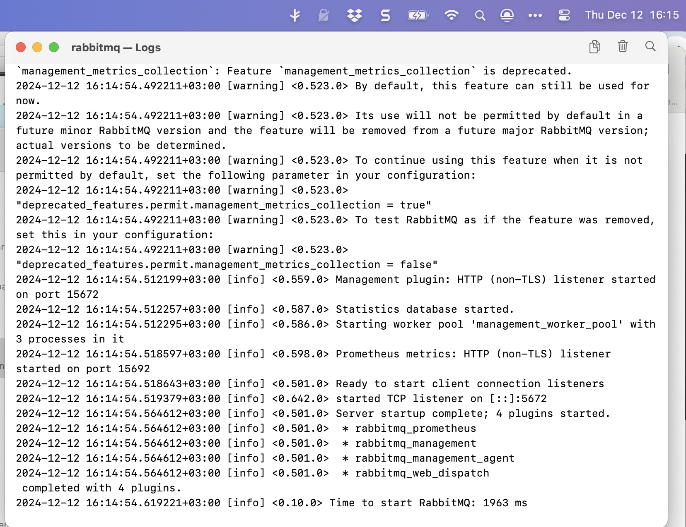
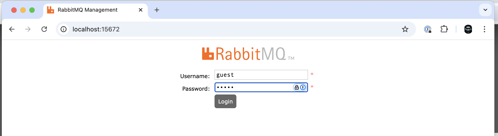
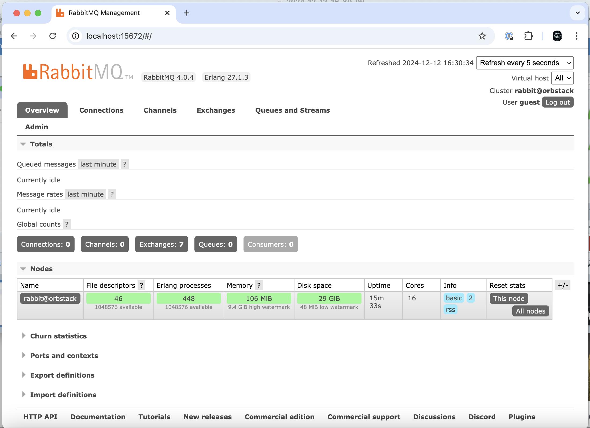
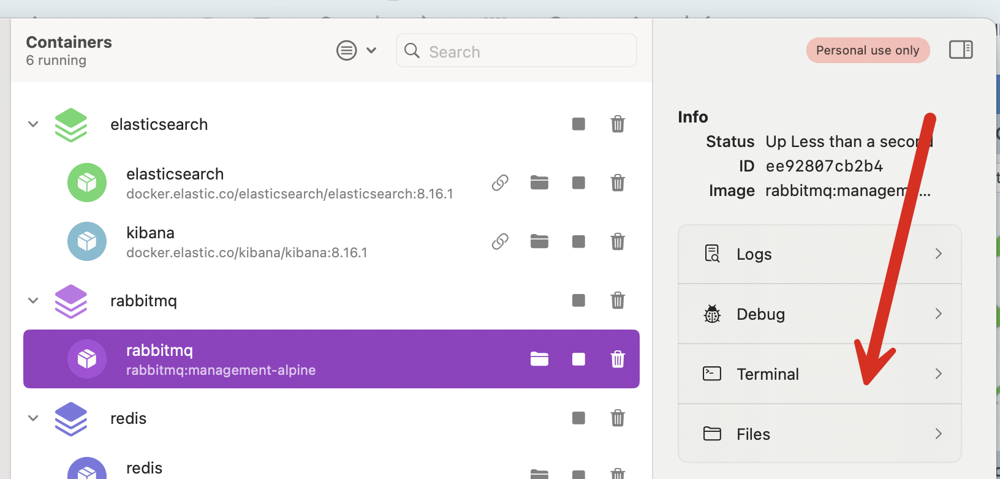
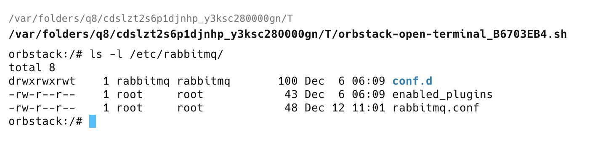

If you require a message queueing solution, [RabbitMQ](https://www.rabbitmq.com) is hard to beat. Not only is it an excellent piece of software, but it is also [cross-platform](https://www.rabbitmq.com/docs/platforms) and available as a [docker image](https://hub.docker.com/_/rabbitmq).

As a developer, I cannot stress enough the value of dockerizing your development infrastructure. It makes life so much easier in terms of quickly spinning up, running, administration and updates (or downgrades!) of required software and services.

Assuming you have docker installed, this is the docker-compose.yaml for a RabbitMQ instance.

```yaml
services:
  rabbitmq:
    image: rabbitmq:management-alpine
    container_name: rabbitmq
    restart: always
    network_mode: host
    expose:
      - 5672:5672
      - 15672:15672
```

The entries are as follows:

- `image` specifies the lightest RabbitMQ image that has the core software and the management interface, based on [Alpine Linux](https://alpinelinux.org) On my machine (MacOS M4 OS On Sonoma 14), it is 191.9 Mb.
- `container_name` is the name of the container. If you don't specify one, docker will generate one for you
- `restart` specifies that the container should always be restarted if it stops
- `host` removes network isolation between the container and the Docker host, and uses the host's networking directly
- `expose` opens the ports to access from the host, `5672` being the port for the core software and `15672` the port for the [admin management interface](https://www.cloudamqp.com/blog/part3-rabbitmq-for-beginners_the-management-interface.html)

We can then spin up the container from the folder where the docker-compose.yaml file is, using the following command:

```bash
docker compose up -d --build
```

This recreates the container (if the image file is a newer version) or just starts it, running it in the background.

If you view the logs, you should see that the container has started successfully.

Here are some screenshots of my machine. I am using Orbstack to run and administer my docker. But you can view the logs using any tool, including the command line.





Highlighted is the fact that docker is using a time of **13:08** but on my machine, East African Time (Kenya), it is actually **16:08**.

This can potentially cause problems around time-specific operations.

We can fix this by updating the `docker-compose.yaml` to specify the time zone required.

```yaml
services:
  rabbitmq:
    image: rabbitmq:management-alpine
    container_name: rabbitmq
    restart: always
    network_mode: host
    expose:
      - 5672:5672
      - 15672:15672
    environment:
      - TZ=Africa/Nairobi
```

I have added a new section, `environment` and specified a variable, `TZ,` whose value I set to the timezone I want, Africa/Nairobi.

You will need to delete the container altogether to see the change completely - rebuilding it will not be enough as it will use the cached data in the container.

Once it is up and running, I can see the time now matches on the host and the container.



I can then log in to the admin UI, which, as specified in the config, is exposed on `15672`. You can change the port in the config to something else, perhaps if you already have RabbitMQ running natively on your machine.

You would do that as follows:

```yaml
ports:
  - 6672:5672
  - 16672:15672
```

Here, we say the RabbitMQ in docker should be accessed on `6672` on the host and its admin interface on `16672`.

Unless you specify otherwise, the default username is `guest`, and the password is also `guest`.



You should then see the admin console:



Naturally, you will want to change to default username and password.

How you do this will depend on the version of RabbitMQ you want to run.

If it is **earlier** than 3.9, which is to say 3.8 and earlier, update your `docker-compose.yaml` as follows:

```yaml
services:
  rabbitmq:
    image: rabbitmq:management-alpine
    container_name: rabbitmq
    restart: always
    network_mode: host
    expose:
      - 5672:5672
      - 15672:15672
    environment:
      - TZ=Africa/Nairobi
      - RABBITMQ_DEFAULT_USER: myuser
      - RABBITMQ_DEFAULT_PASS: mypassword
```

If it is **3.9 or later**, the above will not work as RabbitMQ switched to using a configuration file for some parameters, which include the `username` and the `password`. You can get a list of parameters that you can configure [here](https://www.rabbitmq.com/docs/configure).

For this to work, create a new text file in the folder where your `docker-compose.yaml` file is, and name it `rabbitmq.conf`

In it, put the following contents:

```plaintext
default_user = myuser
default_pass = mypassword
```

Next, update your `docker-compose.yaml` to look like this:

```yaml
services:
  rabbitmq:
    image: rabbitmq:management-alpine
    container_name: rabbitmq
    restart: always
    network_mode: host
    volumes:
      - ./rabbitmq.conf:/etc/rabbitmq/rabbitmq.conf
    environment:
      - TZ=Africa/Nairobi
    expose:
      - 5672:5672
      - 15672:15672
```

The relevant section is this one:

```yaml
   volumes:
      - ./rabbitmq.conf:/etc/rabbitmq/rabbitmq.conf
```

Here, we are saying we want the file `rabbitmq.conf` to be mounted **inside the container**, in the location `/etc/rabbitmq/`

Again, remove the container completely and then recreate it.

If we navigate to `/etc/rabbitmq/`, we should see the config file there.

Using Orbstack, I launched a terminal in the container:



And from there, I can list the contents:



The new credentials should now be active.

Happy hacking!
