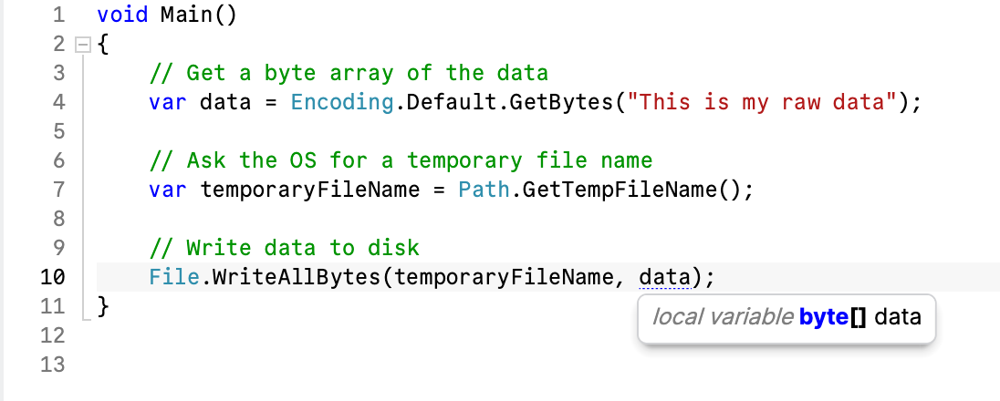
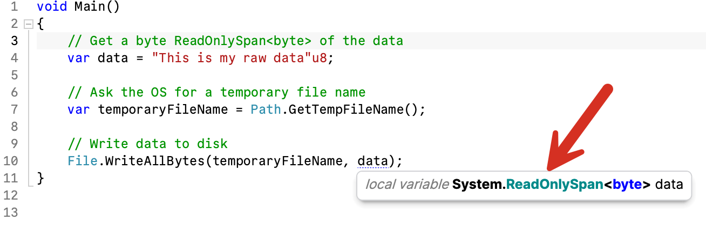

A number of processing APIs and modules operate on `byte` arrays rather than discrete structures like `strings`.

You will, therefore, find yourself often doing the following:

```csharp
// Get a byte array of the data
var data = Encoding.Default.GetBytes("This is my raw data");
```

Two things are happening here:

1. Memory is allocated to store the `byte` array
2. The process of converting the string to a `byte` array is carried out, and the result is stored in the new memory. This is called an allocation.

This is a fairly common operation, especially when it comes to the ASP.NET engine, which deals a lot with `strings` and `byte` arrays.

There has been an improvement on this at compile time - the [UTF 8 string literal](https://learn.microsoft.com/en-us/dotnet/csharp/language-reference/proposals/csharp-11.0/utf8-string-literals).

The previous code can be written as follows:

```csharp
var data = "This is my raw data"u8;
```

There are two important things to note here:

- The `u8` immediately after the closing quotes is a  UTF 8 string literal, instructing the compiler and runtime on what to do with the data. We have met [integer literals before]()
- The variable `data` contains not a `byte` array but a `ReadOnlySpan<byte>`. This is a faster technique of accessing data that avoids allocations. This is `string` data in [UTF 8 encoding](https://learn.microsoft.com/en-us/dotnet/api/system.text.encoding.utf8?view=net-9.0).

The [Span](https://learn.microsoft.com/en-us/archive/msdn-magazine/2018/january/csharp-all-about-span-exploring-a-new-net-mainstay) and [ReadOnlySpan](https://learn.microsoft.com/en-us/dotnet/api/system.readonlyspan-1?view=net-9.0) have such benefits for performance and memory reasons that an increasing number of APIs that used to take byte arrays or strings now have overloads that accept `ReadOnlySpans`.

For example, the API that writes data to a file takes both a `byte` array and a `ReadOnlySpan<byte>` as a parameter, [File.WriteAllBytes()](https://learn.microsoft.com/en-us/dotnet/api/system.io.file.writeallbytes?view=net-9.0) in addition to the file name.

So, we can modify our first example to write the data to a file as follows:

```csharp
// Get a byte array of the data
var data = Encoding.Default.GetBytes("This is my raw data");

// Ask the OS for a temporary file name
var temporaryFileName = Path.GetTempFileName();

// Write data to disk
File.WriteAllBytes(temporaryFileName, data);
```

In the code, `data` is a byte array.



We can modify the second example that uses a `string` literal as follows:

```csharp
// Get a byte ReadOnlySpan<byte> of the data
var data = "This is my raw data"u8;

// Ask the OS for a temporary file name
var temporaryFileName = Path.GetTempFileName();

// Write data to disk
File.WriteAllBytes(temporaryFileName, data);
```

The code is virtually identical, but you can see that the API to write the data to disk now is taking a `ReadOnlySpan<byte>` rather than a `byte` array.



Happy hacking!
