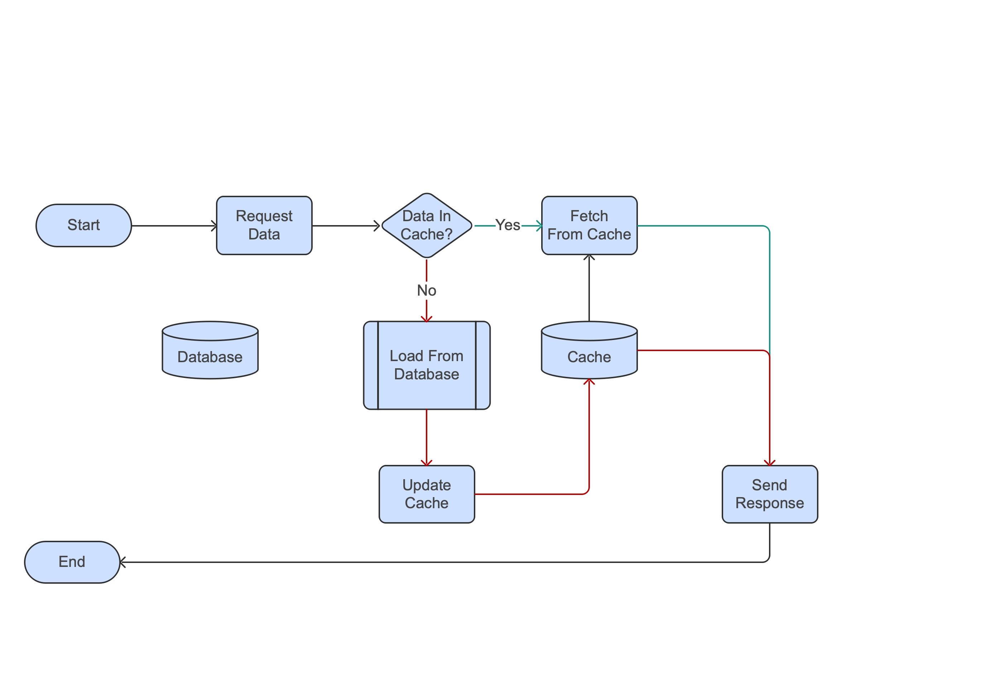
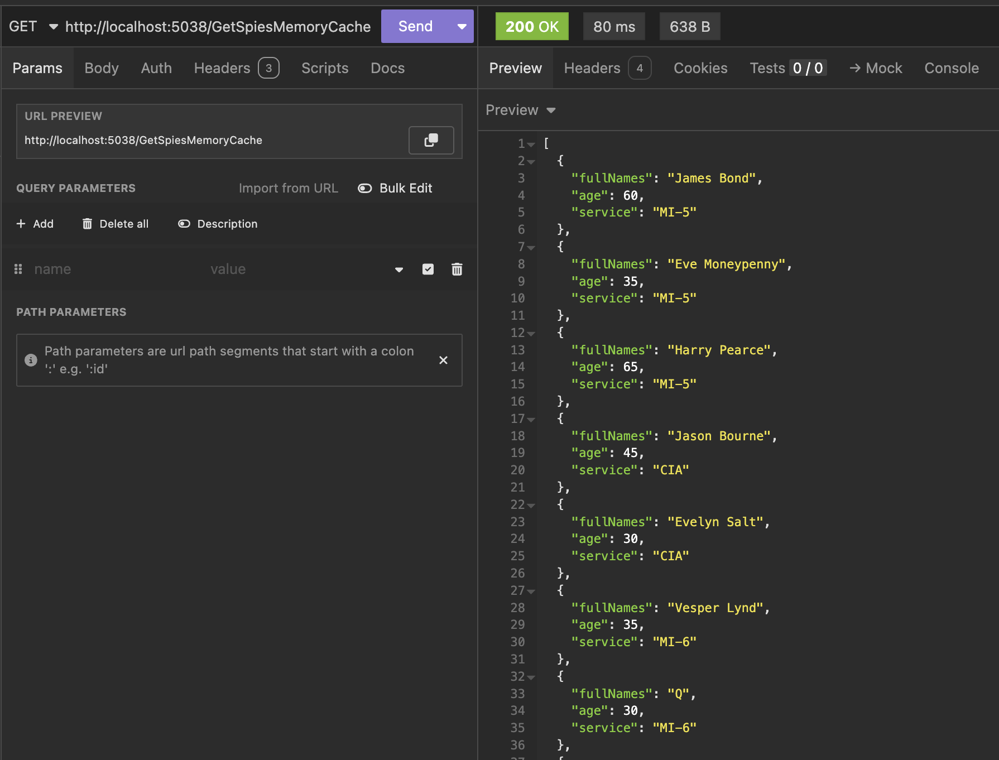
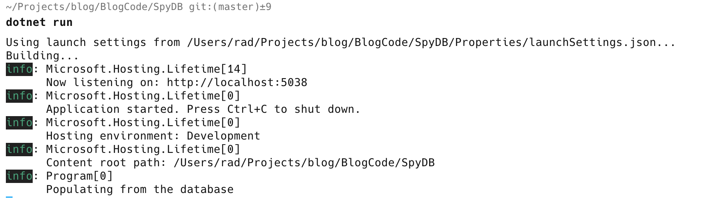
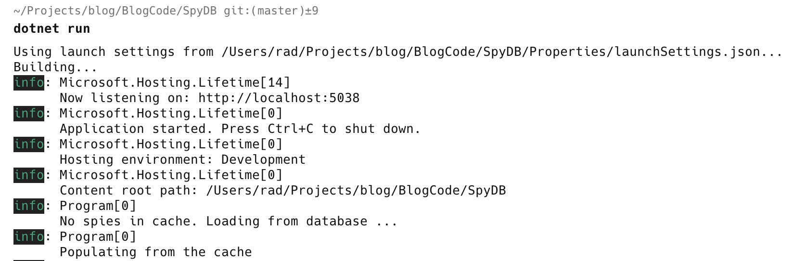

A large percentage of applications, web and otherwise, usually have a database of some sort somewhere. When it comes to improving performance or throughput, a number of things can be done to improve the performance of the database

1. [Indexing](https://www.atlassian.com/data/databases/how-does-indexing-work)
2. Reducing data returned in queries
3. [Normalization](https://en.wikipedia.org/wiki/Database_normalization) (to reduce redundancy)
4. [De-normalization](https://en.wikipedia.org/wiki/Denormalization) (to reduce joins)

But no matter what initiatives you take to improve database performance, the fact remains that the slowest part of an application is usually the database access.

A strategy to mitigate this is to use some sort of [cache](https://en.wikipedia.org/wiki/Cache_(computing)).

The thinking here is that once you have fetched the data once, depending on the data, if a similar request comes, there is no need to re-fetch it again from the database - you can maintain a copy of the data in memory and then serve that.

This is called [in-memory caching](https://www.gridgain.com/resources/glossary/in-memory-computing-platform/in-memory-cache).



Support for in-memory caching is available in .NET by injecting the [IMemoryCache](https://learn.microsoft.com/en-us/aspnet/core/performance/caching/memory?view=aspnetcore-9.0) into your minimal api, controller or service.

Let us take a simple example: a web API that uses this model:

```csharp
public record Spy(string FullNames, int Age, string Service);
```

Instead of a database, we will use a simple in-memory collection to simulate a database and populate that at startup

```csharp
Spy[] allSpies =
[
  new Spy("James Bond", 60, "MI-5"),
  new Spy("Eve Moneypenny", 35, "MI-5"),
  new Spy("Harry Pearce", 65, "MI-5"),
  new Spy("Jason Bourne", 45, "CIA"),
  new Spy("Evelyn Salt", 30, "CIA"),
  new Spy("Vesper Lynd", 35, "MI-6"),
  new Spy("Q", 30, "MI-6"),
  new Spy("Ethan Hunt", 45, "IMF"),
  new Spy("Luther Stickell", 48, "IMF"),
  new Spy("Benji Dunn", 36, "IMF"),
  new Spy("Adam Carter", 40, "MI-5"),
  new Spy("Ros Myers", 37, "MI-5")
];
```

Next, we configure our application to register the cache.

```csharp
// Register the cache with dependency injection
builder.Services.AddMemoryCache();
```

Finally, we write a simple API implementing the logic in the flowchart above.

The final code looks like this.

```csharp
app.MapGet("/GetSpiesMemoryCache", (IMemoryCache cache) =>
  {
    // Check if the list of spies is in the cache.
    // If so, fetch that and return it
    if (cache.TryGetValue(allSpiesKey, out Spy[]? spies))
    	return spies;

    // Configure our cache memory options.
    // We want the cache to expire in 5 minutes
    var cacheOptions = new MemoryCacheEntryOptions
    {
    	AbsoluteExpirationRelativeToNow = TimeSpan.FromMinutes(5)
    };

    // Here we would query the database and store the result
    // in the cache
    cache.Set(allSpiesKey, allSpies, cacheOptions);

    return allSpies;
  })
  .WithName("GetSpiesFromMemoryCache");

app.Run();
```

If we run the application and query the endpoint, we should get our result.



Of note is the [MemoryCacheEntryOptions](https://learn.microsoft.com/en-us/dotnet/api/microsoft.extensions.caching.memory.memorycacheentryoptions?view=net-9.0-pp) - this is what is used to configure how long before to flush the cache. In our case, it is every 5 minutes. This is called **absolute expiry**.

You can also set a **sliding expiration** that resets the timer every time an entry is accessed.

Also, note the use of a cache key, in our case `allSpiesKey`. This is what is used to refer to the data in the cache for setting and fetching.

One major problem with this code is the logic around checking whether the cache has an entry and populating it is not [thread-safe](https://en.wikipedia.org/wiki/Thread_safety). If two concurrent requests are received at almost the same time, it is possible for both to attempt to update the cache at the same time and depending on the timing, it is possible for both fetches to return different results.

This can be improved using the [GetOrCreate](https://learn.microsoft.com/en-us/dotnet/api/microsoft.extensions.caching.memory.cacheextensions.getorcreate?view=net-9.0-pp) method.

```csharp
  app.MapGet("/GetSpiesMemoryCache", (IMemoryCache cache, ILogger<Program> logger) =>
  {
    return cache.GetOrCreate(allSpiesKey, entry =>
    {
      entry.SetAbsoluteExpiration(TimeSpan.FromMinutes(5));
      // Log that we are populating from the 'database'
      logger.LogInformation("Populating from the database");
      return allSpies;
      });
    })
  .WithName("GetSpiesFromMemoryCache");
```

There is a bit more going on here

1. I have injected an `ILogger<Program>` so that I can log whenever the data is NOT being populated from the cache
2. I am using the `GetOrCreate` method and passing two parameters - a cache key (how to locate the data in the cache) and a function that is responsible for fetching the data if it is not found in the cache.

If we run this and hit the endpoint several times (within the span of 5 minutes), the logs will only show on request to the 'database'.



We can make three further improvements to increase the performance of this API

1. Make it asynchronous by adding the async keyword to the API method and using the async version of the `GetOrCreate method` - [GetOrCreateAsync](https://learn.microsoft.com/en-us/dotnet/api/microsoft.extensions.caching.memory.cacheextensions.getorcreateasync?view=net-9.0-pp)
2. Add support for a [cancellation token](https://medium.com/@mitesh_shah/a-deep-dive-into-c-s-cancellationtoken-44bc7664555f) to allow clients to abort requests
3. Refactor getting all spies to a local function to demonstrate long-running logic in a different method that may take time

The final API will look like this:

```csharp
app.MapGet("/GetSpiesMemoryCache", async (IMemoryCache cache, ILogger<Program> logger, CancellationToken token) =>
  {
    return await cache.GetOrCreateAsync(allSpiesKey, entry =>
    {
      entry.SetAbsoluteExpiration(TimeSpan.FromMinutes(5));
      // Log that we are populating from the 'database'
      logger.LogInformation("Populating from the database");
      // Local function to simulate cancellable query to database
      return GetAllSpiesAsync(token);
    });
  })
  .WithName("GetSpiesFromMemoryCache");

app.Run();

return;

// Local method to simulate database fecth that supprot cancelling
async Task<Spy[]> GetAllSpiesAsync(CancellationToken token)
{
  // Wait for 5 seconds to simulate work
  await Task.Delay(TimeSpan.FromSeconds(5), token);
  return allSpies;
}
```

If you run the code now, it will initially wait 5 seconds before producing any results and then will return results as quickly as you request them, demonstrating the value of caching.

This code works well if running on a single web application.

But often, this is never the case. Perhaps your web app is running in some sort of cluster. Or you need to share the cache with a completely different application altogether.

In this case, the In-memory cache will not fit the bill.

In such a scenario, you will need to use a distributed cache, which is a cache that is accessible from different applications or even different machines altogether. A popular distributed cache is [Redis](https://redis.io/), and Microsoft recently released an open-source drop-in replacement named [Garnet](https://microsoft.github.io/garnet/docs).

To make use of this, you need to do the following:

1. Install the Nuget package for Redis - [Microsoft.Extensions.Caching.StackExchangeRedis](https://learn.microsoft.com/en-us/dotnet/api/microsoft.extensions.caching.stackexchangeredis.rediscache?view=net-9.0-pp)
2. Configure the program startup dependency injection to register and configure `Redis`
3. Inject [IDistributedCache](https://learn.microsoft.com/en-us/dotnet/api/microsoft.extensions.caching.distributed.idistributedcache?view=net-9.0-pp) into your API, Controller or Service
4. Write the code to fetch data from the cache and populate it if not present.

The final code looks like this:

```csharp
using System.Text;
using System.Text.Json;
using Microsoft.Extensions.Caching.Distributed;
using Microsoft.Extensions.Caching.Memory;

// Define Our Keys

const string allSpiesKey = nameof(allSpiesKey);

// Create an in-memory list to represent a database

Spy[] allSpies =
[
  new Spy("James Bond", 60, "MI-5"),
  new Spy("Eve Moneypenny", 35, "MI-5"),
  new Spy("Harry Pearce", 65, "MI-5"),
  new Spy("Jason Bourne", 45, "CIA"),
  new Spy("Evelyn Salt", 30, "CIA"),
  new Spy("Vesper Lynd", 35, "MI-6"),
  new Spy("Q", 30, "MI-6"),
  new Spy("Ethan Hunt", 45, "IMF"),
  new Spy("Luther Stickell", 48, "IMF"),
  new Spy("Benji Dunn", 36, "IMF"),
  new Spy("Adam Carter", 40, "MI-5"),
  new Spy("Ros Myers", 37, "MI-5")
];

var builder = WebApplication.CreateBuilder(args);

// Register the cache with dependency injection
builder.Services.AddMemoryCache();
builder.Services.AddStackExchangeRedisCache(options =>
{
  // The Redis connection string
  options.Configuration = "localhost:6379";
});

var app = builder.Build();

app.MapGet("/GetSpiesDistributedCache",
async (IDistributedCache cache, ILogger<Program> logger, CancellationToken token) =>
  {
    var spyData = await cache.GetAsync(allSpiesKey, token);

    if (spyData == null)
    {
    	logger.LogInformation("No spies in cache. Loading from database ...");
      // Could not find in cache. Load from 'database'
      var spies = await GetAllSpiesAsync(token);
      // Serialize to JSON and encode into a byte array
      spyData = Encoding.Default.GetBytes(JsonSerializer.Serialize(spies));
      // Update the cache
      await cache.SetAsync(allSpiesKey, spyData, new DistributedCacheEntryOptions
      {
          AbsoluteExpirationRelativeToNow = TimeSpan.FromMinutes(5)
      }, token);
    }

    // If we are here, we found data in the cache
    logger.LogInformation("Populating from the cache");
    return JsonSerializer.Deserialize<Spy[]>(spyData);
  })
  .WithName("GetSpiesFromDistributedCache");

app.Run();

return;

// Local method to simulate database fetch that support cancelling
async Task<Spy[]> GetAllSpiesAsync(CancellationToken token)
{
  // Wait for 5 seconds to simulate work
  await Task.Delay(TimeSpan.FromSeconds(5), token);
  return allSpies;
}
```

If we run the code and make two requests, you will see in the console that the first is served from the database but the second is from the cache.



Unlike `InMemoryCache`, [GetAsync](https://learn.microsoft.com/en-us/dotnet/api/microsoft.extensions.caching.distributed.idistributedcache.getasync?view=net-9.0-pp#microsoft-extensions-caching-distributed-idistributedcache-getasync(system-string-system-threading-cancellationtoken)) and [SetAsync](https://learn.microsoft.com/en-us/dotnet/api/microsoft.extensions.caching.distributed.idistributedcache.setasync?view=net-9.0-pp) are thread-safe.

If you have a cluster or web farm for this app or want to share the cache between a web app and an API and a service, this solution will work well.

However, there are still some unresolved problems

1. If, just after application startup, there are 50 simultaneous requests for some data. What will happen is all 50 requests will fail to find data in the cache, and therefore, there will be 50 requests to the database to populate the cache. This is called a [stampede](https://en.wikipedia.org/wiki/Cache_stampede).
2. Sometimes, there are valid reasons to cache some data in memory rather than in a distributed cache. In such a scenario, you will need to inject both the `IMemoryCache` and the `IDistributedCache`.
3. The current serialization options for a distributed cache are only a `byte` array or a `string`. You might want to cache data in alternative formats, such as [XML](https://aws.amazon.com/what-is/xml/) or [Protocol Buffers](https://protobuf.dev/).
4. The APIs for In-Memory and Distributed Cache are similar but not the same. You can't just swap one out with the other. You generally will need to decide ahead of time which one to pick and use.

A possible solution to this is the [HybridCache](https://learn.microsoft.com/en-us/aspnet/core/performance/caching/hybrid?view=aspnetcore-9.0), which attempts to solve these problems.

To use it, you need to do the following

1. Install the Nuget Package [Microsoft.Extensions.Caching.Hybrid](https://www.nuget.org/packages/Microsoft.Extensions.Caching.Hybrid/). It is currently (as of 22 Dec 2024) in pre-release, so install it like this:
	```bash
	dotnet add package Microsoft.Extensions.Caching.Hybrid --version 9.0.0-preview.9.24556.5
	```
2. Configure the cache for dependency injection
3. Inject `HypridCache` into your minimal APIs, controllers or services

The code with `HybridCache` looks like this:

```csharp
using Microsoft.Extensions.Caching.Hybrid;

// Define Our Keys

const string allSpiesKey = nameof(allSpiesKey);

// Create an in-memory list to represent a database

Spy[] allSpies =
[
  new Spy("James Bond", 60, "MI-5"),
  new Spy("Eve Moneypenny", 35, "MI-5"),
  new Spy("Harry Pearce", 65, "MI-5"),
  new Spy("Jason Bourne", 45, "CIA"),
  new Spy("Evelyn Salt", 30, "CIA"),
  new Spy("Vesper Lynd", 35, "MI-6"),
  new Spy("Q", 30, "MI-6"),
  new Spy("Ethan Hunt", 45, "IMF"),
  new Spy("Luther Stickell", 48, "IMF"),
  new Spy("Benji Dunn", 36, "IMF"),
  new Spy("Adam Carter", 40, "MI-5"),
  new Spy("Ros Myers", 37, "MI-5")
];

var builder = WebApplication.CreateBuilder(args);

// This is to disable the compiler complaining that the cache is in preview
#pragma warning disable EXTEXP0018
builder.Services.AddHybridCache(options =>
{
    options.DefaultEntryOptions = new HybridCacheEntryOptions
    {
        Expiration = TimeSpan.FromMinutes(5),
        LocalCacheExpiration = TimeSpan.FromMinutes(5)
    };
});
#pragma warning restore EXTEXP0018

var app = builder.Build();

app.MapGet("/GetSpiesHybridCache",
        async (HybridCache cache, ILogger<Program> logger, CancellationToken token) =>
        {
            // You can override the global entry options here
            var localEntryOptions = new HybridCacheEntryOptions
            {
                Expiration = TimeSpan.FromMinutes(5),
                LocalCacheExpiration = TimeSpan.FromMinutes(5)
            };
            
            return await cache.GetOrCreateAsync(allSpiesKey, async localCancellationToken =>
                {
                    logger.LogInformation("Populating from the database");
                    return await GetAllSpiesAsync(localCancellationToken);
                },
                localEntryOptions,
                cancellationToken: token);
        })
    .WithName("GetSpiesFromHybridCache");

app.Run();

return;

// Local method to simulate database fetch that support cancelling
async Task<Spy[]> GetAllSpiesAsync(CancellationToken token)
{
  // Wait for 5 seconds to simulate work
  await Task.Delay(TimeSpan.FromSeconds(5), token);
  return allSpies;
}
```

A couple of things to note here.

1. When using the `HybridCache`, you do not need to register the InMemory Cache. It is registered and used automatically.
2. If you register a distributed cache, the hybrid cache will use that as a secondary cache.

Removing items from the `HybridCache` is as simple as calling the `RemoveAsync` method, passing the **key** and (optionally) the `CancellationToken`

```csharp
await cache.RemoveAsync(allSpiesKey, token);
```

A final benefit of the `HybridCache` is that it allows you to tag entries. This is information provided as an `IEnumerable<T>` of `string` that is attached to the cache entry. This is an elegant solution to a common problem where you are required to invalidate related cache data, for instance, a customer, their orders and their invoices.

This is achieved using one of the overloads for `GetOrCreateAsync`.

```csharp
// Create tags
string[] tags = ["Sunday", "December"];
// You can override the global entry options here
var localEntryOptions = new HybridCacheEntryOptions
{
    Expiration = TimeSpan.FromMinutes(5),
    LocalCacheExpiration = TimeSpan.FromMinutes(5)
};

return await cache.GetOrCreateAsync(allSpiesKey, async localCancellationToken =>
    {
        logger.LogInformation("Populating from the database");
        return await GetAllSpiesAsync(localCancellationToken);
    },
    localEntryOptions,
    tags,
    cancellationToken: token);
```

You can then eject any entries by their tags like this:

```csharp
await cache.RemoveByTagAsync(["Any", "Of", "These"], token);
```

**The logic around removal by tag is currently work in progress and is not currently functional.**

To demonstrate a complete API with cache invalidation, we can create three more APIs that use the `HybridCache`  -  one to **View** a `Spy`, one to **Create** a `Spy` and one to **Delete** a `Spy`. For a more complete example, we will start by modifying the `Spy` to add an ID property like this:

```csharp
public record Spy(int Id, string FullNames, int Age, string Service);
```

Then, rather than use an array as the collection, we modify it to a `List<Spy>`

We then add a type to support the **Creation** of a `Spy`

```csharp
public record CreateSpyRequest(string FullNames, int Age, string Service);
```

We then add a method to simulate the work of inserting a `Spy`

```csharp
async Task AddSpyAsync(Spy spy, CancellationToken token)
{
  // Wait for 5 seconds to simulate work
  await Task.Delay(TimeSpan.FromSeconds(5), token);
  allSpies.Add(spy);
}
```

The complete code is as follows:

```csharp
using System.Text;
using System.Text.Json;
using Microsoft.Extensions.Caching.Distributed;
using Microsoft.Extensions.Caching.Hybrid;
using Microsoft.Extensions.Caching.Memory;

// Define Our Keys

const string allSpiesKey = nameof(allSpiesKey);

// Create an in-memory list to represent a database

List<Spy> allSpies =
[
    new Spy(1, "James Bond", 60, "MI-5"),
    new Spy(2, "Eve Moneypenny", 35, "MI-5"),
    new Spy(3, "Harry Pearce", 65, "MI-5"),
    new Spy(4, "Jason Bourne", 45, "CIA"),
    new Spy(5, "Evelyn Salt", 30, "CIA"),
    new Spy(6, "Vesper Lynd", 35, "MI-6"),
    new Spy(7, "Q", 30, "MI-6"),
    new Spy(8, "Ethan Hunt", 45, "IMF"),
    new Spy(9, "Luther Stickell", 48, "IMF"),
    new Spy(10, "Benji Dunn", 36, "IMF"),
    new Spy(11, "Adam Carter", 40, "MI-5"),
    new Spy(12, "Ros Myers", 37, "MI-5")
];

var builder = WebApplication.CreateBuilder(args);

// Register the cache with dependency injection
builder.Services.AddMemoryCache();
builder.Services.AddStackExchangeRedisCache(options =>
{
    // The Redis connection string
    options.Configuration = "localhost:6379";
});

#pragma warning disable EXTEXP0018
builder.Services.AddHybridCache(options =>
{
    options.DefaultEntryOptions = new HybridCacheEntryOptions
    {
        Expiration = TimeSpan.FromMinutes(5),
        LocalCacheExpiration = TimeSpan.FromMinutes(5)
    };
});
#pragma warning restore EXTEXP0018

var app = builder.Build();

app.MapGet("/GetSpiesMemoryCache", async (IMemoryCache cache, ILogger<Program> logger, CancellationToken token) =>
    {
        return await cache.GetOrCreateAsync(allSpiesKey, entry =>
        {
            entry.SetAbsoluteExpiration(TimeSpan.FromMinutes(5));
            // Log that we are populating from the 'database'
            logger.LogInformation("Populating from the database");
            // Local function to simulate cancellable query to database
            return GetAllSpiesAsync(token);
        });
    })
    .WithName("GetSpiesFromMemoryCache");

app.MapGet("/GetSpiesDistributedCache",
        async (IDistributedCache cache, ILogger<Program> logger, CancellationToken token) =>
        {
            var spyData = await cache.GetAsync(allSpiesKey, token);

            if (spyData == null)
            {
                logger.LogInformation("No spies in cache. Loading from database ...");
                // Could not find in cache. Load from 'database'
                var spies = await GetAllSpiesAsync(token);
                // Serialize to JSON and encode into a byte array
                spyData = Encoding.Default.GetBytes(JsonSerializer.Serialize(spies));
                // Update the cache
                await cache.SetAsync(allSpiesKey, spyData, new DistributedCacheEntryOptions
                {
                    AbsoluteExpirationRelativeToNow = TimeSpan.FromMinutes(5)
                }, token);
            }

            // If we are here, we found data in the cache
            logger.LogInformation("Populating from the cache");
            return JsonSerializer.Deserialize<Spy[]>(spyData);
        })
    .WithName("GetSpiesFromDistributedCache");

app.MapGet("/GetSpiesHybridCache",
        async (HybridCache cache, ILogger<Program> logger, CancellationToken token) =>
        {
            // Create tags
            string[] tags = ["Sunday", "December"];
            // You can override the global entry options here
            var localEntryOptions = new HybridCacheEntryOptions
            {
                Expiration = TimeSpan.FromMinutes(5),
                LocalCacheExpiration = TimeSpan.FromMinutes(5)
            };


            return await cache.GetOrCreateAsync(allSpiesKey, async localCancellationToken =>
                {
                    logger.LogInformation("Populating from the database");
                    return await GetAllSpiesAsync(localCancellationToken);
                },
                localEntryOptions,
                tags,
                cancellationToken: token);
        })
    .WithName("GetSpiesFromHybridCache");

app.MapGet("/Spies/{id:int}", (int id) =>
{
    // Try and find the spy in the cache
    var spy = allSpies.SingleOrDefault(x => x.Id == id);

    // If null, wasn't found
    if (spy == null)
        return Results.NotFound();

    return Results.Ok(spy);
}).WithName("ViewSpyHybridCache");

app.MapPost("/CreateSpyHybridCache",
        async (CreateSpyRequest request, HybridCache cache, CancellationToken token) =>
        {
            // Add the spy to the list. The ID generation is simplistic and should not be done
            // like this in production as it isn't thread-safe
            var newSpy = new Spy(allSpies.Count + 1, request.FullNames, request.Age, request.Service);
            await AddSpyAsync(newSpy, token);
            // Invalidate the cache
            await cache.RemoveAsync(allSpiesKey, token);
            // Here we should redirect to the new Spy
            return Results.Created($"Spies/{newSpy.Id}", newSpy);
        })
    .WithName("CreateSpyWithHybridCache");
app.Run();

app.MapDelete("/DeleteSpyHybridCache/{id:int}",
        async (int id, HybridCache cache, CancellationToken token) =>
        {
            var removedSpies = allSpies.RemoveAll(x => x.Id == id);

            // Check of any spies were removed
            if (removedSpies == 0)
                return Results.NotFound();

            // If we are here, a spy was removed. Invalidate the cache
            await cache.RemoveAsync(allSpiesKey, token);
            // Return status
            return Results.NoContent();
        })
    .WithName("DeleteSpyWithHybridCache");
app.Run();

return;

// Local method to simulate database fetch that supports cancelling
async Task<Spy[]> GetAllSpiesAsync(CancellationToken token)
{
    // Wait for 5 seconds to simulate work
    await Task.Delay(TimeSpan.FromSeconds(5), token);
    return allSpies.ToArray();
}

async Task AddSpyAsync(Spy spy, CancellationToken token)
{
    // Wait for 5 seconds to simulate work
    await Task.Delay(TimeSpan.FromSeconds(5), token);
    allSpies.Add(spy);
}
```

### TLDR

**The Hybrid Cache, when completed, will offer a very powerful way to utilize caching, whether locally in memory or distributed. It is [not specific to .NET 9](https://www.nuget.org/packages/Microsoft.Extensions.Caching.Hybrid/#supportedframeworks-body-tab) and should be usable by most .NET implementations.**

The complete API code showing all this is in my [GitHub](https://github.com/conradakunga/BlogCode/tree/master/2024-12-23%20-%20Caching%20In%20.NET%20Applications).

> [This article is part of the 2024 C# Advent!](https://www.csadvent.christmas/)

Happy hacking!