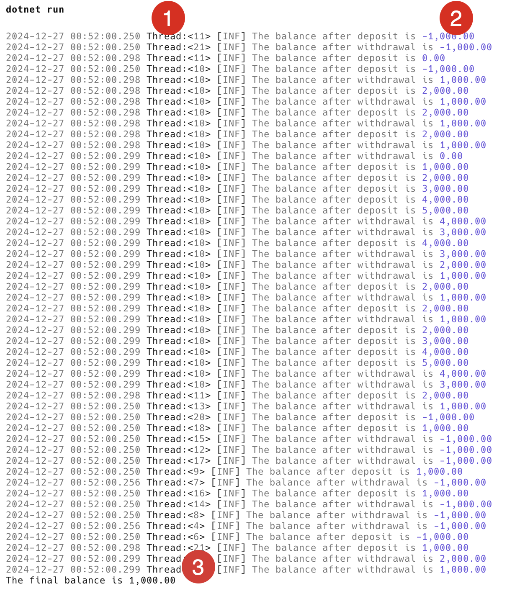

With the advent of computers with multiple processors and multiple cores, [parallelism](https://en.wikipedia.org/wiki/Parallel_computing) can be increasingly used to improve software performance.

My MacBook, for example, has 16 cores.


The challenge, of course, is that you must be very careful when writing multithreaded code that accesses common data because you can easily introduce bugs that are very difficult to detect and correct as they may sporadically appear and disappear.

Let us take an example of an `Account` class that allows `Withdrawal` and `Deposit` and maintains a `Balance`.

The code looks like this:

```csharp
public sealed class Account
{
    public decimal Balance { get; private set; }

    public void Deposit(decimal amount)
    {
      Balance += amount;
    }

    public void Withdraw(decimal amount)
    {
      Balance -= amount;
    }
}
```

We then have a simple program that **Deposits** 1,000 25 times and **Withdraws** 1,000 25 times in different threads so as to demonstrate the problems that can arise with multi-threaded code.

```csharp
using Serilog;

// Create logger configuration
var config = new LoggerConfiguration()
    // Enrich with thread id
    .Enrich.WithThreadId()
    // Write to console with specified template
    .WriteTo.Console(
        outputTemplate:
        "{Timestamp:yyyy-MM-dd HH:mm:ss.fff} Thread:<{ThreadId}> [{Level:u3}] {Message:lj} {NewLine}{Exception}");

// Create the logger
Log.Logger = config.CreateLogger();

// Create an account
var account = new Account();

// Create a list of tasks to deposit and withdraw money
// at the end the balance should be 0
List<Task> tasks = [];
for (var i = 0; i < 25; i++)
{
    tasks.Add(Task.Run(() =>
    {
        account.Deposit(1000);
        Log.Information("The balance after deposit is {Balance:#,0.00}", account.Balance);
    }));

    tasks.Add(Task.Run(() =>
    {
        account.Withdraw(1000);
        Log.Information("The balance after withdrawal is {Balance:#,0.00}", account.Balance);
    }));
}

// Execute all the tasks
await Task.WhenAll(tasks);

// Print final balance
Console.WriteLine($"The final balance is {account.Balance:#,0.00}");
```

To make the logging clearer, I am using the [Serilog.Sinks.Console](https://github.com/serilog/serilog-sinks-console) package as well as the [Serilog.Erichers.Thread](https://github.com/serilog/serilog-enrichers-thread) with a template configured to display the `ThreadID` of the currently running thread.


Given we are depositing 25 times and withdrawing 25 times, the expectation is that the final balance should be 0.

When I ran this code, I got the following:



1. Is the `ThreadID` that is changing as the runtime creates and allocates threads

2. Is the `Balance` after the operation. Note that in many cases, the balance changes as the log is being written; for example, the first entry.

    ```plaintext
    2024-12-27 00:52:00.250 Thread:<11> [INF] The balance after deposit is -1,000.00 
    ```

Note that the closing `Balance` is 1,000, which should be impossible.

If I run the code a second time, I get the following:


Note here the closing `Balance` is -5,000.

The problem here is that **multiple threads are accessing and mutating our account at the same time**, leading to inconsistent and invalid state.  Such code is said NOT to be thread-safe.

The solution to this problem is to introduce some sort of mechanism to inform the runtime that the `Account` should only be accessed by one thread at a time.

A simple way to address this is to introduce a [lock](https://learn.microsoft.com/en-us/dotnet/csharp/language-reference/statements/lock). This is an object that the runtime can be instructed to use to restrict access to a resource per thread.

The `Account` can thus be updated as follows:

```csharp
public sealed class Account
{
    private readonly object _lock = new();
    public decimal Balance { get; private set; }

    public void Deposit(decimal amount)
    {
        lock (_lock)
        {
            Balance += amount;
        }
    }

    public void Withdraw(decimal amount)
    {
        lock (_lock)
        {
            Balance -= amount;
        }
    }
}
```

If I run this a couple of times, I get a consistent closing Balance of 0, as expected.


The magic is taking place here:


The code within the statement block is called a **[critical section](https://en.wikipedia.org/wiki/Critical_section)**.

Before the existing thread can update the `Balance`, it must first secure a `Lock`. If it cannot (because another thread has succeeded), the executing thread will **wait** until it can secure the lock.

This mechanism has been improved in .NET 9 with the creation of an actual type called a [Lock](https://learn.microsoft.com/en-us/dotnet/api/system.threading.lock?view=net-9.0).

We can update our `Account` class as follows to modify the definition of the lock from an object to a Lock

```csharp
private readonly Lock _lock = new();
```

The rest of the code remains the same.

The new `Lock` also allows you to use a new syntax for indicating code that is protected. The code below shows the `Deposit` method using the `lock` syntax and the `Withdraw` method using the new [EnterScope](https://learn.microsoft.com/en-us/dotnet/api/system.threading.lock.enterscope?view=net-9.0) method.

```csharp
public sealed class Account
{
    private readonly Lock _lock = new();
    public decimal Balance { get; private set; }

    public void Deposit(decimal amount)
    {
        lock (_lock)
        {
            Balance += amount;
        }
    }

    public void Withdraw(decimal amount)
    {
        using (_lock.EnterScope())
        {
            Balance -= amount;
        }
    }
}
```

My preference would be to use the `EnterScope()` method because if someone were to change the Lock back to an object mistakenly, the code would not be able to compile.

There are a couple be benefits to this:

1. Clearer syntax and explicity types to communicate meaning to anyone reading the code
2. Under the hood, the compiler generates different code from the old approach that is more performant
3. The lock uses [Dispose](https://learn.microsoft.com/en-us/dotnet/standard/design-guidelines/dispose-pattern) semantics that can prevent bugs from developers forgetting to release the Lock.

### TLDR

**The new `Lock` class makes it easier to write thread-safe code that communicates intent and has better performance.**

The code is in my [GitHub](https://github.com/conradakunga/BlogCode/tree/master/2024-12-27%20-%20Using%20Locks).

Happy hacking!