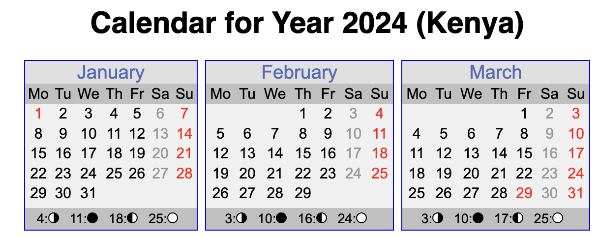
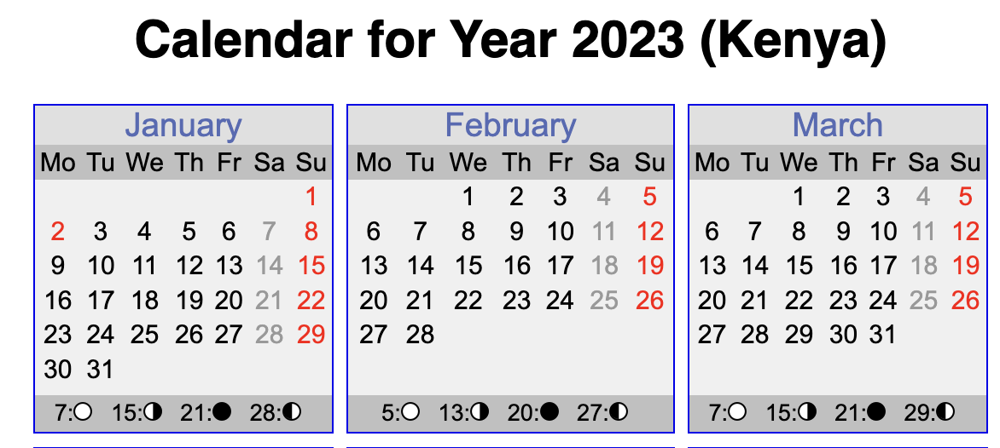
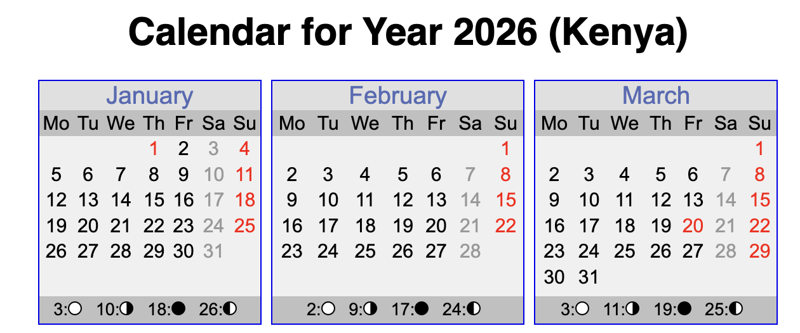
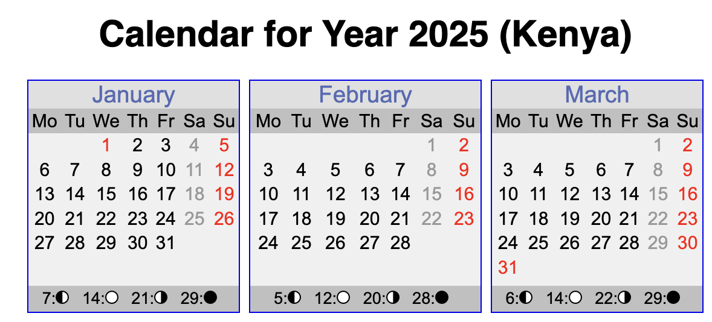

Today is the **28th Of December, 2024**. Which week number is it? That is a tricky question, starting with which dates were in Week #1.

Take this calendar from 2024.



I think it is hard to argue all dates from the 1st to the 7th are on Week #1.

But what about 2023?



If Week #1 is the week that has 1 Jan, that means 31 December is also on Week 1.

Or 2026, where 1 Jan falls in the middle of the week



So the question arises - how do we decide which is the first week of the year?

Turns out there are three possible definitions:

1. The first week with **four or more days falling in January**
2. The first **complete week with all its days in January**
3. The first week with the **first day of January**

The ISO Standard, [ISO 8601](https://en.wikipedia.org/wiki/ISO_8601), uses the first definition.

There is also the debate of which, in fact, is the first day of the week. Most of the time, Monday is considered the first day of the week. But in some places, Sunday is considered the first day of the week.

So, how can we determine this programmatically?

We use the [GregorianCalendar](https://learn.microsoft.com/en-us/dotnet/api/system.globalization.gregoriancalendar?view=net-9.0) class. Like this:

```csharp
// Create the date we want to check
var date = new DateTime(2024, 12, 31);
var cal = new GregorianCalendar();
// Get the week of the year specifying rules for the week and first day
var weekOfYear = cal.GetWeekOfYear(date, CalendarWeekRule.FirstFourDayWeek, DayOfWeek.Monday);
Console.WriteLine(weekOfYear);
```

This prints the following

```plaintext
53
```

Which is wrong. 31 December 2024 is in fact in Week #1 of 2025, which we can see has 5 days in January.



You will see this issue in 2018, 2019, 2024 and 2025, among other dates.

So what do we do about this?

We use the excellent [NodaTime](https://nodatime.org/) library for this purpose. This is a great library that has tackled a lot of the issues with the correct handling of dates and times.

The code to get the Week Number in `NodaTime` is this:

```csharp
// Create our date, using the LocalDate object
var date = new LocalDate(year, 12, 31);
// Indicate our week of the year rules to be ISO
var rule = WeekYearRules.Iso;
// Get the week number
var correctWeekNumber = rule.GetWeekOfWeekYear(date);
Console.WriteLine(correctWeekNumber);
```

This correctly prints the expected value: 1.

If, for whatever reason, you want the legacy behaviour for the rule, you do it like this:

```csharp
var rule = WeekYearRules.FromCalendarWeekRule(CalendarWeekRule.FirstFourDayWeek, DayOfWeek.Monday);
```

The code below is a simple test harness to compare the computation of `NodaTime` with that of the .NET `GregorianCalendar`.

```csharp
// Create the calendar we will be re-using in the loop
var cal = new GregorianCalendar();
// Set our IEnumerable collection
var years = Enumerable.Range(2017, 15);
foreach (var year in years)
{
  // Create our date
  var date = new LocalDate(year, 12, 31);
  // Indicate our week of the year rules to be ISO
  var rule = WeekYearRules.Iso;
  // Get the week number
  var correctWeekNumber = rule.GetWeekOfWeekYear(date);
  var legacyWeekNumber = cal.GetWeekOfYear(new DateTime(year, 12, 31), CalendarWeekRule.FirstFourDayWeek, DayOfWeek.Monday);
  Console.WriteLine($"{year} : NodaTime - {correctWeekNumber} - Gregorian {legacyWeekNumber}");
}
```

This will print the following:

```plaintext
2017 : NodaTime - 52 - Gregorian 52
2018 : NodaTime - 1 - Gregorian 53
2019 : NodaTime - 1 - Gregorian 53
2020 : NodaTime - 53 - Gregorian 53
2021 : NodaTime - 52 - Gregorian 52
2022 : NodaTime - 52 - Gregorian 52
2023 : NodaTime - 52 - Gregorian 52
2024 : NodaTime - 1 - Gregorian 53
2025 : NodaTime - 1 - Gregorian 53
2026 : NodaTime - 53 - Gregorian 53
2027 : NodaTime - 52 - Gregorian 52
2028 : NodaTime - 52 - Gregorian 52
2029 : NodaTime - 1 - Gregorian 53
2030 : NodaTime - 1 - Gregorian 53
2031 : NodaTime - 1 - Gregorian 53
```

Note the number of years from which there is a variance.

### TLDR

**The `GreogrianCalendar` does not consistently correctly compute the week number using ISO rules. If you need that, use `NodaTime` and its `WeekRules`**

Happy hacking!