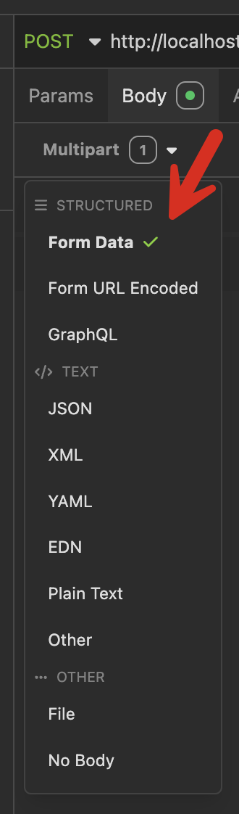
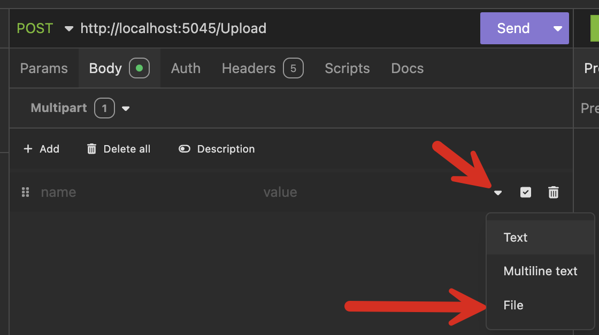
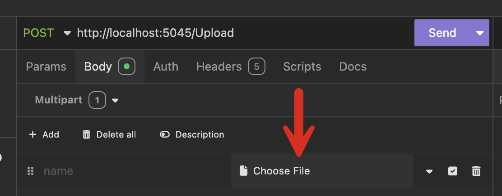
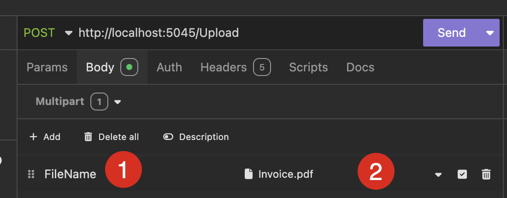
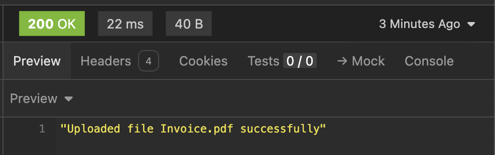

While most of the time, web forms submit form data, you will occasionally need to upload files.

When it comes to dealing with files, there are a number of considerations you will need to make:

1. What **type** of files will you accept? You probably don't want to accept executables and scripts.
2. What **size** of files will you accept? If you allow any file size, it is possible for a denial of service where malicious actors upload a lot of very large files, and your system will be kept busy processing these files. Also, there is the matter of potentially running out of storage.
3. **Where** will you store the files? On disk? In a database? In a [Blob](https://www.cloudflare.com/learning/cloud/what-is-blob-storage/) store like [Amazon](https://aws.amazon.com/s3/) [Azure](https://azure.microsoft.com/en-us/products/storage/blobs) or [Google](https://cloud.google.com/storage)?

The answers to these will inform how you tackle the problem.

Let us implement a simple example that will store files on disk.

```csharp
var builder = WebApplication.CreateBuilder(args);

var app = builder.Build();

// The location that uploaded files will be stored
// This ideally should be stored as a setting
const string fileStoreLocation = "/Users/rad/Projects/Temp/Conrad/Uploaded";

// Create the location, if it doesn't exist
if (!Directory.Exists(fileStoreLocation))
    Directory.CreateDirectory(fileStoreLocation);

// The max file size, 5MB
const int maxFileSize = 5 * 1024 * 1024;

// Allowed file extensions
string[] allowedFileExtensions = [".jpg", ".jpeg", ".png", ".gif", ".pdf", ".docx", ".xlsx"];

app.MapPost("/Upload", async (IFormFile file, ILogger<Program> logger) =>
    {
        // Abort for zero length files
        if (file.Length == 0)
        {
            logger.LogWarning("Uploaded file {FileName} is zero length", file.FileName);
            return Results.BadRequest("File is empty");
        }

        // Abort for files larger than the threshold
        if (file.Length > maxFileSize)
        {
            logger.LogWarning("Uploaded file {FileName} is larger than the allowed size", maxFileSize);
            return Results.BadRequest("File larger than the allowed size");
        }

        // Validate the extension. If the extension is NOT in the array of allowed
        // extensions, block it
        var fileExtension = Path.GetExtension(file.FileName);
        if (allowedFileExtensions.All(ext => fileExtension != ext))
        {
            logger.LogWarning("Uploaded file {FileName} is a {Extension} which is blocked", file.FileName,
                fileExtension);
            return Results.BadRequest("Blocked file extension");
        }

        // Build the filename in preparation for writing
        // Ideally, prepend some sort of unique identifier per file
        // To avoid overwriting older uploaded files with the same name
        var storeFileName = Path.Combine(fileStoreLocation, file.FileName);
        // Write the file to disk asynchronously
        await using (var stream = new FileStream(storeFileName, FileMode.Create))
        {
            await file.CopyToAsync(stream, CancellationToken.None);
        }

        logger.LogInformation("Upload of file {FileName} was successful", file.FileName);
        return Results.Ok($"Uploaded file {file.FileName} successfully");
    }).DisableAntiforgery()
    .WithName("UploadFile");

app.Run();
```

This code does the following:

1. Defines a **location where the files will be stored**, in this case,`/Users/rad/Projects/Temp/Conrad/Uploaded`. I have avoided using a relative location based on the web application because should you deploy multiple instances of this application, you will have a lot of problems around uploaded files being unable to be retrieved as the uploaded files will be stored on the root folder of each web application. In other words, users (assuming users can access their uploads) can only retrieve their uploaded file on the instance they uploaded the file to.
2. It then **creates** the folder if it does not exist.
3. It then **specifies a maximum file size of 5MB**. Ideally, this should be a system setting read at runtime.
4. It then **specifies a list of allowed file extensions**. Note, that the period is part of the extension!
5. It then defines the [POST](https://developer.mozilla.org/en-US/docs/Web/HTTP/Methods/POST) endpoint, `/Upload`
6. The end point
    1. Validates against **zero-length** files
    2. Validates against files **bigger than the allowed limit**
    3. Validates against the **allowed extensions**
    4. If any validations fail, return a [BadRequest (400)](https://developer.mozilla.org/en-US/docs/Web/HTTP/Status/400)
    5. Generates a filename at the Upload file location
    6. Copies the contents of the [Stream](https://learn.microsoft.com/en-us/dotnet/api/system.io.stream?view=net-9.0) of the uploaded file to the new location
    7. Returns a [Success (200)](https://developer.mozilla.org/en-US/docs/Web/HTTP/Status/200)

A couple of additional things of interest.

1. The endpoint calls `DisableAntiforgery`. This is because, by default, the ASP.NET form mechanism has built-in protection from cross-site request forgery that you need to build into your forms. For this example, I have not done so, but in a real-world scenario, the form that submits the file would. You can read about this in detail [here](https://learn.microsoft.com/en-us/aspnet/core/security/anti-request-forgery?view=aspnetcore-9.0).
2. The generated file for storage simply appends the folder location with the file name of the upload. You probably will need to generate some prefix for all your uploaded files to avoid the issue of attempts to overwrite files that had previously been uploaded with the same name.

You can test this API using [Postman](https://www.postman.com/), [Insomnia](https://insomnia.rest/), or your favourite tool (including command line tools like [curl](https://curl.se/) and [HTTPie](https://httpie.io/)).

To test the upload, go to the **Body** section. From the menu, you will want to choose **Form Data** and NOT **File**



Then, on the body section, you can click the dropdown to get the options menu. Go ahead and choose `File`



You will now get an option to choose the file to upload



Once you have chosen the file (2), you can give it a name (1). This name will be used to refer to the file programmatically as a form element; ideally, you will use the same name as on the actual form used to upload the file.



We can then go ahead and send the request.

The response should be as follows:



The equivalent curl request for this is as follows:

```bash
curl --request POST \
  --url http://localhost:5045/Upload \
  --header 'Content-Type: multipart/form-data' \
  --header 'User-Agent: insomnia/10.3.0' \
  --form File=@/Users/rad/WindowsShare/Invoice.pdf
```

### TLDR

This is an end-to-end, working tutorial on how to build a Minimal API endpoint that supports uploading of files

The code is in my [GitHub](https://github.com/conradakunga/BlogCode/tree/master/2024-12-29%20-%20Minimal%20API%20File%20Upload).

Happy Hacking