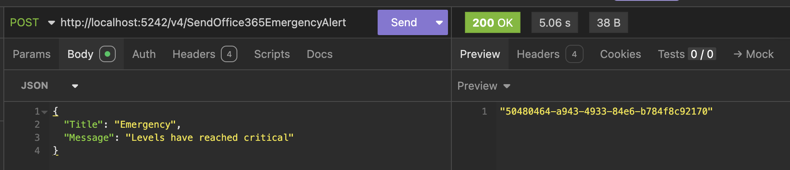
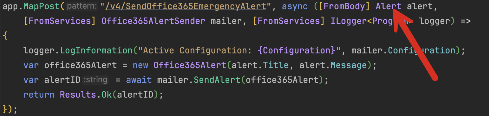

This is Part 2 of a series on Dependency Injection

- [Dependency Injection In C# & .NET Part 1 - Introduction & Basic Implementation]()
- **Dependency Injection In C# & .NET Part 2 - Making Implementations Pluggable (this post)**

In our last post, we looked at what dependency injection is, how to set it up, and how it works to address some basic problems.

In this post, we will extend this further.

Suppose the business decides that due to whatever reasons, they want to use [Office365](https://www.office.com/) as the service to send alerts.

The implementation would look very similar.

First, there is the alert type:

```c#
public record Office365Alert(string Title, string Message);
```

Then there is the implementation of the sender, the `Office365AlertSender`.

```c#
public sealed class Office365AlertSender
{
    private readonly string _key;
    public string Configuration { get; }

    public Office365AlertSender(string key)
    {
        _key = key;
        Configuration = $"Configuration - Key: {_key}";
    }

    public async Task<string> SendAlert(Office365Alert message)
    {
        await Task.Delay(TimeSpan.FromSeconds(5));
        return Guid.NewGuid().ToString();
    }
}
```

Unlike the `GmailAlertSender`, this (fake) implementation only requires a key to operate.

We can then create a class to hold our `Office365` settings.

```c#
public class Office365Settings
{
    public string Key { get; set; } = "";
}
```

Then we update our `appsettings.json` to add the new section

```json
{
  "Logging": {
    "LogLevel": {
      "Default": "Information",
      "Microsoft.AspNetCore": "Warning"
    }
  },
  "AllowedHosts": "*",
  "GmailSettings": {
    "GmailUserName": "username",
    "GmailPassword": "password",
    "GmailPort": 4000
  },
  "Office365Settings": {
    "Key": "Office365Key"
  }
}
```

Then, we update our dependency injection in the program startup to register this sender, starting with registering the settings for injection

```c#
builder.Services.Configure<Office365Settings>(builder.Configuration.GetSection(nameof(Office365Settings)));
```

Then, we configure the DI to register our `Office365AlertSender` to use the settings we have just registered for injection.

```c#
// Register our Office365 sender, passing our settings
builder.Services.AddSingleton<Office365AlertSender>(provider =>
{
    // Fetch the settings from the DI Container
    var settings = provider.GetService<IOptions<Office365Settings>>()!.Value;
    return new Office365AlertSender(settings.Key);
});
```

Finally, we update our endpoints to replace the injected `GmailAlertSender` with an `Office365AlertSender`.

```c#
app.MapPost("/v4/SendOffice365NormalAlert", async (Alert alert, Office365AlertSender mailer) =>
{
    var office365Alert = new Office365Alert(alert.Title, alert.Message);
    var alertID = await mailer.SendAlert(office365Alert);
    return Results.Ok(alertID);
});

app.MapPost("/v4/SendOffice365EmergencyAlert", async ([FromBody] Alert alert,
    [FromServices] Office365AlertSender mailer, [FromServices] ILogger<Program> logger) =>
{
    logger.LogInformation("Active Configuration: {Configuration}", mailer.Configuration);
    var office365Alert = new Office365Alert(alert.Title, alert.Message);
    var alertID = await mailer.SendAlert(office365Alert);
    return Results.Ok(alertID);
});
```

So our change here (apart from renaming the route) is to inject an `Office365AlertSender` and, within the endpoint, build an `Office365Alert` with which to send the message.

If we run our API, we should get the identifier returned.



And in our logs we should see the settings were correctly injected.

```plaintext
info: Program[0]
      Active Configuration: Configuration - Key: Office365Key
```

And then, as is often the case with life, the business decides that that they want the **option to choose which provider to use every calendar year**.

Now, here we have some options.

We can change our endpoints every calendar year to reflect the relevant service. After all, the code is already written—it is just a matter of moving things around. However, this means touching the code, which is error-prone and can quickly become monotonous.

Things get more complicated when one of the nephews of the CEO mentions that where he works, they use Zoho email and have had a great experience, and we should consider using that.

At this point, we must return to the drawing board.

Dependency injection can help with this problem.

Let us start with the data types.

```c#
public record GmailAlert(string Title, string Body);
public record Office365Alert(string Title, string Message);
```

The properties are exactly the same.

We can refactor to a common type

```c#
public record GeneralAlert(string Title, string Message);
```

I am calling it `GeneralAlert` and not `Alert` because Alert is already in use to signify the object coming from the client calling the endpoint.



Which begs the question why don't we use **that** `Alert` directly? Why create a totally new type? It would certainly be simpler.

That is true. But this potentially could be a problem downstream if we use the **same** object on the **client** and **server** sides. Perhaps in the future, we want the client to provide additional information, perhaps a username and a timestamp for logging passwords. Now, our **server-side code would need to change**, regardless of the fact that those parameters are not necessary for sending alerts. And vice-versa - we might need to change the object on the API side to pass additional properties to the sender, **which would break the client**.

In short, it is important to **segregate client-side concerns from server-side concerns**.

Next, let us look at the senders closely, particularly what each requires to send a message.

```c#
// Gmail sender
public async Task<string> SendAlert(GmailAlert message)
{
  await Task.Delay(TimeSpan.FromSeconds(5));
  return Guid.NewGuid().ToString();
}

// Office 365 sender
public async Task<string> SendAlert(Office365Alert message)
{
  await Task.Delay(TimeSpan.FromSeconds(5));
  return Guid.NewGuid().ToString();
}
```

If we look closely, we can see that the parameters these take are similar and, given our refactoring, can take a common parameter.

We can thus add an additional method to both that takes a `GeneralAlert`

```c#
// Gmail sender
public async Task<string> SendAlert(GeneralAlert message)
{
  await Task.Delay(TimeSpan.FromSeconds(5));
  return Guid.NewGuid().ToString();
}

// Office 365 sender
public async Task<string> SendAlert(GeneralAlert message)
{
  await Task.Delay(TimeSpan.FromSeconds(5));
  return Guid.NewGuid().ToString();
}
```

We can then extract a general contract that all alert senders should adhere to by way of an interface.

```c#
interface IAlertSender
{
    public Task<string> SendAlert(GeneralAlert message);
}
```

Finally, we update both senders to indicate that they are compliant with the IAlertSender interface.

The `GmailAlertSender` now looks like this:

```c#
public sealed class GmailAlertSender : IAlertSender
{
    private readonly int _port;
    private readonly string _username;
    private readonly string _password;
    public string Configuration { get; }

    public GmailAlertSender(int port, string username, string password)
    {
        _port = port;
        _username = username;
        _password = password;
        Configuration = $"Configuration - Port: {_port}; Username: {_username}; Password: {_password}";
    }

    public async Task<string> SendAlert(GmailAlert message)
    {
        await Task.Delay(TimeSpan.FromSeconds(5));
        return Guid.NewGuid().ToString();
    }

    // New method that sends a generic GeneralAlert
    public async Task<string> SendAlert(GeneralAlert message)
    {
        await Task.Delay(TimeSpan.FromSeconds(5));
        return Guid.NewGuid().ToString();
    }
}
```

And the `Office365AlertSender` now looks like this:

```c#
public sealed class Office365AlertSender : IAlertSender
{
    private readonly string _key;
    public string Configuration { get; }

    public Office365AlertSender(string key)
    {
        _key = key;
        Configuration = $"Configuration - Key: {_key}";
    }

    public async Task<string> SendAlert(Office365Alert message)
    {
        await Task.Delay(TimeSpan.FromSeconds(5));
        return Guid.NewGuid().ToString();
    }

    // New method that sends a generic GeneralAlert
    public async Task<string> SendAlert(GeneralAlert message)
    {
        await Task.Delay(TimeSpan.FromSeconds(5));
        return Guid.NewGuid().ToString();
    }
}
```

You might ask why we have retained the old `SendAlert` that takes specific alert types. Removing those would be a breaking change, and other parts of the system may still use the existing endpoints as they are.

The next order of business is to modify the dependency injection slightly.

Currently, we are doing this:

```c#
// Register our GmailSender, passing our settings
builder.Services.AddSingleton<GmailAlertSender>(provider =>
{
    // Fetch the settings from the DI Container
    var settings = provider.GetService<IOptions<GmailSettings>>()!.Value;
    return new GmailAlertSender(settings.GmailPort, settings.GmailUserName,
        settings.GmailPassword);
});
// Register our Office365 sender, passing our settings
builder.Services.AddSingleton<Office365AlertSender>(provider =>
{
    // Fetch the settings from the DI Container
    var settings = provider.GetService<IOptions<Office365Settings>>()!.Value;
    return new Office365AlertSender(settings.Key);
});
```

And each endpoint has to be explicitly told what to inject.

Let us assume for the current financial year we want to use Gmail.

We update our DI as follows:

```c#
// Register our generic Office 365 sender, passing our settings
builder.Services.AddSingleton<IAlertSender>(provider =>
{
    // Fetch the settings from the DI Container
    var settings = provider.GetService<IOptions<Office365Settings>>()!.Value;
    return new Office365AlertSender(settings.Key);
});
```

Notice the parameter here to `AddSingleton` is an `IAlertSender` and not a `GmailAlertSender`

What this means is **"any request for an IAlertSender should have a Office365AlertSender returned."**

Finally, we update our endpoints to inject an `IAlertSender`, rather than the GmailAlertSender or the Office365AlertSender. And since we now use a single endpoint regardless of the sender, we can also rename those to the generic `SendEmergencyAlert` and `SendNormalAlert`.

Our endpoints now look like this:

```c#
app.MapPost("/v5/SendNormalAlert", async ([FromBody] Alert alert,
    [FromServices] IAlertSender mailer) =>
{
    // Map the client provide alert to the server side alert
    var genericAlert = new GeneralAlert(alert.Title, alert.Message);
    var alertID = await mailer.SendAlert(genericAlert);
    return Results.Ok(alertID);
});
app.MapPost("/v5/SendEmergencyAlert", async ([FromBody] Alert alert,
    [FromServices] Office365AlertSender mailer, [FromServices] ILogger<Program> logger) =>
{
    logger.LogInformation("Active Configuration: {Configuration}", mailer.Configuration);
    // Map the client provide alert to the server side alert
    var genericAlert = new GeneralAlert(alert.Title, alert.Message);
    var alertID = await mailer.SendAlert(genericAlert);
    return Results.Ok(alertID);
});
```

If now run this app and check the logs, you should see:

```plaintext
info: Program[0]
      Active Configuration: Configuration - Key: Office365Key
```

Indicating that the `Office365AlertSender` serviced that request.

If we want to use a `GmailAlertSender` instead, we change our DI as follows:

```c#
// Register our generic Gmail sender, passing our settings
builder.Services.AddSingleton<IAlertSender>(provider =>
{
    // Fetch the settings from the DI Container
    var settings = provider.GetService<IOptions<GmailSettings>>()!.Value;
    return new GmailAlertSender(settings.GmailPort, settings.GmailUserName,
        settings.GmailPassword);
});
```

If we re-run the code, we should see this in the logs:

```plaintext
info: Program[0]
      Active Configuration: Configuration - Port: 4000; Username: username; Password: password
```

Indicating that a `GmailAlertSender` serviced the request.

Now, say we want to add support for Zoho.

All we need to do is to implement the IAlertSender interface. Suppose Zoho requires senders to authenticate with an **OrganizationID** and a **Secret Key**.

Our Zoho sender would look like this:

```c#
public sealed class ZohoAlertSender : IAlertSender
{
    private readonly string _organizationID;
    private readonly string _secretKey;
    public string Configuration { get; }

    public ZohoAlertSender(string organizationID, string secretKey)
    {
        _organizationID = organizationID;
        _secretKey = secretKey;
        Configuration = $"Configuration - Organization ID: {_organizationID}, secretKey: {_secretKey}";
    }
    public async Task<string> SendAlert(GeneralAlert message)
    {
        await Task.Delay(TimeSpan.FromSeconds(5));
        return Guid.NewGuid().ToString();
    }
}
```

Notice here that our `SendAlert` is a single method that only sends a `GeneralAlert`. There isn't one that sends a `ZohoAlert`, nor do we need to create one. We don't have any backward compatibility issues, so we can afford to do this.

We then, as usual, create a class to store these settings.

```c#
public class ZohoSettings
{
    public string OrganizationID { get; set; } = "";
    public string SecretKey { get; set; } = "";
}
```

We then update our `appsettings.json` to add the new settings

```json
{
  "Logging": {
    "LogLevel": {
      "Default": "Information",
      "Microsoft.AspNetCore": "Warning"
    }
  },
  "AllowedHosts": "*",
  "GmailSettings": {
    "GmailUserName": "username",
    "GmailPassword": "password",
    "GmailPort": 4000
  },
  "Office365Settings": {
    "Key": "Office365Key"
  },
  "ZohoSettings": {
    "OrganizationID": "MyOrg",
    "SecretKey": "Secret"
  }
}
```

We then register our ZohoSettings for DI

```c#
builder.Services.Configure<ZohoSettings>(builder.Configuration.GetSection(nameof(ZohoSettings)));
```

Finally. we change our DI to register our `ZohoAlertSender` as the `IAlertSender`.

```c#
// Register our generic Zoho sender, passing our settings
builder.Services.AddSingleton<IAlertSender>(provider =>
{
    // Fetch the settings from the DI Container
    var settings = provider.GetService<IOptions<ZohoSettings>>()!.Value;
    return new ZohoAlertSender(settings.OrganizationID, settings.SecretKey);
});
```

If we run this now we should see this in the logs.

```plaintext
info: Program[0]
      Active Configuration: Configuration - Organization ID: MyOrg, secretKey: Secret
```

What improvements have we made here?

1. We have **unified the object model** to make the system much more flexible for future improvements
2. We have **eliminated provider-specific endpoints** (for Gmail and Office365) and now have a single generic endpoint capable of sending alerts to any provider.
3. We have made it very **easy to add a new provider** - just implement the IAlertSender interface and register it for DI
4. The endpoints will **generally** never need to change when implementing a new provider - making maintenance and improvements much easier.

There are definitely great improvements, but we are not quite there.

In the next post, we will look at how to use dependency injection to dynamically change providers.

The code is in my [GitHub](https://github.com/conradakunga/BlogCode/tree/master/Mailer). *The source code builds from first principles as outlined in this series of posts with different versions of the API demonstrating the improvements.*

Happy hacking!
