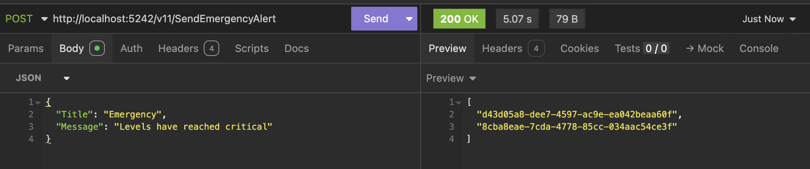

This is Part 5 of a series on dependency injection.

- [Dependency Injection In C# & .NET Part 1 - Introduction & Basic Implementation]()
- [Dependency Injection In C# & .NET Part 2 - Making Implementations Swappable]()
- [Dependency Injection In C# & .NET Part 3 - Making Implementations Pluggable]()
- [Dependency Injection In C# & .NET Part 4 - Making Implementations Hot-Pluggable]()
- **Dependency Injection In C# & .NET Part 5 - Making All Services Available (this post)**
- [Dependency Injection In C# & .NET Part 6 - Implementation Testing]()

In our [last post](), we looked at how to dynamically **swap out the implementations** we want to use **without restarting** the application so as to maximize uptime.

Today we will look at another scenario - where you simultaneously need all the implementations available.

There could be several reasons for this:

1. You want to **decide dynamically** which implementation to use based on some business logic
2. You want to use **multiple implementations** at the same time.

Let us use this scenario:

1. If the time is **before midday**, use the `GmailAlertSender`. Otherwise, use the `Office365AlertSender`
2. Regardless of the implementation used, **always send a copy** using the `ZohoAlertSender`

Our dependency injection does not need to change, as the DI configuration that we will need to inject was already specified earlier:

```c#
builder.Services.Configure<GmailSettings>(builder.Configuration.GetSection(nameof(GmailSettings)));
builder.Services.Configure<Office365Settings>(builder.Configuration.GetSection(nameof(Office365Settings)));
builder.Services.Configure<ZohoSettings>(builder.Configuration.GetSection(nameof(ZohoSettings)));
builder.Services.Configure<GeneralSettings>(builder.Configuration.GetSection(nameof(GeneralSettings)));

// Register our GmailSender, passing our settings
builder.Services.AddSingleton<GmailAlertSender>(provider =>
{
    // Fetch the settings from the DI Container
    var settings = provider.GetService<IOptions<GmailSettings>>()!.Value;
    return new GmailAlertSender(settings.GmailPort, settings.GmailUserName,
        settings.GmailPassword);
});
// Register our Office365 sender, passing our settings
builder.Services.AddSingleton<Office365AlertSender>(provider =>
{
    // Fetch the settings from the DI Container
    var settings = provider.GetService<IOptions<Office365Settings>>()!.Value;
    return new Office365AlertSender(settings.Key);
});

// Register our Zoho sender, passing our settings
builder.Services.AddSingleton<ZohoAlertSender>(provider =>
{
    // Fetch the settings from the DI Container
    var settings = provider.GetService<IOptions<ZohoSettings>>()!.Value;
    return new ZohoAlertSender(settings.OrganizationID, settings.SecretKey);
});
```

Our endpoint we can change to factor in our logic like this:

```c#
app.MapPost("/v10/SendEmergencyAlert", async ([FromBody] Alert alert,
    GmailAlertSender gmailAlertSender, Office365AlertSender office365AlertSender, ZohoAlertSender zohoAlertSender,
    [FromServices] ILogger<Program> logger) =>
{
    // Create the alert
    var genericAlert = new GeneralAlert(alert.Title, alert.Message);
    // Create the Zoho task that always runs
    var zohoTask = zohoAlertSender.SendAlert(genericAlert);
    if (TimeOnly.FromDateTime(DateTime.Now) < new TimeOnly(12, 0, 0, 0))
    {
        // It is before midday. Use the gmail Sender, and also send a copy using Zoho.
        // Create task for this work and run them in parallel with the Zoho
        var gmailTask = gmailAlertSender.SendAlert(genericAlert);
        var morningResults = await Task.WhenAll(gmailTask, zohoTask);
        return Results.Ok(morningResults);
    }

    // It is after midday. Use the Office365 Sender, and also send a copy using Zoho.
    // Create task tasks for this work and run in parallel with the Zoho
    var office365Task = office365AlertSender.SendAlert(genericAlert);
    var afternoonResults = await Task.WhenAll(office365Task, zohoTask);
    return Results.Ok(afternoonResults);
});
```

Here, we are injecting all our `AlertSenders` into the endpoint.

Another way of achieving this is to **defer the injection** of the `AlertSenders`, inject the [IServiceProvider](https://learn.microsoft.com/en-us/dotnet/api/system.iserviceprovider?view=net-9.0) and then use that to resolve the senders.

```c#
app.MapPost("/v11/SendEmergencyAlert", async ([FromBody] Alert alert,
    IServiceProvider provider, [FromServices] ILogger<Program> logger) =>
{
    // Retrieve the senders from DI
    var zohoAlertSender = provider.GetRequiredService<ZohoAlertSender>();
    var office365AlertSender = provider.GetRequiredService<Office365AlertSender>();
    var gmailAlertSender = provider.GetRequiredService<GmailAlertSender>();

    // Create the alert
    var genericAlert = new GeneralAlert(alert.Title, alert.Message);
    // Create the Zoho task that always runs
    var zohoTask = zohoAlertSender.SendAlert(genericAlert);
    if (TimeOnly.FromDateTime(DateTime.Now) < new TimeOnly(12, 0, 0, 0))
    {
        // It is before midday. Use the gmail Sender, and also send a copy using Zoho.
        // Create task for this work and then in parallel with Zoho
        var gmailTask = gmailAlertSender.SendAlert(genericAlert);
        var morningResults = await Task.WhenAll(gmailTask, zohoTask);
        return Results.Ok(morningResults);
    }

    // It is after midday. Use the gmail Sender, and also send a copy using Zoho.
    // Create task for this work and then in parallel with Zoho
    var office365Task = office365AlertSender.SendAlert(genericAlert);
    var afternoonResults = await Task.WhenAll(office365Task, zohoTask);
    return Results.Ok(afternoonResults);
});
```

If we run this endpoint, we should get a result like this:



Personally, I would use the latter approach as the strategy of the former, direct injection of each `AlertSender`, could become noisy over time

There are two IDs because we ran two tasks in parallel, and each returned an identifier as a `string`.

In the next post we will look at how to **leverage dependency injection to aid in testing**.

The code is in my [GitHub](https://github.com/conradakunga/BlogCode/tree/master/Mailer). *The source code builds from first principles as outlined in this series of posts with different versions of the API demonstrating the improvements.*
