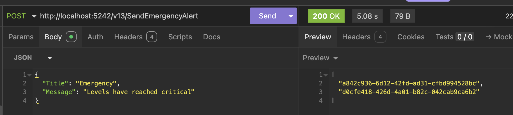

---

layout: post
title: Dependency Injection In C# & .NET Part 7 - Integration Testing
date: 2025-01-06 20:13:51 +0300
categories:
    - C#
    - .NET
    - Architecture
    - Domain Design
---
This is Part 7 of a series on dependency injection.

- [Dependency Injection In C# & .NET Part 1 - Introduction & Basic Implementation]()
- [Dependency Injection In C# & .NET Part 2 - Making Implementations Swappable]()
- [Dependency Injection In C# & .NET Part 3 - Making Implementations Pluggable]()
- [Dependency Injection In C# & .NET Part 4 - Making Implementations Hot-Pluggable]()
- [Dependency Injection In C# & .NET Part 5 - Making All Implementations Available]()
- [Dependency Injection In C# & .NET Part 6 - Implementation Testing]()
- **Dependency Injection In C# & .NET Part 7 - Integration Testing (this post)**

In our [last post,]() we looked at how we can leverage dependency injection to ease **implementation testing**.

In this post we look at how dependency injection can be a powerful aid to **integration testing**.

As a brief recap, we have three types of `AlertSender`

- `GmailAlertSender`
- `Office365AlertSender`
- `ZohoAlertSender`

We also have some business logic:

- If the time is **before noon**, send alerts using a `GmailAlertSender`
- If **later**, use the `Office356AlertSender`
- Whichever the case, **send a copy** using a `ZohoAlertSender`

We now need a way to **test this end-to-end**, covering both scenarios.

This means we need to be able to execute and verify the following:

1. **Startup** of the application
2. **Inject** the correct components
3. **Run** the logic
4. **Verify** that the expected components produced the expected results.

As always, there are plenty of schools of thought about how to achieve these results, and, as ever, my position is **pragmatism - do what you feel works for you**.

Personally, I would tackle it this way:

1. Find a way to generate a **known value** for the expected components. This will address **#4**
2. From #4, we can infer **#2**
3. **If we can verify #2 and #4, our system is working as expected**

Here is a simple way to implement **#4**

1. A `FakeGmailAlertSender` always returns the `Guid` **FFFFFFFF-FFFF-FFFF-FFFF-FFFFFFFFFFFF**
2. A `FakeOffice365AlertSender` always returns the `Guid` **EEEEEEEE-EEEE-EEEE-EEEE-EEEEEEEEEEEE**
3. A `FakeZohoAlertSender` always returns the `Guid` **DDDDDDDD-DDDD-DDDD-DDDD-DDDDDDDDDDDD**

These `Guid` values are **extremely unlikely** to be naturally generated.

The rationale, thus, is if we see any of these `Guid` values, we can infer the `AlertSender` used to generate them.

The first thing to do, as we had done in the previous post, is create the relevant contracts as interfaces and change the `AlertSenders` to implement these.

```c#
public interface IOffice365AlertSender : IAlertSender;

public interface IZohoAlertSender : IAlertSender;
```

Next, we update the existing `AlertSender` implementations to implement these interfaces. First, the `Office365AlertSender`:

```c#
public sealed class Office365AlertSender : IOffice365AlertSender
{
    private readonly string _key;
    public string Configuration { get; }

    public Office365AlertSender(string key)
    {
        _key = key;
        Configuration = $"Configuration - Key: {_key}";
    }

    public async Task<string> SendAlert(Office365Alert message)
    {
        await Task.Delay(TimeSpan.FromSeconds(5));
        return Guid.NewGuid().ToString();
    }

    // New method that sends a generic GeneralAlert
    public async Task<string> SendAlert(GeneralAlert message)
    {
        await Task.Delay(TimeSpan.FromSeconds(5));
        return Guid.NewGuid().ToString();
    }
}
```

Then the `ZohoAlertSender`:

```c#
public sealed class ZohoAlertSender : IZohoAlertSender
{
    private readonly string _organizationID;
    private readonly string _secretKey;
    public string Configuration { get; }

    public ZohoAlertSender(string organizationID, string secretKey)
    {
        _organizationID = organizationID;
        _secretKey = secretKey;
        Configuration = $"Configuration - Organization ID: {_organizationID}, secretKey: {_secretKey}";
    }

    public async Task<string> SendAlert(GeneralAlert message)
    {
        await Task.Delay(TimeSpan.FromSeconds(5));
        return Guid.NewGuid().ToString();
    }
}
```

Next, we create **fakes** of these implementations, starting with the `FakeOffice365AlertSender`

```c#
public sealed class FakeOffice365AlertSender : IOffice365AlertSender
{
    private readonly string _key;
    public string Configuration { get; }

    public FakeOffice365AlertSender(string key)
    {
        _key = key;
        Configuration = $"Configuration - Key: {_key}";
    }

    public Task<string> SendAlert(GeneralAlert message)
    {
        Log.Information("FAKE Office 365 sending alert - {Title} : {Body}", message.Title, message.Message);
        return Task.FromResult(Guid.Parse("EEEEEEEE-EEEE-EEEE-EEEE-EEEEEEEEEEEE").ToString());
    }
}
```

Then the `FakeZohoAlertSender`:

```c#
public sealed class FakeZohoAlertSender : IZohoAlertSender
{
    private readonly string _organizationID;
    private readonly string _secretKey;
    public string Configuration { get; }

    public FakeZohoAlertSender(string organizationID, string secretKey)
    {
        _organizationID = organizationID;
        _secretKey = secretKey;
        Configuration = $"Configuration - Organization ID: {_organizationID}, secretKey: {_secretKey}";
    }

    public Task<string> SendAlert(GeneralAlert message)
    {
        Log.Information("FAKE Zoho sending alert - {Title} : {Body}", message.Title, message.Message);
        return Task.FromResult(Guid.Parse("FFFFFFFF-FFFF-FFFF-FFFF-FFFFFFFFFFFF").ToString());
    }
}
```

Next, we update the dependency injection to specify the **specific contracts** instead of the generic `IAlertSender`.

```c#
// Keyed services registration
// Register GmailAlertSender as a keyed singleton
builder.Services.AddKeyedSingleton<IGmailAlertSender, GmailAlertSender>(AlertSender.Gmail, (provider, _) =>
{
    var settings = provider.GetRequiredService<IOptions<GmailSettings>>().Value;
    return new FakeGmailAlertSender(settings.GmailPort, settings.GmailUserName, settings.GmailPassword);
});

// Register Office365AlertSender as a keyed singleton
builder.Services.AddKeyedSingleton<IOffice365AlertSender, Office365AlertSender>(AlertSender.Office365, (provider, _) =>
{
    var settings = provider.GetRequiredService<IOptions<Office365Settings>>().Value;
    return new Office365AlertSender(settings.Key);
});

// Register ZohoAlertSender as a keyed singleton
builder.Services.AddKeyedSingleton<IZohoAlertSender, ZohoAlertSender>(AlertSender.Zoho, (provider, _) =>
{
    var settings = provider.GetRequiredService<IOptions<ZohoSettings>>().Value;
    return new ZohoAlertSender(settings.OrganizationID, settings.SecretKey);
});

```

Note here we are specifying the **specific interfaces** and returning the **actual implementations**.

How, then, do we test using the fake implementations?

Again, here, we can leverage the fact that **ASP.NET heavily uses dependency injection internally**.

The first thing to do is to create a test project, and change to that directory.

```bash
dotnet new xunit -o MailerTests
cd MailerTests
```

To this test project, we add references to our API project and our core logic

```bash
dotnet add reference ../API/API.csproj
dotnet add reference ../Mailer/Mailer.csproj
```

We then add a reference to [FluentAssertions](https://www.nuget.org/packages/fluentassertions/) to make writing our tests and assertions easier.

```bash
dotnet add package FluentAssertions
```

We also need a reference to the [ASP.NET testing](https://www.nuget.org/packages/Microsoft.AspNetCore.Mvc.Testing) engine

```bash
dotnet add package Microsoft.AspNetCore.Mvc.Testing
```

Our next challenge is this: there is some code that depends on the **time of the day**.

```c#
if (TimeOnly.FromDateTime(DateTime.Now) < new TimeOnly(12, 0, 0, 0))
{
    // It is before midday. Use the gmail Sender, and also send a copy using Zoho.
    // Create task for this work and then in parallel with Zoho
    var gmailTask = gmailAlertSender.SendAlert(genericAlert);
    var morningResults = await Task.WhenAll(gmailTask, zohoTask);
    return Results.Ok(morningResults);
}
```

This is **very difficult to test** because we have to run the code **before** and **after** midday to see if it behaves correctly, depending on the system clock.

There is a solution to this - **dependency injection!** We can inject a [TimeProvider](https://learn.microsoft.com/en-us/dotnet/api/system.timeprovider?view=net-9.0). For production use, we use the system clock (Which would result in [DateTime.Now](https://learn.microsoft.com/en-us/dotnet/api/system.datetime.now?view=net-9.0)). And for testing, we use a [FakeTimeProvider](https://learn.microsoft.com/en-us/dotnet/api/microsoft.extensions.time.testing.faketimeprovider?view=net-9.0-pp). You can read about these abstractions [here](https://learn.microsoft.com/en-us/dotnet/standard/datetime/timeprovider-overview).

First, we register the `TimeProvider` with the DI.

```c#
// Register the system time provider
builder.Services.AddSingleton(TimeProvider.System);
```

Then, we update our endpoint to pick the time from the provider.

```c#
app.MapPost("/v13/SendEmergencyAlert", async ([FromBody] Alert alert,
    IServiceProvider provider, [FromServices] TimeProvider timeProvider, [FromServices] ILogger<Program> logger) =>
{
    // Retrieve the senders from DI
    var zohoAlertSender = provider.GetKeyedService<IZohoAlertSender>(AlertSender.Zoho)!;
    var office365AlertSender = provider.GetKeyedService<IOffice365AlertSender>(AlertSender.Office365)!;
    var gmailAlertSender = provider.GetKeyedService<IGmailAlertSender>(AlertSender.Gmail)!;

    // Create the alert
    var genericAlert = new GeneralAlert(alert.Title, alert.Message);
    // Create the Zoho task that always runs
    var zohoTask = zohoAlertSender.SendAlert(genericAlert);
    if (TimeOnly.FromDateTime(timeProvider.GetLocalNow().DateTime) < new TimeOnly(12, 0, 0, 0))
    {
        // It is before midday. Use the gmail Sender, and also send a copy using Zoho.
        // Create task for this work and then in parallel with Zoho
        var gmailTask = gmailAlertSender.SendAlert(genericAlert);
        var morningResults = await Task.WhenAll(gmailTask, zohoTask);
        return Results.Ok(morningResults);
    }

    // It is after midday. Use the gmail Sender, and also send a copy using Zoho.
    // Create task for this work and then in parallel with Zoho
    var office365Task = office365AlertSender.SendAlert(genericAlert);
    var afternoonResults = await Task.WhenAll(office365Task, zohoTask);
    return Results.Ok(afternoonResults);
});
```

The magic is happening here:

```c#
TimeOnly.FromDateTime(timeProvider.GetLocalNow().DateTime)
```

Now that the API is updated, we return to the tests.

What we do next is this:

1. Write code to **spin up the API**
2. **Override** the existing DI and **configure services** of our choice
3. **Create requests and send** them to the API, **re-configuring the DI** where necessary
4. **Examine the response**

To spin up the API, we write a class that subclasses [WebApplicationFactory](https://learn.microsoft.com/en-us/dotnet/api/microsoft.aspnetcore.mvc.testing.webapplicationfactory-1?view=aspnetcore-9.0). This class allows us to 

1. Set up the **environment** we want to use (usually Test or **Staging**). But you can use whatever you want
2. Load whatever **configurations** we need. 
3. Override [ConfigureWebHost](https://learn.microsoft.com/en-us/dotnet/api/microsoft.aspnetcore.mvc.testing.webapplicationfactory-1.configurewebhost?view=aspnetcore-9.0), which allows us to **access** (and **change**, where necessary) the **existing** configuration of services.

```c#
public class MailerApplicationFactory<T> : WebApplicationFactory<T>, IAsyncLifetime where T : class
{
    public Task InitializeAsync()
    {
        return Task.CompletedTask;
    }

    public new async Task DisposeAsync()
    {
        await base.DisposeAsync();
    }

    protected override void ConfigureWebHost(IWebHostBuilder builder)
    {
        builder.UseEnvironment("Test"); // Use the desired environment
        builder.ConfigureAppConfiguration((context, config) =>
        {
            config.Sources.Clear();
            var env = context.HostingEnvironment;
            // Use the settings file for testing, appsettings.Test.json
            config.AddJsonFile($"appsettings.{env.EnvironmentName}.json", optional: false, reloadOnChange: true);
            config.AddEnvironmentVariables();
        });

        // No changes to the services here, as it will use the same as the main application
        builder.ConfigureServices(services =>
        {
            // Remove the current actual implementations and replace with fakes
            services.RemoveAll<IGmailAlertSender>();
            services.RemoveAll<IOffice365AlertSender>();
            services.RemoveAll<IZohoAlertSender>();

            // Register Fake GmailAlertSender as a keyed singleton
            services.AddKeyedSingleton<IGmailAlertSender>(AlertSender.Gmail, (provider, _) =>
            {
                var settings = provider.GetRequiredService<IOptions<GmailSettings>>().Value;
                return new FakeGmailAlertSender(settings.GmailPort, settings.GmailUserName, settings.GmailPassword);
            });
            // Register Fake Office365AlertSender as a keyed singleton
            services.AddKeyedSingleton<IOffice365AlertSender>(AlertSender.Office365, (provider, _) =>
            {
                var settings = provider.GetRequiredService<IOptions<Office365Settings>>().Value;
                return new FakeOffice365AlertSender(settings.Key);
            });
            // Register Fake ZohoAlertSender as a keyed singleton
            services.AddKeyedSingleton<IZohoAlertSender>(AlertSender.Zoho, (provider, _) =>
            {
                var settings = provider.GetRequiredService<IOptions<ZohoSettings>>().Value;
                return new FakeZohoAlertSender(settings.OrganizationID, settings.SecretKey);
            });
        });
    }
}
```

Next, we create an `appsettings.json` to store the settings specific to our tests. We will name this `appSettings.Test.json` so that we can dynamically build the name, as **Test** here is going to be the **environment**.

Simply copy the contents of the existing **appsettings.json** to `appSettings.Test.json` and then modify the settings you want for the tests.

The next thing is to create a test class, into which we inject the `WebApplicationFactory` that we have just subclassed.

```c#
public class TimedAlertSenderTests : IClassFixture<MailerApplicationFactory<Program>>
{
    private readonly MailerApplicationFactory<Program> _factory;
    private readonly HttpClient _client;

    public TimedAlertSender(MailerApplicationFactory<Program> factory)
    {
        _factory = factory;
        _client = factory.CreateClient();
    }
}
```

We are now ready to write our first test.

```c#
[Fact]
public async Task Alert_Is_Sent_Successfully()
{
    var request = new GeneralAlert("Title", "Message");
    var response = await _client.PostAsJsonAsync("/v13/SendEmergencyAlert", request);
    response.StatusCode.Should().Be(HttpStatusCode.OK);
}
```

This test simply verifies that a request is responded to with [HTTP 200 (OK)](https://developer.mozilla.org/en-US/docs/Web/HTTP/Status/200)


Our next test requires a bit more work.

We want to test whether a request sent **in the morning** (before 12:00) is sent using the `GmailAlertSender`.

The problem here is, for purposes of the test, to **tell the application that it is morning, regardless of the actual time**.

This is solved using **dependency injection**.

We reconfigure our DI in the test to create a `FakeTimeProvider`, use that to configure the time we want, remove the existing System `TimeProvider` and replace it with our fake. At the same time, we want to keep the changes that were in our custom `WebApplicationFactory` DI configuration.

```c#
[Fact]
public async Task Morning_Alert_Is_Sent_Successfully()
{
    // Create a fake time provider
    var fake = new FakeTimeProvider();
    // Set the time to 11 AM. The date doesn't matter
    fake.SetUtcNow(new DateTimeOffset(new DateTime(2025, 1, 1, 11, 0, 0)));

    // Use the currently configured DI configuration as a starting point
    var client = _factory.WithWebHostBuilder(builder =>
    {
        builder.ConfigureServices(services =>
        {
            // Remove the system time provider
            var descriptor = services.FirstOrDefault(d => d.ServiceType == typeof(TimeProvider));
            if (descriptor != null)
            {
                services.Remove(descriptor);
            }

            // Add our fake time provider to the DI container
            services.AddSingleton<TimeProvider>(fake);
        });
    }).CreateClient();

    var request = new GeneralAlert("Title", "Message");
    var response = await client.PostAsJsonAsync("/v13/SendEmergencyAlert", request);
    response.StatusCode.Should().Be(HttpStatusCode.OK);
    var responseString = await response.Content.ReadAsStringAsync();
    // One of the returned values should be the Guid FFFF for Gmail
    responseString.Should().Contain("ffffffff-ffff-ffff-ffff-ffffffffffff");
    // One of the returned values should be the Guid DDDD for Zoho 
    responseString.Should().Contain("dddddddd-dddd-dddd-dddd-dddddddddddd");
}
```

We can then send our request and examine the response.

We expect two `Guid` values in the response, that for a `GmailAlertSender` and that for a `ZohoAlertSender`.


Given that this test is passing, we can confidently assume

1. The `GmailAlertSender` was invoked
2. The `ZohoAlertSender` was invoked
3. If both were invoked, that means the DI located and injected them correctly

Hypothetically, it is possible that the endpoint could be returning all `Guid` values from 0000-FFFF. We should, therefore, verify that only two `Guid` values are being returned.

Successful invocation, remember, should look like this:



We can add the following additional assertion to check this.

```c#
// Check that only two values were returned
JsonSerializer.Deserialize<Guid[]>(responseString)!.Length.Should().Be(2);
```

Our test for whether the code behaves correctly in the afternoon will be similar - inject a `FakeTimeProvider`, **set the time** and then **run the tests**.

```c#
[Fact]
public async Task Afternoon_Alert_Is_Sent_Successfully()
{
    // Create a fake time provider
    var fake = new FakeTimeProvider();
    // Set the time to 12 AM. The date doesn't matter
    fake.SetUtcNow(new DateTimeOffset(new DateTime(2025, 1, 1, 12, 0, 0)));

    var client = _factory.WithWebHostBuilder(builder =>
    {
        builder.ConfigureServices(services =>
        {
            // Remove the system time provider
            var descriptor = services.FirstOrDefault(d => d.ServiceType == typeof(TimeProvider));
            if (descriptor != null)
            {
                services.Remove(descriptor);
            }

            // Add our fake time provider to the DI container
            services.AddSingleton<TimeProvider>(fake);
        });
    }).CreateClient();

    var request = new GeneralAlert("Title", "Message");
    var response = await client.PostAsJsonAsync("/v13/SendEmergencyAlert", request);
    response.StatusCode.Should().Be(HttpStatusCode.OK);
    var responseString = await response.Content.ReadAsStringAsync();
    // One of the returned values should be the Guid EEEE for office 
    responseString.Should().Contain("eeeeeeee-eeee-eeee-eeee-eeeeeeeeeeee");
    // One of the returned values should be the Guid DDDD for Zoho 
    responseString.Should().Contain("dddddddd-dddd-dddd-dddd-dddddddddddd");
    // Check that only two values were returned
    JsonSerializer.Deserialize<Guid[]>(responseString)!.Length.Should().Be(2);
}
```

If we run this test, we can see that it is passing.


To recap:

1. We have written our API to use **actual implementations** of the required services (`AlertSender`)
2. We have **injected** a `TimeProvider` to make date and time-based logic easier to test.
3. We have **created a Test Project** to run integration tests, and added the relevant [nuget](https://www.nuget.org/) packages to it
4. We have overridden the `WebApplicationFactory` to customize our DI - we want to **remove all concrete implementations and replace them with our fake ones**.
5. We have **written three tests**, two of which require customization of the `TimeProvider` - morning and after noon prior to injection.

Thus, we can see that dependency injection is a very powerful tool for writing our application and allowing us flexibility around testing.

In our next post we will look at **types of dependency injection**.

The code is in my [GitHub](https://github.com/conradakunga/BlogCode/tree/master/Mailer). *The source code builds from first principles as outlined in this series of posts with different versions of the API demonstrating the improvements.*

Happy hacking!
