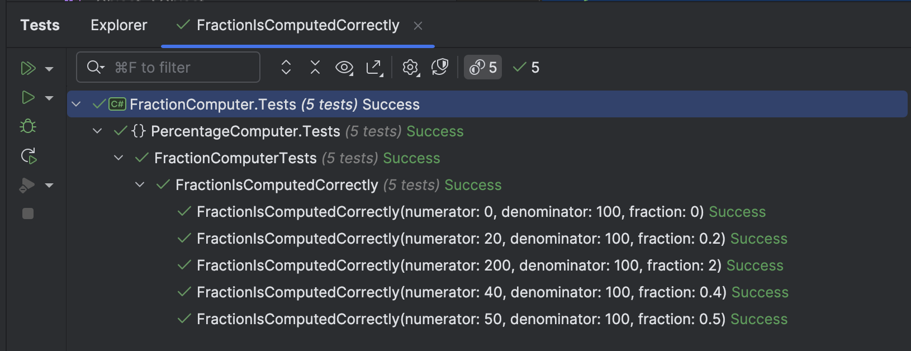
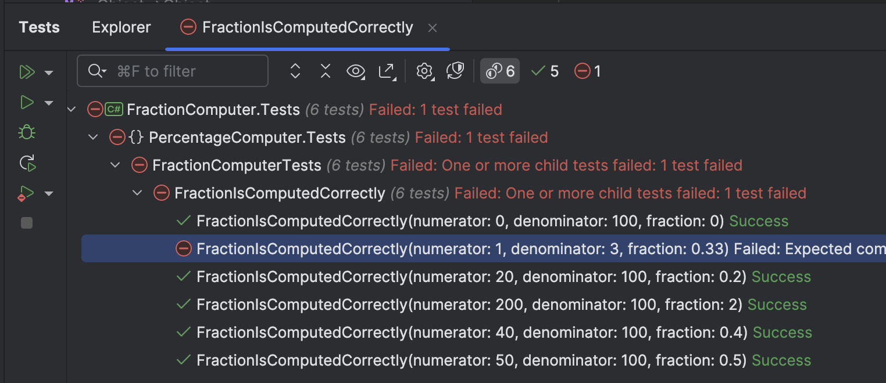
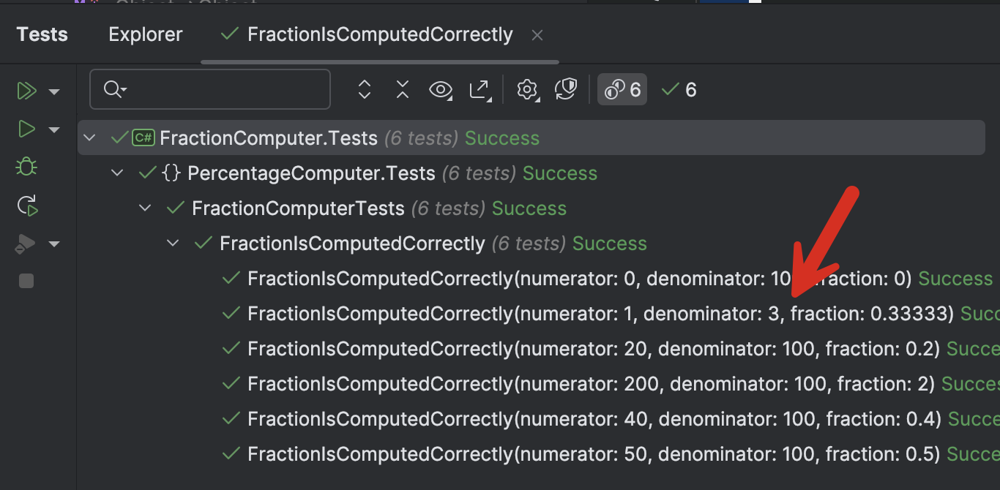

Suppose you have some logic that computes a value and returns potentially a fractional result.

Let us take a simple class that computes the percentage given two `int` values.

```c#
public class FractionComputer
{
    public decimal Compute(decimal numerator, decimal denominator)
    {
        if (denominator == 0)
            throw new ArgumentException("Denominator cannot be zero.");
        return numerator / denominator;
    }
}
```

We can then set up a [xUnit](https://xunit.net) test project that tests this.

```c#
dotnet new xunit -o dotnet new xunit -o FractionComputer.Tests
```

To make it easier to write the assertions, we add the [FluentAssertions](https://www.nuget.org/packages/fluentassertions/) package.

Our test now looks like this:

```c#
public class FractionComputerTests
{
    [Theory]
    [InlineData(50, 100, .5)]
    [InlineData(20, 100, .20)]
    [InlineData(40, 100, .4)]
    [InlineData(0, 100, 0)]
    [InlineData(200, 100, 2)]
    public void FractionIsComputedCorrectly(int numerator, int denominator, decimal fraction)
    {
        var computer = new FractionComputer();
        computer.Compute(numerator, denominator).Should().Be(fraction);
    }
}
```

Here you can see the test cases have been provided inline, using the `InlineData` attribute.

If we run the tests, we get the following results:



So far, so good.

Now, let us provide the following test case - a numerator of `1` and a denominator of `3`.

This test fails.



The error details are as follows:

```plaintext
Expected computer.Compute(numerator, denominator) to be 0.33M, but found 0.3333333333333333333333333333M (difference of 0.0033333333333333333333333333...
```

The problem here is that `1/3` is `0.333333`... where **the repetition is infinite**.

How do we test this?

One way would be to round the result to a known decimal point, and then assert against that.

We can rewrite our tests like this:

```c#
[Theory]
[InlineData(50, 100, .5)]
[InlineData(20, 100, .20)]
[InlineData(40, 100, .4)]
[InlineData(0, 100, 0)]
[InlineData(200, 100, 2)]
[InlineData(1, 3, 0.33)]
[InlineData(1, 3, 0.33333)]
public void FractionIsComputedCorrectly(int numerator, int denominator, decimal fraction)
{
    var computer = new FractionComputer();
    Math.Round(computer.Compute(numerator, denominator), 5).Should().Be(fraction);
}
```

Here, we are rounding all our outputs to 5 decimals and then testing against that.

A better way of doing this is rather than using the `Should().Be()` method, we use the `Should().BeApproximately()` method, which allows us to specify a level of accuracy.

```c#
[Theory]
[InlineData(50, 100, .5)]
[InlineData(20, 100, .20)]
[InlineData(40, 100, .4)]
[InlineData(0, 100, 0)]
[InlineData(200, 100, 2)]
[InlineData(1, 3, 0.33333)]
public void FractionIsComputedCorrectly(int numerator, int denominator, decimal fraction)
{
    var computer = new FractionComputer();
    computer.Compute(numerator, denominator).Should().BeApproximately(fraction, 0.00001M);
}
```

Here, we are saying that success means the variance at the **fifth** decimal should not exceed **0.00001**.

If we re-run the tests:



Now, our tests are passing for our edge case.

The code is in my [Github](https://github.com/conradakunga/BlogCode/tree/master/2025-01-10%20-%20Testing%20Fractional%20Values),

Happy hacking!
