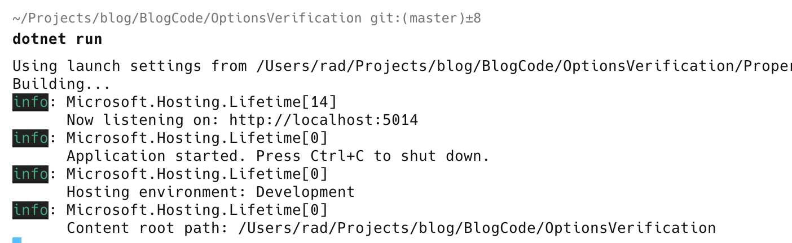
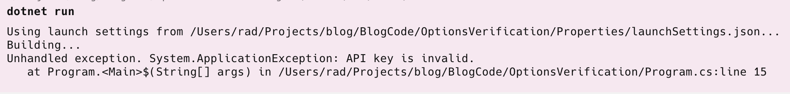

This is Part 1 of a series on validating application settings.

- **Validating .NET Settings Part 1 - Manual Validation (this post)**
- [Validating .NET Settings Part 2 - Validating Using FluentValidation]()

When it comes to  .NET applications, you have a number of options:

- Web APIs
- Web Applications
- Console Applications
- Service Applications

All of these would typically require some settings or their execution. 

But the assumption is always that the settings are provided correctly. **What if they are not?**

Assume we have this class that stores our settings:

```c#
public class ApplicationOptions
{
    public string APIKey { get; set; }
    public int RetryCount { get; set; }
    public int RequestsPerMinute { get; set; }
    public int RequestsPerDay { get; set; }
}
```

Let us further assume we have the following constraints:

- The `APIKey` must be composed of **uppercase characters with a **maximum length of 10**
- The `RetryCount` must be between `1` and 5
- The `RequetsPerMinute` must be less than `3`
- The `RequestsPerMinute` cannot be more than `1000`
- The `RequestsPerDay` cannot be more than the `RequetsPerMinute`
- All of these settings are mandatory

We then update our `appsettings.json` to store these values:

```json
{
  "Logging": {
    "LogLevel": {
      "Default": "Information",
      "Microsoft.AspNetCore": "Warning"
    }
  },
  "AllowedHosts": "*",
  "ApplicationOptions": {
    "APIKey": "ABCDEFGHIJ",
    "RetryCount": 3,
    "RequestsPerMinute": 3,
    "RequestsPerDay": 100
  }
}
```


Typically, we would configure our DI as follows:

```c#
var builder = WebApplication.CreateBuilder(args);

builder.Services.AddOptions<ApplicationOptions>();

var app = builder.Build();
```

But then remember that we want to validate these options **before configuring the pipeline**.

A very simple way to do this would be to use **direct binding**, [which we have discussed]() before.

Here, we would **create and directly bind an object**; then, we can **validate** that object. If at any point we find an invalid value, we **throw an exception**.

```c#
var settings = new ApplicationOptions();
builder.Configuration.GetSection(nameof(ApplicationOptions)).Bind(settings);

// Check API Key is present
if (string.IsNullOrWhiteSpace(settings.APIKey))
    throw new ApplicationException("API key is missing.");
// Check API Key is composed of characters
var regex = new Regex("^[A-Z]{10}$");
if (!regex.IsMatch(settings.APIKey))
    throw new ApplicationException("API key is invalid.");
// Check the retry count is between 1 and 5
if (settings.RetryCount is < 0 or > 5)
    throw new ApplicationException("Retry count is invalid.");
// Check the Requests per minute are more than 3 and less than 1000
if (settings.RequestsPerMinute is < 3 or > 1000)
    throw new ApplicationException("Requests per minute is invalid.");
// Check that the requests per minute do not exceed requests per day
if (settings.RequestsPerMinute > settings.RequestsPerDay)
    throw new ApplicationException("Requests per day is invalid.");
```

If we start our application, it will start as usual because our settings are valid.



But if we changed the API key to `abcdefghij` and restarted the application:



This approach has a number of problems:

1. It is **difficult to test** the validation code
2. The validation code is **mixed in with the application startup code**
3. The validation code can be **difficult to read, understand and maintain**

In our [next post](), we will see how to validate more robustly using a library dedicated to validation.

The code is in my [GitHub](https://github.com/conradakunga/BlogCode/tree/master/2025-01-11%20-%20Validating%20Settings%20-%20Manual%20Validation).

Happy hacking!
