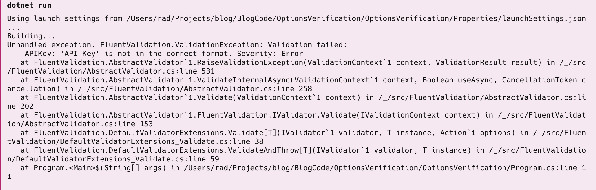
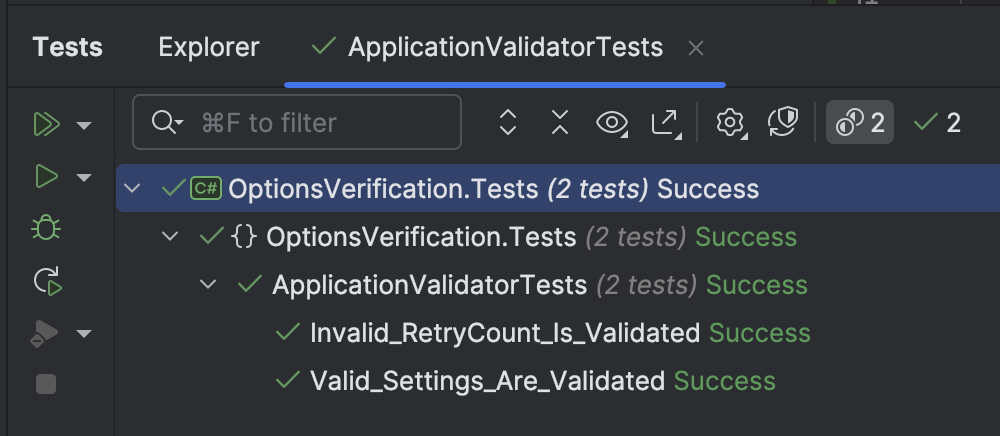

This is Part 2 of a series on validating application settings.

- [Validating .NET Settings Part 1 - Manual Validation]()
- **Validating .NET Settings Part 2 - Validating Using FluentValidation (this post)**

In our [last post](), we looked at how we could manually validate application settings at startup.

In this post we will look at how to use a library specialized for validation, [FluentValidation](https://docs.fluentvalidation.net/en/latest/).

To recap, our settings class looks like this:

```c#
public class ApplicationOptions
{
    public string APIKey { get; set; }
    public int RetryCount { get; set; }
    public int RequestsPerMinute { get; set; }
    public int RequestsPerDay { get; set; }
}
```

Our constraints are these:

- The `APIKey` must be composed of **uppercase characters with a **maximum length of 10**
- The `RetryCount` must be between `1` and 5
- The `RequetsPerMinute` must be less than `3`
- The `RequestsPerMinute` cannot be more than `1000`
- The `RequestsPerDay` cannot be more than the `RequetsPerMinute`
- All of these settings are mandatory

The first thing to do is use nuget to install the FluentValidation package to the API

```c#
dotnet add package FluentValidation
```

We then write a class with the logic to validate our class by inheriting the generic [AbstractValidator](https://docs.fluentvalidation.net/en/latest/start.html) class.

```c#
public class ApplicationOptionsValidator : AbstractValidator<ApplicationOptions>
{
    public ApplicationOptionsValidator()
    {
        RuleFor(x => x.APIKey)
            .NotNull().NotEmpty() // Required, and not default
            .Matches("^[A-Z]{10}$");

        RuleFor(x => x.RetryCount)
            .NotNull().NotEmpty() // Required, and not default
            .InclusiveBetween(1, 5);

        RuleFor(x => x.RequestsPerMinute)
            .NotNull().NotEmpty() // Required, and not default
            .LessThanOrEqualTo(3)
            .LessThanOrEqualTo(x => x.RequestsPerDay)

        RuleFor(x => x.RequestsPerDay)
            .NotNull().NotEmpty() // Required, and not default
            .LessThan(1_000);
    }
}
```

We then update our startup to **create a validator and perform the validation**, **throwing an exception** if there is a failed validation.

```c#
var settings = new ApplicationOptions();
builder.Configuration.GetSection(nameof(ApplicationOptions)).Bind(settings);

// Validate the settings
var validator = new ApplicationOptionsValidator();
validator.ValidateAndThrow(settings);
```



We can also write tests to verify our validation logic. This test verifies valid settings are accepted

```c#
  [Fact]
  public void Valid_Settings_Are_Validated()
  {
      var settings = new ApplicationOptions
      {
          APIKey = "ABCDEFGHIJ",
          RetryCount = 3,
          RequestsPerMinute = 3,
          RequestsPerDay = 500
      };

      var validator = new ApplicationOptionsValidator();
      var result = validator.Validate(settings);
      result.IsValid.Should().BeTrue();
  }
```

This test verifies one of the invalid cases - an invalid `RequestsPerMinute`

```c#
[Fact]
public void Invalid_RetryCount_Is_Validated()
{
    var settings = new ApplicationOptions
    {
        APIKey = "ABCDEFGHIJ",
        RetryCount = 5,
        RequestsPerMinute = 5,
        RequestsPerDay = 500
    };

    var validator = new ApplicationOptionsValidator();
    var result = validator.Validate(settings);
    // It should not be valid
    result.IsValid.Should().BeFalse();
    // Should have only one error
    result.Errors.Should().HaveCount(1);
    // Error message should be as follows
    result.Errors[0].ErrorMessage.Should().Be("'Requests Per Minute' must be less than or equal to '3'.");
}
```

If we run our tests, we should see the following:



This approach has a number of benefits over manual validation:

1. The code to validate is in **one place**

2. It is **easy to test** the validation code

3. This validator can be used **across the application layers** or even **other applications** if they have the same problem domain

4. Validation rules are **easy to read, write and understand**

5. If any validation fails, **you have options** — you do not have to throw an exception. You can also perform the validation, check whether it succeeded, and get information on why it didn't.

    ```c#
    var result = validator.Validate(settings);
    if (!result.IsValid)
    {
        // Print the errors
        foreach (var failure in result.Errors)
        {
            Console.WriteLine(failure.ErrorMessage);
        }
    }
    ```

In our next post, we will examine how the built-in .NET pipeline can help validate our settings.

The code is in my [GitHub](https://github.com/conradakunga/BlogCode/tree/master/2025-01-12%20-%20Validating%20Settings%20-%20FluentValidation).

Happy hacking!
