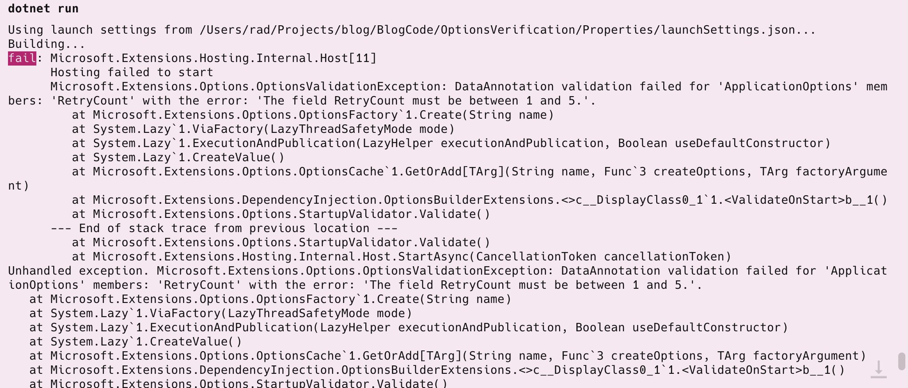

This is Part 3 of a series on validating application settings.

- [Validating .NET Settings Part 1 - Manual Validation]()
- [Validating .NET Settings Part 2 - Validating Using FluentValidation]()
- **Validating .NET Settings Part 3 - Validating Using Data Annotations (this post)**

In our [last post](), we looked at how to use [FluentValidation](https://docs.fluentvalidation.net/en/latest/) to carry out our settings validation.

In this post, we will look at how to use [data annotations](https://learn.microsoft.com/en-us/dotnet/api/system.componentmodel.dataannotations?view=net-9.0) to validate our settings.

To recap, our settings class looks like this:

```c#
public class ApplicationOptions
{
    public string APIKey { get; set; }
    public int RetryCount { get; set; }
    public int RequestsPerMinute { get; set; }
    public int RequestsPerDay { get; set; }
}
```

Our constraints are these:

- The `APIKey` must be composed of **uppercase characters with a **maximum length of 10**
- The `RetryCount` must be between `1` and 5
- The `RequetsPerMinute` must be less than `3`
- The `RequestsPerMinute` cannot be more than `1000`
- The `RequestsPerDay` cannot be more than the `RequetsPerMinute`
- All of these settings are mandatory

`DataAnnotations` use attributes against each of the properties we want to validate.

So, we update our class as follows:

```c#
public class ApplicationOptions
{
    [Required]
    [StringLength(10)]
    [RegularExpression("^[A-Z]{10}$")]
    public string APIKey { get; set; } = null!;
    [Required]
  	[Range(1, 5)]
  	public int RetryCount { get; set; }
    [Range(0, 1_000)]
  	[Required] 
  	public int RequestsPerMinute { get; set; }
    [Required]
  	public int RequestsPerDay { get; set; }
}
```

Next, we update our `Program.cs` startup as follows:

```c#
bbuilder.Services.AddOptions<ApplicationOptions>()
    .Bind(builder.Configuration.GetSection(nameof(ApplicationOptions)))
    .ValidateDataAnnotations()
    .ValidateOnStart();
```

The [ValidateOnStart](https://learn.microsoft.com/en-us/dotnet/api/microsoft.extensions.dependencyinjection.optionsbuilderextensions.validateonstart?view=net-9.0-pp) method call is important because if you omit it, the settings **will not be validated until they are first requested**. You want the application to fail immediately on start. Otherwise, users will have an unfriendly experience.

If we supply invalid data, for instance, an invalid `RetryCount`, we will get an error as follows:



The validation that `RequestsPerMinute` cannot exceed the `RequestsPerDay` cannot be enforced through annotations - you must validate that separately as follows:

```c#
builder.Services.AddOptions<ApplicationOptions>()
    .Bind(builder.Configuration.GetSection(nameof(ApplicationOptions)))
    .ValidateDataAnnotations()
    .Validate(config =>
    {
        // Assert the requests per day are greater
        return config.RequestsPerDay > config.RequestsPerMinute;
    }, "Requests per day must be greater than or equal to requests per minute.")
    .ValidateOnStart();
```

You can also use the direct method [AddOptionsWithValidateOnStart](https://learn.microsoft.com/en-us/dotnet/api/microsoft.extensions.dependencyinjection.optionsservicecollectionextensions.addoptionswithvalidateonstart?view=net-9.0-pp) as follows:

```c#
builder.Services.AddOptionsWithValidateOnStart<ApplicationOptions>()
    .Bind(builder.Configuration.GetSection(nameof(ApplicationOptions)))
    .ValidateDataAnnotations()
    .Validate(config =>
    {
        // Assert the requests per day are greater
        return config.RequestsPerDay > config.RequestsPerMinute;
    }, "Requests per day must be greater than or equal to requests per minute.");
```

Check the [documentation](https://learn.microsoft.com/en-us/dotnet/api/system.componentmodel.dataannotations?view=net-9.0) for a list of attributes you can use to validate various properties by type.

Our next post will examine how to write more complex validation without annotation.

The code is in my [GitHub](https://github.com/conradakunga/BlogCode/tree/master/2025-01-13%20-%20Validating%20Settings%20-%20Data%20Annotations).

Happy hacking!
