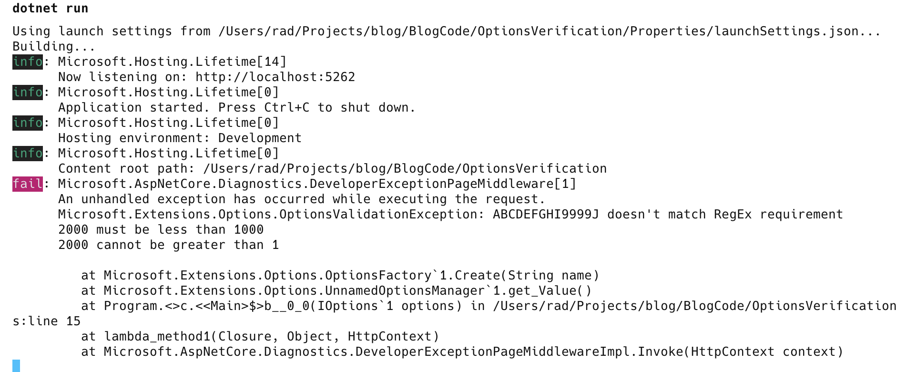

This is Part 4 of a series on validating application settings.

- [Validating .NET Settings Part 1 - Manual Validation]()
- [Validating .NET Settings Part 2 - Validating Using FluentValidation]()
- [Validating .NET Settings Part 3 - Validating Using Data Annotations]()
- [Validating .NET Settings Part 4 - Validating Using IValidateOptions]()

In our [last post](), we looked at using [DataAnnotations](https://learn.microsoft.com/en-us/dotnet/api/system.componentmodel.dataannotations?view=net-9.0) attributes to indicate our validation requirements on the properties to validate, and how to get the runtime to execute the validations on startup.

In this post, we will look at leveraging the [IValidateOptions](https://learn.microsoft.com/en-us/dotnet/api/microsoft.extensions.options.ivalidateoptions-1?view=net-9.0-pp) to encapsulate validations in a class.

To recap, our settings class looks like this:

```c#
public class ApplicationOptions
{
    public string APIKey { get; set; }
    public int RetryCount { get; set; }
    public int RequestsPerMinute { get; set; }
    public int RequestsPerDay { get; set; }
}
```

Our constraints are these:

- The `APIKey` must be composed of **uppercase characters** with a **maximum length of 10**
- The `RetryCount` must be between `1` and 5
- The `RequestsPerMinute` cannot be more than `1000`
- The `RequestsPerDay` cannot be more than the `RequetsPerMinute`
- All of these settings are mandatory

The `IValidateOptions` generic interface allows you to write a class that encapsulates your validations.

```c#
public sealed class ValidateApplicationOptions : IValidateOptions<ApplicationOptions>
{
    public ValidateOptionsResult Validate(string? name, ApplicationOptions options)
    {
        // String builder to store errors
        var errors = new StringBuilder();

        // Regex to validate API Key
        var reg = new Regex("^[A-Z]{10}$");
        if (!reg.IsMatch(options.APIKey))
        {
            errors.AppendLine($"{options.APIKey} doesn't match RegEx requirement");
        }

        if (options.RetryCount is < 1 or > 5)
        {
            errors.AppendLine($"{options.RetryCount} must be between 1 and 5");
        }

        if (options.RequestsPerMinute > 1_000)
        {
            errors.AppendLine($"{options.RequestsPerMinute} must be less than 1000");
        }

        if (options.RequestsPerMinute > options.RequestsPerDay)
        {
            errors.AppendLine($"{options.RequestsPerMinute} cannot be greater than {options.RequestsPerDay}");
        }

        return errors.Length > 0 ? ValidateOptionsResult.Fail(errors.ToString()) : ValidateOptionsResult.Success;
    }
}
```

Next,  we update our DI setup as follows:

```c#
builder.Services.Configure<ApplicationOptions>(
    builder.Configuration.GetSection(nameof(ApplicationOptions)));

builder.Services.AddSingleton<IValidateOptions<ApplicationOptions>, ValidateApplicationOptions>();
```

Finally, we update our endpoint to **inject** our settings.

```c#
app.MapGet("/Hello", (IOptions<ApplicationOptions> options) =>
{
    var applicationOptions = options.Value;
    // Return result
    return Results.Ok("Hello!");
});
```

If there are any invalid settings, an exception will be thrown **the first time the settings are requested**.

Assuming our settings were as follows in the `appsettings.json`

```json
{
  "Logging": {
    "LogLevel": {
      "Default": "Information",
      "Microsoft.AspNetCore": "Warning"
    }
  },
  "AllowedHosts": "*",
  "ApplicationOptions": {
    "APIKey": "ABCDEFGHI9999J",
    "RetryCount": 3,
    "RequestsPerMinute": 2000,
    "RequestsPerDay": 1
  }
}

```

A request would return the following:



The benefit of this is that **the code for validation is encapsulated in a single class**.

Given the four options we have discussed, which would I personally use? 

Absolutely the [FluentValidations]() route. More **expressive**, easier to **test**, and easier to **reuse** across application layers and applications.

The code is in my [GitHub](https://github.com/conradakunga/BlogCode/tree/master/2025-01-14%20-%20Validating%20Settings%20-%20IValidateOptions)

Happy hacking!
