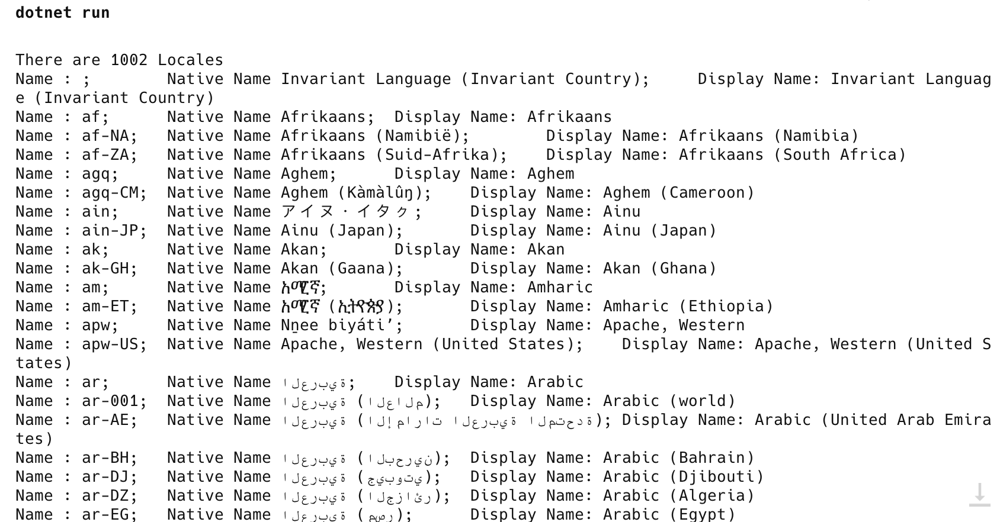
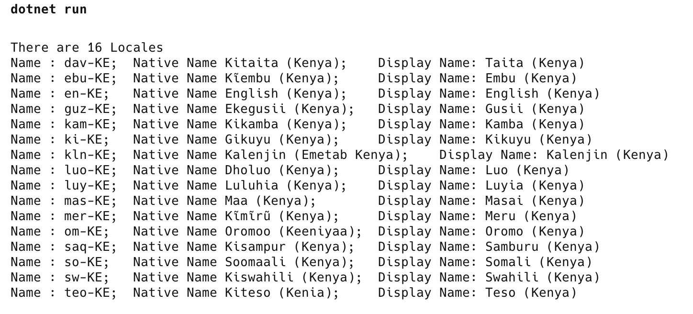

The .NET Framework has excellent support for locales all over the world. I wondered how good and whether that extended to Kenyan cultures. Turns out - it does!

To get a list of all the supported locales, use the following code, leveraging the [System.Globalization](https://learn.microsoft.com/en-us/dotnet/api/system.globalization?view=net-9.0) namespace.

```c#
// Fetch all the cultures supported
var allCultures = CultureInfo.GetCultures(CultureTypes.AllCultures)
    .Select(x => new { x.Name, x.NativeName, x.DisplayName }).ToArray();

// Print count
Console.WriteLine($"There are {allCultures.Length} Locales");

// List all the found cultures
foreach (var culture in allCultures)
{
    Console.WriteLine(
        $"Name : {culture.Name};\tNative Name {culture.NativeName};\tDisplay Name: {culture.DisplayName}");
}
```

On my machine it returns the following:



There are some **1,002** [locales](https://learn.microsoft.com/en-us/dotnet/fundamentals/runtime-libraries/system-globalization-cultureinfo).

To filter those in Kenya, I can make use of the fact that the name contains the suffix `-KE`. We can use [LINQ](https://learn.microsoft.com/en-us/dotnet/csharp/linq/) to **filter** the locales:

```c#
var kenyanCultures = allCultures.Where(x => x.Name.Contains("-KE")).ToArray();
// Print count
Console.WriteLine($"There are {kenyanCultures.Length} Locales");

// List all the found cultures
foreach (var culture in kenyanCultures)
{
    Console.WriteLine(
        $"Name : {culture.Name};\tNative Name {culture.NativeName};\tDisplay Name: {culture.DisplayName}");
}
```

This code returns the following:



The locales are:

- Embu (Kenya)
- English (Kenya)
- Gusii (Kenya)
- Kalenjin (Kenya)
- Kamba (Kenya)
- Kikuyu (Kenya)
- Luo (Kenya)
- Luyia (Kenya)
- Masai (Kenya)
- Meru (Kenya)
- Oromo (Kenya)
- Samburu (Kenya)
- Somali (Kenya)
- Swahili (Kenya)
- Taita (Kenya)
- Teso (Kenya)

These are the [English Names](https://learn.microsoft.com/en-us/dotnet/api/system.globalization.cultureinfo.englishname?view=net-9.0).

The `Native Names` are as follows; where the [Native Name](https://learn.microsoft.com/en-us/dotnet/api/system.globalization.cultureinfo.nativename?view=net-9.0) refers to the names the cultures refer to themselves as.

- Kĩembu (Kenya)
- English (Kenya)
- Ekegusii (Kenya)
- Kalenjin (Emetab Kenya)
- Kikamba (Kenya)
- Gikuyu (Kenya)
- Dholuo (Kenya)
- Luluhia (Kenya)
- Maa (Kenya)
- Kĩmĩrũ (Kenya)
- Oromoo (Keeniyaa)
- Kisampur (Kenya)
- Soomaali (Kenya)
- Kiswahili (Kenya)
- Kitaita (Kenya)
- Kiteso (Kenia)

Given that we have the actual locale name, we can use that to interrogate each culture for information like the **days of the week** and the **months of the year**.

The following code will, for each locale, print the days of the week and the months of the year in that language.

```c#
foreach (var cultureInfo in kenyanCultures)
{
    // Load the culture by name
    var culture = new CultureInfo(cultureInfo.Name);
    // Fetch format info
    var format = culture.DateTimeFormat;
    // Get the days of the week
    var daysOfTheWeek = format.DayNames;
    // Get the months of the year
    var monthsOfTheYear = format.MonthGenitiveNames;
    // Print
    Console.WriteLine(cultureInfo.DisplayName);
    var days = string.Join(",", daysOfTheWeek);
    Console.WriteLine($"Days Of The Week: {days}");
    var months = string.Join(",", monthsOfTheYear);
    Console.WriteLine($"Months Of The Year: {months}");
    Console.WriteLine();
}
```

The results are as follows:

```plaintext
dotnet run

Taita (Kenya)
Days Of The Week: Ituku ja jumwa,Kuramuka jimweri,Kuramuka kawi,Kuramuka kadadu,Kuramuka kana,Kuramuka kasanu,Kifula nguwo
Months Of The Year: Mori ghwa imbiri,Mori ghwa kawi,Mori ghwa kadadu,Mori ghwa kana,Mori ghwa kasanu,Mori ghwa karandadu,Mori ghwa mfungade,Mori ghwa wunyanya,Mori ghwa ikenda,Mori ghwa ikumi,Mori ghwa ikumi na imweri,Mori ghwa ikumi na iwi,

Embu (Kenya)
Days Of The Week: Kiumia,Njumatatu,Njumaine,Njumatano,Aramithi,Njumaa,NJumamothii
Months Of The Year: Mweri wa mbere,Mweri wa kaĩri,Mweri wa kathatũ,Mweri wa kana,Mweri wa gatano,Mweri wa gatantatũ,Mweri wa mũgwanja,Mweri wa kanana,Mweri wa kenda,Mweri wa ikũmi,Mweri wa ikũmi na ũmwe,Mweri wa ikũmi na Kaĩrĩ,

English (Kenya)
Days Of The Week: Sunday,Monday,Tuesday,Wednesday,Thursday,Friday,Saturday
Months Of The Year: January,February,March,April,May,June,July,August,September,October,November,December,

Gusii (Kenya)
Days Of The Week: Chumapiri,Chumatato,Chumaine,Chumatano,Aramisi,Ichuma,Esabato
Months Of The Year: Chanuari,Feburari,Machi,Apiriri,Mei,Juni,Chulai,Agosti,Septemba,Okitoba,Nobemba,Disemba,

Kamba (Kenya)
Days Of The Week: Wa kyumwa,Wa kwambĩlĩlya,Wa kelĩ,Wa katatũ,Wa kana,Wa katano,Wa thanthatũ
Months Of The Year: Mwai wa mbee,Mwai wa kelĩ,Mwai wa katatũ,Mwai wa kana,Mwai wa katano,Mwai wa thanthatũ,Mwai wa muonza,Mwai wa nyaanya,Mwai wa kenda,Mwai wa ĩkumi,Mwai wa ĩkumi na ĩmwe,Mwai wa ĩkumi na ilĩ,

Kikuyu (Kenya)
Days Of The Week: Kiumia,Njumatatũ,Njumaine,Njumatana,Aramithi,Njumaa,Njumamothi
Months Of The Year: Njenuarĩ,Mwere wa kerĩ,Mwere wa gatatũ,Mwere wa kana,Mwere wa gatano,Mwere wa gatandatũ,Mwere wa mũgwanja,Mwere wa kanana,Mwere wa kenda,Mwere wa ikũmi,Mwere wa ikũmi na ũmwe,Ndithemba,

Kalenjin (Kenya)
Days Of The Week: Kotisap,Kotaai,Koaeng’,Kosomok,Koang’wan,Komuut,Kolo
Months Of The Year: Mulgul,Ng’atyaato,Kiptaamo,Iwootkuut,Mamuut,Paagi,Ng’eiyeet,Rooptui,Bureet,Epeeso,Kipsuunde ne taai,Kipsuunde nebo aeng’,

Luo (Kenya)
Days Of The Week: Jumapil,Wuok Tich,Tich Ariyo,Tich Adek,Tich Ang’wen,Tich Abich,Ngeso
Months Of The Year: Dwe mar Achiel,Dwe mar Ariyo,Dwe mar Adek,Dwe mar Ang’wen,Dwe mar Abich,Dwe mar Auchiel,Dwe mar Abiriyo,Dwe mar Aboro,Dwe mar Ochiko,Dwe mar Apar,Dwe mar gi achiel,Dwe mar Apar gi ariyo,

Luyia (Kenya)
Days Of The Week: Jumapiri,Jumatatu,Jumanne,Jumatano,Murwa wa Kanne,Murwa wa Katano,Jumamosi
Months Of The Year: Januari,Februari,Machi,Aprili,Mei,Juni,Julai,Agosti,Septemba,Oktoba,Novemba,Desemba,

Masai (Kenya)
Days Of The Week: Jumapílí,Jumatátu,Jumane,Jumatánɔ,Alaámisi,Jumáa,Jumamósi
Months Of The Year: Oladalʉ́,Arát,Ɔɛnɨ́ɔɨŋɔk,Olodoyíóríê inkókúâ,Oloilépūnyīē inkókúâ,Kújúɔrɔk,Mórusásin,Ɔlɔ́ɨ́bɔ́rárɛ,Kúshîn,Olgísan,Pʉshʉ́ka,Ntʉ́ŋʉ́s,

Meru (Kenya)
Days Of The Week: Kiumia,Muramuko,Wairi,Wethatu,Wena,Wetano,Jumamosi
Months Of The Year: Januarĩ,Feburuarĩ,Machi,Ĩpurũ,Mĩĩ,Njuni,Njuraĩ,Agasti,Septemba,Oktũba,Novemba,Dicemba,

Oromo (Kenya)
Days Of The Week: Dilbata,Wiixata,Qibxata,Roobii,Kamiisa,Jimaata,Sanbata
Months Of The Year: Amajjii,Guraandhala,Bitooteessa,Elba,Caamsa,Waxabajjii,Adooleessa,Hagayya,Fuulbana,Onkololeessa,Sadaasa,Muddee,

Samburu (Kenya)
Days Of The Week: Mderot ee are,Mderot ee kuni,Mderot ee ong’wan,Mderot ee inet,Mderot ee ile,Mderot ee sapa,Mderot ee kwe
Months Of The Year: Lapa le obo,Lapa le waare,Lapa le okuni,Lapa le ong’wan,Lapa le imet,Lapa le ile,Lapa le sapa,Lapa le isiet,Lapa le saal,Lapa le tomon,Lapa le tomon obo,Lapa le tomon waare,

Somali (Kenya)
Days Of The Week: Axad,Isniin,Talaado,Arbaco,Khamiis,Jimco,Sabti
Months Of The Year: Bisha Koobaad,Bisha Labaad,Bisha Saddexaad,Bisha Afraad,Bisha Shanaad,Bisha Lixaad,Bisha Todobaad,Bisha Sideedaad,Bisha Sagaalaad,Bisha Tobnaad,Bisha Kow iyo Tobnaad,Bisha Laba iyo Tobnaad,

Swahili (Kenya)
Days Of The Week: Jumapili,Jumatatu,Jumanne,Jumatano,Alhamisi,Ijumaa,Jumamosi
Months Of The Year: Januari,Februari,Machi,Aprili,Mei,Juni,Julai,Agosti,Septemba,Oktoba,Novemba,Desemba,

Teso (Kenya)
Days Of The Week: Nakaejuma,Nakaebarasa,Nakaare,Nakauni,Nakaung’on,Nakakany,Nakasabiti
Months Of The Year: Orara,Omuk,Okwamg’,Odung’el,Omaruk,Omodok’king’ol,Ojola,Opedel,Osokosokoma,Otibar,Olabor,Opoo,

```

To make this easier to read we can output this in markdown.

```c#
// Output days of the week in markdown
Console.WriteLine("| Language | Sunday | Monday | Tuesday | Wednesday | Thursday | Friday | Saturday |");
Console.WriteLine("| ------ | ------ | ------ | ------- | --------- | -------- | ------ | -------- |");
foreach (var cultureInfo in kenyanCultures)
{
    var culture = new CultureInfo(cultureInfo.Name);
    var format = culture.DateTimeFormat;
    var daysOfTheWeek = format.DayNames;
    Console.Write($"| {culture.DisplayName} ");
    for (var i = 0; i < 7; i++)
    {
        Console.Write($"| {daysOfTheWeek[i]}");
    }

    Console.Write(" |");
    Console.WriteLine();
}
```

This will output the following:

| Language | Sunday | Monday | Tuesday | Wednesday | Thursday | Friday | Saturday |
| ------ | ------ | ------ | ------- | --------- | -------- | ------ | -------- |
| Embu (Kenya) | Kiumia| Njumatatu| Njumaine| Njumatano| Aramithi| Njumaa| NJumamothii |
| English (Kenya) | Sunday| Monday| Tuesday| Wednesday| Thursday| Friday| Saturday |
| Gusii (Kenya) | Chumapiri| Chumatato| Chumaine| Chumatano| Aramisi| Ichuma| Esabato |
| Kalenjin (Kenya) | Kotisap| Kotaai| Koaeng’| Kosomok| Koang’wan| Komuut| Kolo |
| Kamba (Kenya) | Wa kyumwa| Wa kwambĩlĩlya| Wa kelĩ| Wa katatũ| Wa kana| Wa katano| Wa thanthatũ |
| Kikuyu (Kenya) | Kiumia| Njumatatũ| Njumaine| Njumatana| Aramithi| Njumaa| Njumamothi |
| Luo (Kenya) | Jumapil| Wuok Tich| Tich Ariyo| Tich Adek| Tich Ang’wen| Tich Abich| Ngeso |
| Luyia (Kenya) | Jumapiri| Jumatatu| Jumanne| Jumatano| Murwa wa Kanne| Murwa wa Katano| Jumamosi |
| Masai (Kenya) | Jumapílí| Jumatátu| Jumane| Jumatánɔ| Alaámisi| Jumáa| Jumamósi |
| Meru (Kenya) | Kiumia| Muramuko| Wairi| Wethatu| Wena| Wetano| Jumamosi |
| Oromo (Kenya) | Dilbata| Wiixata| Qibxata| Roobii| Kamiisa| Jimaata| Sanbata |
| Samburu (Kenya) | Mderot ee are| Mderot ee kuni| Mderot ee ong’wan| Mderot ee inet| Mderot ee ile| Mderot ee sapa| Mderot ee kwe |
| Somali (Kenya) | Axad| Isniin| Talaado| Arbaco| Khamiis| Jimco| Sabti |
| Swahili (Kenya) | Jumapili| Jumatatu| Jumanne| Jumatano| Alhamisi| Ijumaa| Jumamosi |
| Taita (Kenya) | Ituku ja jumwa| Kuramuka jimweri| Kuramuka kawi| Kuramuka kadadu| Kuramuka kana| Kuramuka kasanu| Kifula nguwo |
| Teso (Kenya) | Nakaejuma| Nakaebarasa| Nakaare| Nakauni| Nakaung’on| Nakakany| Nakasabiti |

Similar code will output the months of the year:

```c#
// Output months of the year in markdown
Console.WriteLine("| Language | January| February| March| April| May| June| July| August| September| October| November| December |");
Console.WriteLine("| ------ | ------ | ------ | ------- | --------- | -------- | ------ | -------- | -------- | -------- | -------- | -------- |-------- |");
foreach (var cultureInfo in kenyanCultures)
{
    var culture = new CultureInfo(cultureInfo.Name);
    var format = culture.DateTimeFormat;
    var monthsOfTheYear = format.MonthGenitiveNames;
    Console.Write($"| {culture.DisplayName} ");
    for (var i = 0; i < 12; i++)
    {
        Console.Write($"| {monthsOfTheYear[i]}");
    }
    Console.Write(" |");
    Console.WriteLine();
}
```

The output will be as follows:

| Language         | January          | February       | March            | April               | May                  | June                | July               | August             | September        | October         | November                  | December                |
| ---------------- | ---------------- | -------------- | ---------------- | ------------------- | -------------------- | ------------------- | ------------------ | ------------------ | ---------------- | --------------- | ------------------------- | ----------------------- |
| Embu (Kenya)     | Mweri wa mbere   | Mweri wa kaĩri | Mweri wa kathatũ | Mweri wa kana       | Mweri wa gatano      | Mweri wa gatantatũ  | Mweri wa mũgwanja  | Mweri wa kanana    | Mweri wa kenda   | Mweri wa ikũmi  | Mweri wa ikũmi na ũmwe    | Mweri wa ikũmi na Kaĩrĩ |
| English (Kenya)  | January          | February       | March            | April               | May                  | June                | July               | August             | September        | October         | November                  | December                |
| Gusii (Kenya)    | Chanuari         | Feburari       | Machi            | Apiriri             | Mei                  | Juni                | Chulai             | Agosti             | Septemba         | Okitoba         | Nobemba                   | Disemba                 |
| Kalenjin (Kenya) | Mulgul           | Ng’atyaato     | Kiptaamo         | Iwootkuut           | Mamuut               | Paagi               | Ng’eiyeet          | Rooptui            | Bureet           | Epeeso          | Kipsuunde ne taai         | Kipsuunde nebo aeng’    |
| Kamba (Kenya)    | Mwai wa mbee     | Mwai wa kelĩ   | Mwai wa katatũ   | Mwai wa kana        | Mwai wa katano       | Mwai wa thanthatũ   | Mwai wa muonza     | Mwai wa nyaanya    | Mwai wa kenda    | Mwai wa ĩkumi   | Mwai wa ĩkumi na ĩmwe     | Mwai wa ĩkumi na ilĩ    |
| Kikuyu (Kenya)   | Njenuarĩ         | Mwere wa kerĩ  | Mwere wa gatatũ  | Mwere wa kana       | Mwere wa gatano      | Mwere wa gatandatũ  | Mwere wa mũgwanja  | Mwere wa kanana    | Mwere wa kenda   | Mwere wa ikũmi  | Mwere wa ikũmi na ũmwe    | Ndithemba               |
| Luo (Kenya)      | Dwe mar Achiel   | Dwe mar Ariyo  | Dwe mar Adek     | Dwe mar Ang’wen     | Dwe mar Abich        | Dwe mar Auchiel     | Dwe mar Abiriyo    | Dwe mar Aboro      | Dwe mar Ochiko   | Dwe mar Apar    | Dwe mar gi achiel         | Dwe mar Apar gi ariyo   |
| Luyia (Kenya)    | Januari          | Februari       | Machi            | Aprili              | Mei                  | Juni                | Julai              | Agosti             | Septemba         | Oktoba          | Novemba                   | Desemba                 |
| Masai (Kenya)    | Oladalʉ́          | Arát           | Ɔɛnɨ́ɔɨŋɔk        | Olodoyíóríê inkókúâ | Oloilépūnyīē inkókúâ | Kújúɔrɔk            | Mórusásin          | Ɔlɔ́ɨ́bɔ́rárɛ         | Kúshîn           | Olgísan         | Pʉshʉ́ka                   | Ntʉ́ŋʉ́s                  |
| Meru (Kenya)     | Januarĩ          | Feburuarĩ      | Machi            | Ĩpurũ               | Mĩĩ                  | Njuni               | Njuraĩ             | Agasti             | Septemba         | Oktũba          | Novemba                   | Dicemba                 |
| Oromo (Kenya)    | Amajjii          | Guraandhala    | Bitooteessa      | Elba                | Caamsa               | Waxabajjii          | Adooleessa         | Hagayya            | Fuulbana         | Onkololeessa    | Sadaasa                   | Muddee                  |
| Samburu (Kenya)  | Lapa le obo      | Lapa le waare  | Lapa le okuni    | Lapa le ong’wan     | Lapa le imet         | Lapa le ile         | Lapa le sapa       | Lapa le isiet      | Lapa le saal     | Lapa le tomon   | Lapa le tomon obo         | Lapa le tomon waare     |
| Somali (Kenya)   | Bisha Koobaad    | Bisha Labaad   | Bisha Saddexaad  | Bisha Afraad        | Bisha Shanaad        | Bisha Lixaad        | Bisha Todobaad     | Bisha Sideedaad    | Bisha Sagaalaad  | Bisha Tobnaad   | Bisha Kow iyo Tobnaad     | Bisha Laba iyo Tobnaad  |
| Swahili (Kenya)  | Januari          | Februari       | Machi            | Aprili              | Mei                  | Juni                | Julai              | Agosti             | Septemba         | Oktoba          | Novemba                   | Desemba                 |
| Taita (Kenya)    | Mori ghwa imbiri | Mori ghwa kawi | Mori ghwa kadadu | Mori ghwa kana      | Mori ghwa kasanu     | Mori ghwa karandadu | Mori ghwa mfungade | Mori ghwa wunyanya | Mori ghwa ikenda | Mori ghwa ikumi | Mori ghwa ikumi na imweri | Mori ghwa ikumi na iwi  |
| Teso (Kenya)     | Orara            | Omuk           | Okwamg’          | Odung’el            | Omaruk               | Omodok’king’ol      | Ojola              | Opedel             | Osokosokoma      | Otibar          | Olabor                    | Opoo                    |

The code is in my [GitHub](https://github.com/conradakunga/BlogCode/tree/master/2025-01-15%20-%20Culture%20Support)

Happy hacking!