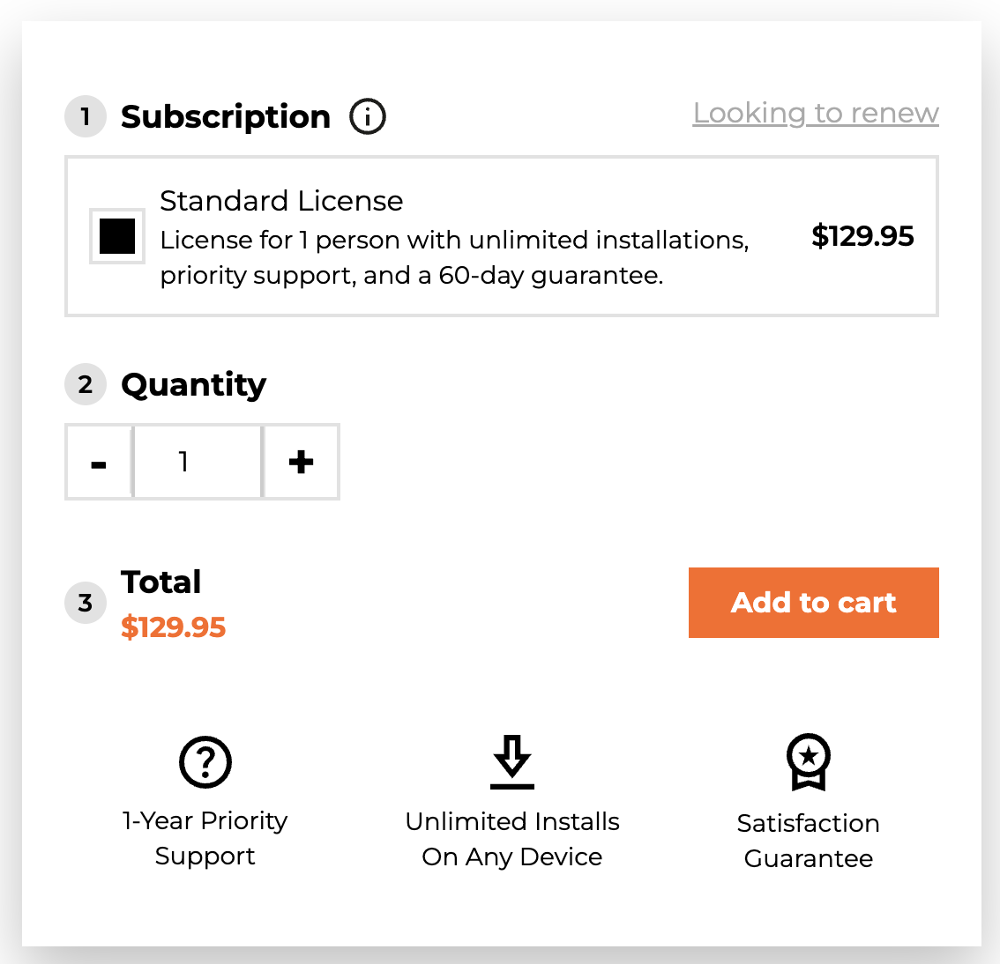
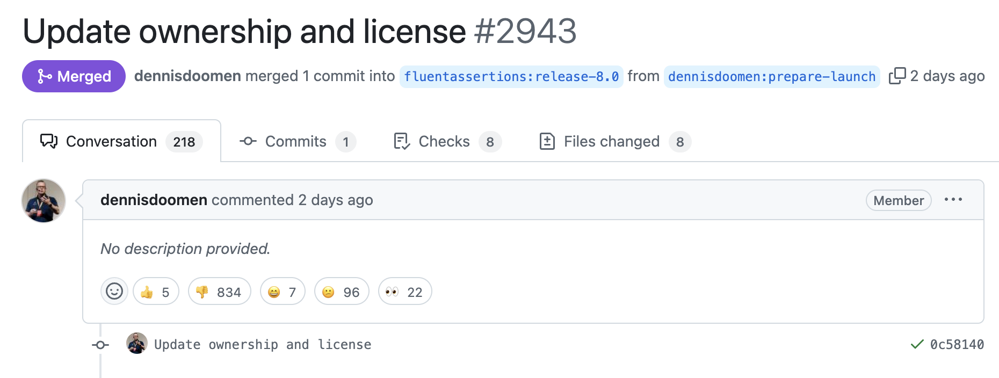

I have long been a proponent of the [FluentAssertions](https://www.nuget.org/packages/fluentassertions/) library, which allows you to write clearer assertion statements in your code fluently, regardless of [your](https://github.com/thomhurst/TUnit) [particular](https://xunit.net/) [testing](https://nunit.org/) [library](https://learn.microsoft.com/en-us/dotnet/core/testing/unit-testing-mstest-intro). I have written a post on this in the past - [Better Assertion Testing With FluentAssertions]().

A few days ago, there was an [announcement](https://xceed.com/blog/news/xceed-software-partners-with-fluent-assertions-to-elevate-developer-tools-and-community-support/) that the [author](https://x.com/ddoomen/status/1879164019229036908) of the library had entered into a "partnership" with [Xceed](https://xceed.com/) software.

**From version 8, you will required to pay a license for commercial use per developer**.

As usual there is [considerable](https://www.youtube.com/watch?v=ZFc6jcaM6Ms) [debate](https://github.com/fluentassertions/fluentassertions/pull/2943) on the license change and cost. The main objections seem to be:

1. The **change of the license** is a "bait and switch."
2. The **price** is outrageous

This debate is **as old as open-source software.** What are the rights and obligations of the author of the software vis a vis those of the users of the software? Who, if not the author, has the right to decide whether and how much to charge? How should an author be compensated for his time and money?

**I don't think Dennis is wrong to want something in return for his dedication**, given that the software has been available since [2011](https://www.nuget.org/packages/fluentassertions/#versions-body-tab). The software and [documentation](https://fluentassertions.com/introduction) are excellent and of very high quality.

If you currently  use `FluentAssertions` you do have options:

1. Continue to use the **current version** - 7
2. Investigate **alternatives**. A promising one is [Shouldly](https://docs.shouldly.org/)

Happy hacking!
