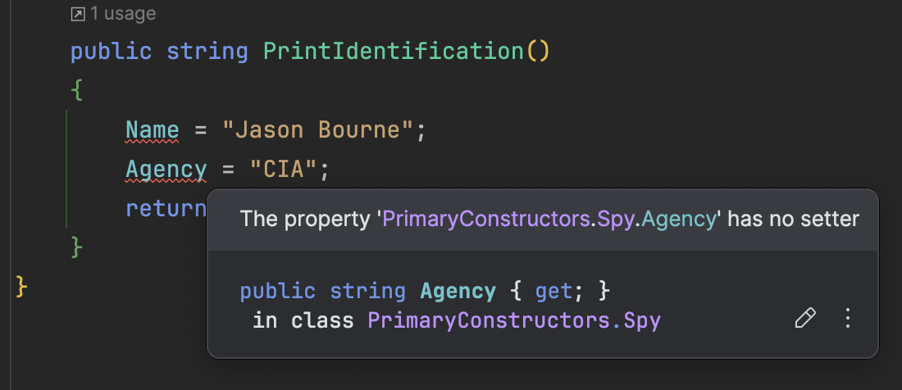

When declaring a type, you typically create it with a constructor, which **initializes any state necessary** for the class to carry out its intended functions.

Let us take, for example, the following simple type:

```c#
public sealed class Spy
{
    public string Name { get; }
    public string Agency { get; }

    public Spy(string name, string agency)
    {
        Name = name;
        Agency = agency;
    }

    public string PrintIdentification()
    {
        return $"Name: {Name}; Agency: {Agency}";
    }
}
```

We can then write a simple program to demonstrate that everything works.

```c#
var spy = new Spy("James Bond", "MI-6");
```

You should see the following in your console.

```plaintext
Name: James Bond; Agency: MI-6
```

One of the new features added to [.NET 8](https://learn.microsoft.com/en-us/dotnet/core/whats-new/dotnet-8/overview) was [primary constructors](https://learn.microsoft.com/en-us/dotnet/csharp/language-reference/proposals/csharp-12.0/primary-constructors).

This is a feature that allows the previous class to be re-written like this:

```c#
public sealed class Spy(string Name, string Agency)
{
    public string PrintIdentification()
    {
        return $"Name: {Name}; Agency: {Agency}";
    }
}
```

The code, unsurprisingly, still functions as expected.

```plaintext
Name: James Bond; Agency: MI-6
```

A primary constructor allows you to specify constructor parameters **in the class definition itself**, thus avoiding creating your own constructor as a method within which you perform any necessary initialization. The rationale here, I would imagine, is for developers to have **less boilerplate code to write**.

Are these types the same? They certainly look the same.

**The answer is no**.

In our type with the primary constructor, we can do the following:

```c#
public sealed class Spy(string Name, string Agency)
{
    public string PrintIdentification()
    {
        Name = "Jason Bourne";
        Agency = "CIA";
        return $"Name: {Name}; Agency: {Agency}";
    }
}
```

This, unsurprisingly, prints the following:

```plaintext
Name: Jason Bourne; Agency: CIA
```

In other words, **the parameters are mutable**.

We cannot do this in the type with the normal constructor - we get a compiler error.



Mutable parameters have the disadvantage that you can **very easily inadvertently introduce bugs into your code** by changing state when it was not meant to be changed.

Luckily, there is somewhat of a solution to this.

We can re-write our type like this:

```c#
public sealed class Spy(string Name, string Agency)
{
    private readonly string _name = Name;
    private readonly string _agency = Agency;

    public string PrintIdentification()
    {
        return $"Name: {_name}; Agency: {_agency}";
    }
}
```

Here, we can signify our **intent** by using the primary constructor to initialize `private`, `readonly` fields, which cannot themselves be modified.

The caveat here is that the developers working on the code **must remember** to always use the `private`, `readonly` fields throughout the type and not the primary constructor parameters, **which are still available throughout the class**!

In other words, it is still possible to accidentally do this:

```c#
public sealed class Spy(string Name, string Agency)
{
    private readonly string _name = Name;
    private readonly string _agency = Agency;

    public string PrintIdentification()
    {
        Name = "Jason Bourne";
        return $"Name: {Name}; Agency: {_agency}";
    }
}
```

Is this something that I will be using personally?

The fact that there is much less code to type is very attractive. However, using a proper IDE like [JetBrains Rider](https://www.jetbrains.com/rider/) (my IDE of choice), [Microsoft Visual Studio](https://visualstudio.microsoft.com) or even [Microsoft Visual Studio Code](https://code.visualstudio.com), generating a **constructor**, **read-only private fields**, or **read-only public properties** is pretty trivial.

If you haven't experienced this in any of the IDEs I have mentioned, create an empty class and within the class definition, type `ctor`. You can then add parameters to the generated empty constructor, and the IDE will **prompt you** whether to create **private, read-only fields** or **public read-only properties**.

**I do not feel that less typing is an acceptable price for the risk of accidentally mutating parameters you did not mean to.**

## TLDR

**Primary constructors, introduced in .NET 8, can save you some boilerplate code. However be very careful that you do not inadvertently mutate the parameters within the body of your class.**

Happy hacking!
