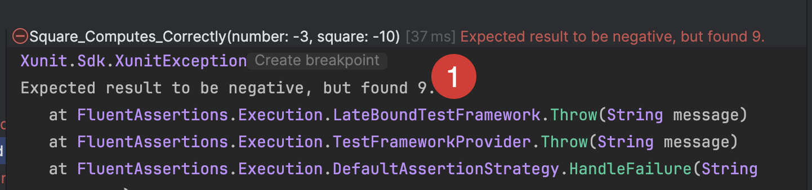
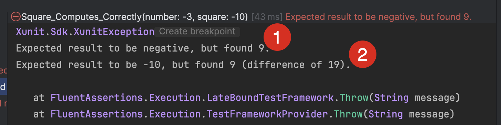

When typically writing unit tests you would typically follow the [AAA pattern - arrange, act, assert.](https://automationpanda.com/2020/07/07/arrange-act-assert-a-pattern-for-writing-good-tests/) This basically means you **set up** the test, **execute** your logic, and then have at least one **assertion** to verify your expected behaviour.

Let us take, for example, the following class:

```c#
public static class Squares
{
    public static int Square(int n) => n * n;
}
```

Let us write tests for this class:

```c#
public class SquareTests
{
    [Theory]
    [InlineData(-3, -10)]
    [InlineData(3, -10)]
    public void Square_Computes_Correctly(int number, int square)
    {
        var result = Squares.Square(number);
        result.Should().BePositive();
        result.Should().Be(square);
    }
}
```

**The test data is wrong to demonstrate a point**.

If we run these tests, they will **fail** with the following error:



What is happening here is that the **first** assertion, `result.Should().BePositive()` fails, and the test runner **stops immediately and moves on to the next test**.

Sometimes, you want to **evaluate all the assertions at once so that you can know well in advance how badly off you are around your logic. It can be **tedious** to **fix one error, run and then find you have yet another error**. In this scenario, you would want to know **all the failed assertions** so that you can fix the logic once and for all.

This can be resolved using an [AssertionScope](https://fluentassertions.com/introduction#assertion-scopes).

We can rewrite our code as follows to add an `AssertionScope`.

```c#
[Theory]
[InlineData(-3, -10)]
[InlineData(3, -10)]
public void Square_Computes_Correctly(int number, int square)
{
    var result = Squares.Square(number);
    using (new AssertionScope())
    {
        result.Should().BeNegative();
        result.Should().Be(square);
    }
}
```

If we run the tests, the following will be the results:



Here we can see, both assertions were evaluated, and the results were output to the console.

### TLDR

`FluentAssertions` has the `AssertionScope` that allows you to evaluate multiple assertions at once.

Happy hacking!
