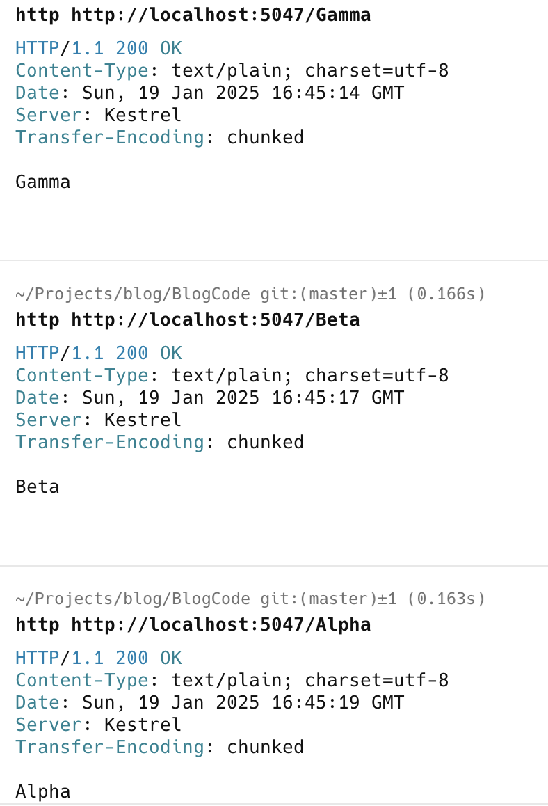
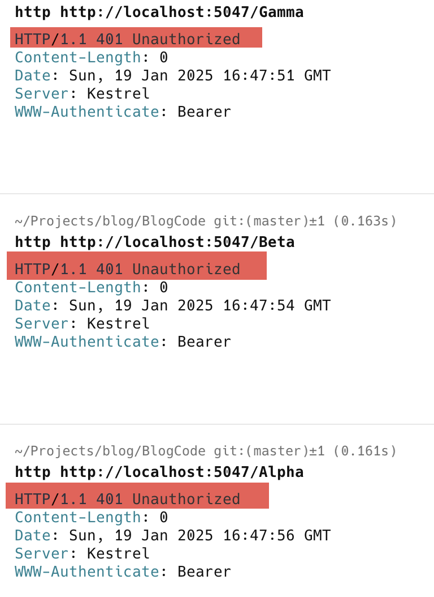
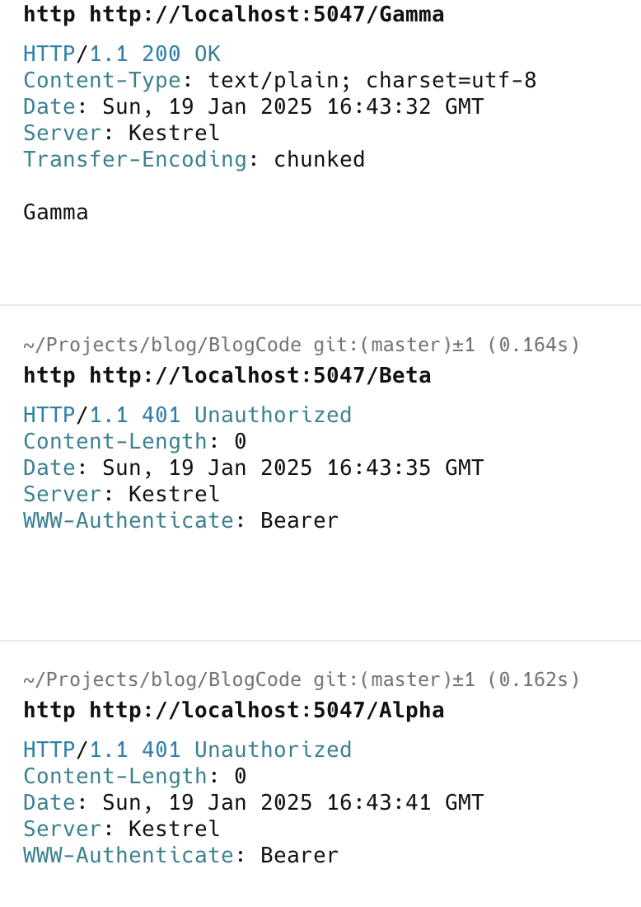

When building a Web API application, you will occasionally need to apply the same treatment to each endpoint.

Take, for example, the following API:

```c#
var builder = WebApplication.CreateBuilder(args);
// Setup authentication
builder.Services.AddAuthentication(JwtBearerDefaults.AuthenticationScheme)
    .AddJwtBearer(options =>
    {
        options.TokenValidationParameters = new Microsoft.IdentityModel.Tokens.TokenValidationParameters
        {
            ValidateIssuer = true,
            ValidateAudience = true,
            ValidateLifetime = true,
            ValidateIssuerSigningKey = true,
            ValidIssuer = "your-issuer",
            ValidAudience = "your-audience",
            IssuerSigningKey = new Microsoft.IdentityModel.Tokens.SymmetricSecurityKey(
                System.Text.Encoding.UTF8.GetBytes("your-secret-key"))
        };
    });

builder.Services.AddAuthorization();
var app = builder.Build();
app.UseAuthentication();
app.UseAuthorization();

app.MapGet("/alpha", () => "Alpha")
    .WithName("Alpha");
app.MapGet("/beta", () => "Beta")
    .WithName("Beta");
app.MapGet("/gamma", () => "Gamma")
    .WithName("Gamma");

app.Run();
```

**The security setup for the authorization is not important in this example.**

All the APIs will function and return the relevant text as displayed.

Here, I have run each endpoint using [Httpie](https://httpie.io/)



Suppose we then decide we want to secure all endpoints by using the [RequireAuthorizaton](https://learn.microsoft.com/en-us/dotnet/api/microsoft.aspnetcore.builder.authorizationendpointconventionbuilderextensions.requireauthorization?view=aspnetcore-9.0) extension method.

One way would be to **update each endpoint to indicate this**:

```c#
builder.Services.AddAuthorization();
var app = builder.Build();
app.UseAuthentication();
app.UseAuthorization();

app.MapGet("/alpha", () => "Alpha")
    .WithName("Alpha").RequireAuthorization();
app.MapGet("/beta", () => "Beta")
    .WithName("Beta").RequireAuthorization();
app.MapGet("/gamma", () => "Gamma")
    .WithName("Gamma").RequireAuthorization();

app.Run();
```

This would return the following:



This, however, can get **tedious** if you have many endpoints.

A solution to this is to use [Groups](https://learn.microsoft.com/en-us/aspnet/core/fundamentals/minimal-apis?view=aspnetcore-9.0#route-groups).

We can update our API as follows:

```c#
builder.Services.AddAuthorization();
var app = builder.Build();
app.UseAuthentication();
app.UseAuthorization();

var group = app.MapGroup("");

group.MapGet("/alpha", () => "Alpha")
    .WithName("Alpha");
group.MapGet("/beta", () => "Beta")
    .WithName("Beta");
group.MapGet("/gamma", () => "Gamma")
    .WithName("Gamma");

group.RequireAuthorization();
app.Run();


```

Here, we can see rather than applying `RequireAuthorization` to each endpoint; we **create a group,** **map each endpoint to the group**, and then apply `RequireAuthorization` to the group. This makes the code not only **less cluttered** but it makes it easier to **turn the authorization on and off.**

What if you don't want the authorization to be on all the APIs but just for a few of them?

Then, **add the ones you want to be authorized to the group**; the rest can be **left out**. For example, if we don't want `gamma` to be authorized, we can write our code like this:

```c#
var builder = WebApplication.CreateBuilder(args);
// Add services to the container.
builder.Services.AddAuthentication(JwtBearerDefaults.AuthenticationScheme)
    .AddJwtBearer(options =>
    {
        options.TokenValidationParameters = new Microsoft.IdentityModel.Tokens.TokenValidationParameters
        {
            ValidateIssuer = true,
            ValidateAudience = true,
            ValidateLifetime = true,
            ValidateIssuerSigningKey = true,
            ValidIssuer = "your-issuer",
            ValidAudience = "your-audience",
            IssuerSigningKey = new Microsoft.IdentityModel.Tokens.SymmetricSecurityKey(
                System.Text.Encoding.UTF8.GetBytes("your-secret-key"))
        };
    });

builder.Services.AddAuthorization();
var app = builder.Build();
app.UseAuthentication();
app.UseAuthorization();

var group = app.MapGroup("");

group.MapGet("/alpha", () => "Alpha")
    .WithName("Alpha");
group.MapGet("/beta", () => "Beta")
    .WithName("Beta");
app.MapGet("/gamma", () => "Gamma")
    .WithName("Gamma");

group.RequireAuthorization();
app.Run()
```

If we make a request to each endpoint, the results should be as follows:



This doesn't just apply to authorization. **Where it makes sense**, you can use most of the same extension methods that apply to the `WebApplication` to the `group`

### TLDR

**Groups allow you to collect API endpoints you want to apply common treatment to, such as security.**

Happy hacking!
