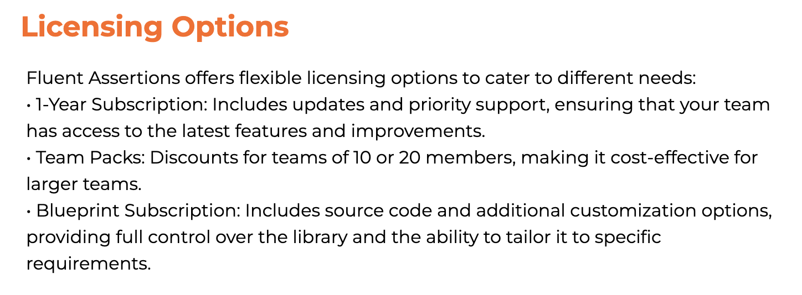

So, in a [past post](), I covered the debacle around the recent change in the [FluentAssertions](https://fluentassertions.com/) library. But the hawk-eyed among you noticed that despite being a [huge]() [proponent]() of the library, **I did not, in fact, say what I intended to do about the situation** and emailed me to ask.

My thoughts are as follows:

I want to gratefully thank the library's authors, led by [Dennis Doomen](https://twitter.com/ddoomen) and [Jonas Nyrup](https://github.com/jnyrup). It is a first-class library with [excellent documentation](https://fluentassertions.com/introduction) I have used for many years.

I first ran into it when I found myself working with two sets of projects - some that had their tests written in [xUnit](https://xunit.net/) and the others written in [NUnit](https://nunit.org/). In case you have yet to use either, they have unique ways of asserting, which are **similar** but **different**.

| **Assertion** |	**xUnit** | **NUnit** |
| --- | ---- | ----|
|Equality | `Assert.Equal(expected, actual);` | `Assert.AreEqual(expected, actual);` |
|Inequality | `Assert.NotEqual(expected, actual);` | `Assert.AreNotEqual(expected, actual);` |
|True | `Assert.True(condition);` | `Assert.IsTrue(condition);` |
|False | `Assert.False(condition);` |`Assert.IsFalse(condition);` |

Remembering to switch content between xUnit assertions and NUnit assertions while writing and maintaining tests can be quite **annoying**. Using `FluentAssertions` meant **I did not need to care what testing framework I used**. The syntax for assertions was the same.

Another benefit was realized when we migrated from `NUnit` and standardized on `xUnit` as our testing framework. This simply meant (mainly) **changing the referenced libraries and re-compiling**. I hardly needed to touch the existing test code.

It is an excellent library.

However, I fear **I cannot reconcile the new fee structure with reality**, and I am really curious about what market research [Xceed](https://xceed.com/) (the new owners) conducted to arrive at their pricing. In case you are unaware, this is the current pricing:

That's 130 dollars.

If you further read the licensing terms:

Yes, you read correctly. That 130 $ is payable **per developer per year**.

That price point is **absurd**.

**I absolutely and 100% support the team's need to monetize their work, but I don't feel that the price point is grounded in reality.**

So here is what I intend to do.

1. I will **not** be upgrading to version 8, the paid version.

2. Any **new tests** will likely be written in a **different assertion library** - [Shoudly](https://docs.shouldly.org/)

3. All my **existing** tests will remain as they are in version 7. 

    

    My rationale here is that there is no need to rewrite the tests - they work correctly as they are, and there is zero value in rewriting them - either to use `xUnit's` assertion clauses or `Shoudly's`

### TLDR

**[FluentAssertiions](https://fluentassertions.com/introduction), while an excellent library, has a new price point that does not make fiscal sense. I will be migrating off it for new work to [Shouldy](https://docs.shouldly.org/) but will maintain existing tests in the last free version - 7.**

Happy Hacking!

