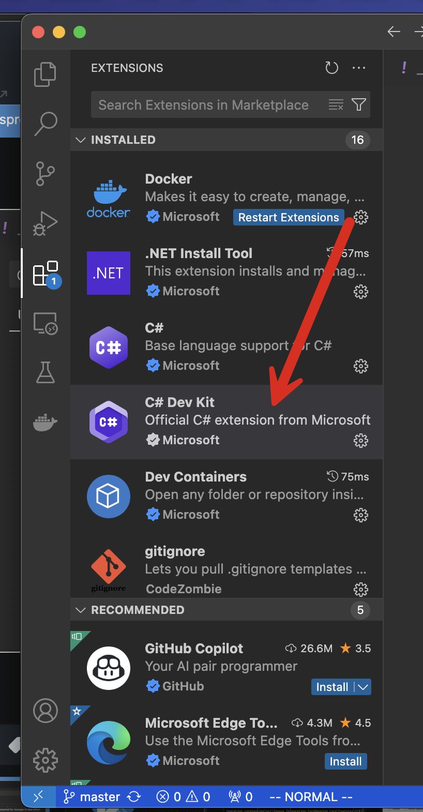
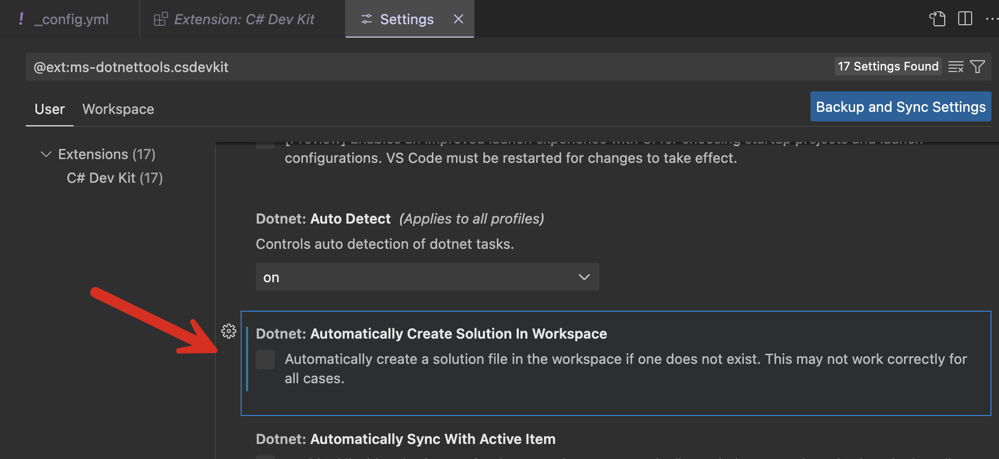

If you are using a recent build of [Visual Studio Code](https://code.visualstudio.com/), you are probably using the [C# Dev Kit](https://learn.microsoft.com/en-us/visualstudio/subscriptions/vs-c-sharp-dev-kit). If that is the case, you may have noted some curious behavior.

If you open a .NET project, it will **automatically create a solution file** for you and add the existing `.csproj` to the solution file.

This can be pretty annoying in terms of **cluttering your project** and **creating artifacts for source code control**.

You can always **delete the solution file**, but it can get annoying after a while.

The solution to this is as follows:

Open the extensions panel

From there, click the C# Dev Kit Extension

On the pane for C# Dev Kit, locate and click the gear to pull up a menu

This will load the settings for the extension.

Locate and toggle **OFF** the following setting:

This will turn off that behaviour.

Happy hacking!
