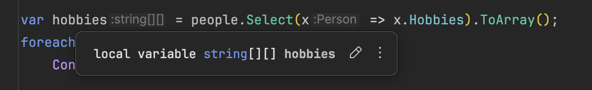
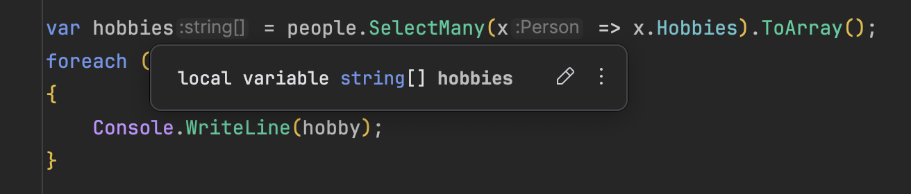
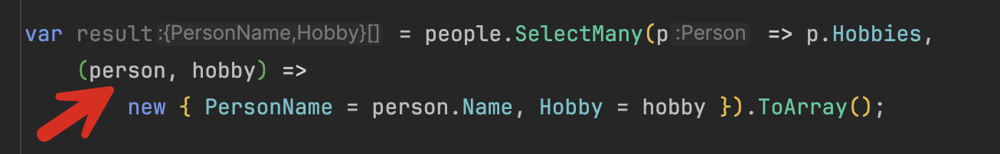

One of the [LINQ](https://learn.microsoft.com/en-us/dotnet/csharp/linq/) methods that it took me some time to figure out is [SelectMany](https://learn.microsoft.com/en-us/dotnet/api/system.linq.enumerable.selectmany?view=net-9.0), and which use cases lend themselves best to its use.

Let us take the following type:

```c#
public sealed record Person
{
  public required string Name { get; init; }
  public required string[] Hobbies { get; init; }
}
```

Let us then create a collection of `Person` in a simple program.

```c#
Person[] people =
[
    new Person { Name = "Stacy", Hobbies = ["Fishing", "Hunting"] },
    new Person { Name = "Tracy", Hobbies = ["Boxing", "Shooting"] },
    new Person { Name = "Rohna", Hobbies = ["Painting", "Shooting"] },
    new Person { Name = "Ronda", Hobbies = ["Diving", "Snorkeling"] },
    new Person { Name = "Donna", Hobbies = ["Poetry", "Archery"] },
    new Person { Name = "Yolanda", Hobbies = ["Gaming"] },
    new Person { Name = "Tawana", Hobbies = ["Jogging", "Basketball"] },
    new Person { Name = "Wanda", Hobbies = ["Karate", "Judo"] },
];
```

If we wanted to print people's **names**, we would do it like this:

```c#
var names = people.Select(x => x.Name).ToArray();
foreach (var name in names)
    Console.WriteLine(name);
```

Now suppose we wanted to print the people's **Hobbies**.

We could try this:

```c#
var hobbies = people.Select(x => x.Hobbies).ToArray();
foreach (var hobby in hobbies)
    Console.WriteLine(hobby);
```

This doesn't do what you think it does.

What hobbies returns is an `array` of `string` `arrays`. The IDE can help us visualize this:



If you want to print their hobbies, we need to do some **extra work** like this:

```c#
var hobbies = people.Select(x => x.Hobbies).ToArray();
foreach (var hobby in hobbies)
{
    foreach (var personalHobby in hobby)
    {
        Console.WriteLine(personalHobby);
    }
}
```

This is the scenario where we need to use `SelectMany`, because this method allows us to **flatten the collection of hobbies into a single collection**.

We write the query like this:

```c#
var hobbies = people.SelectMany(x => x.Hobbies).ToArray();
foreach (var hobby in hobbies)
{
    Console.WriteLine(hobby);
}
```

Our IDE tells us now we are getting a normal `array` of every hobby



This prints what we expect:

```plaintext
Fishing
Hunting
Boxing
Shooting
Painting
Shooting
Diving
Snorkeling
Poetry
Archery
Gaming
Jogging
Basketball
Karate
Judo
```

Note that some hobbies appear more than once. This is by design—the method **just flattens the collection** and does nothing about duplicates. If you don't want duplicates, you have to modify the LINQ pipeline and **indicate that yourself** using the [Distinct](https://learn.microsoft.com/en-us/dotnet/api/system.linq.enumerable.distinct?view=net-9.0) method.

```c#
var distinctHobbies = people.SelectMany(x => x.Hobbies)
    .Distinct()
    .ToArray();

foreach (var hobby in distinctHobbies)
{
    Console.WriteLine(hobby);
}
```


Another way to leverage `SelectMany` is when we need to access the **parent object from within the context of the flattening**.

For example, suppose we needed to print the **hobby** and the `Person` it belonged to.

`SelectMany` has an overload that allows us to specify a **result selector** that we can use within our code.

The query expression will look like this:

```c#
var result = people.SelectMany(p => p.Hobbies,
    (person, hobby) =>
        new { PersonName = person.Name, Hobby = hobby }).ToArray();
```

The magic is happening here:



The parameter `person` allows us to reference the original person to whom the `hobby` belongs.

We then project the **name** and the **hobby** into an anonymous type and return that as an array.

We can then access both as follows:

```c#
foreach (var result in results)
    Console.WriteLine($"{result.Hobby} is a hobby of {result.PersonName}");
```

The results will be as follows:

```plaintext
Fishing is a hobby of Stacy
Hunting is a hobby of Stacy
Boxing is a hobby of Tracy
Shooting is a hobby of Tracy
Painting is a hobby of Rohna
Shooting is a hobby of Rohna
Diving is a hobby of Ronda
Snorkeling is a hobby of Ronda
Poetry is a hobby of Donna
Archery is a hobby of Donna
Gaming is a hobby of Yolanda
Jogging is a hobby of Tawana
Basketball is a hobby of Tawana
Karate is a hobby of Wanda
Judo is a hobby of Wanda
```

### TLDR

**`SelectMany` is a powerful `LINQ` method that allows us to flatten child collections into a single collection and access them in their parent's context.**

The code is in my [GitHub](https://github.com/conradakunga/BlogCode/tree/master/2025-01-25%20-%20Select%20Many).

Happy Hacking!
