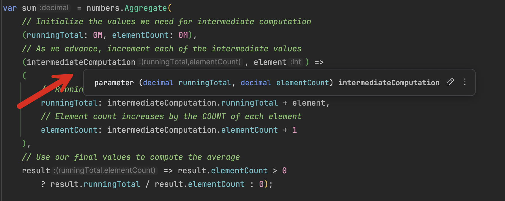
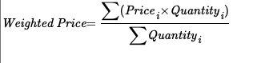
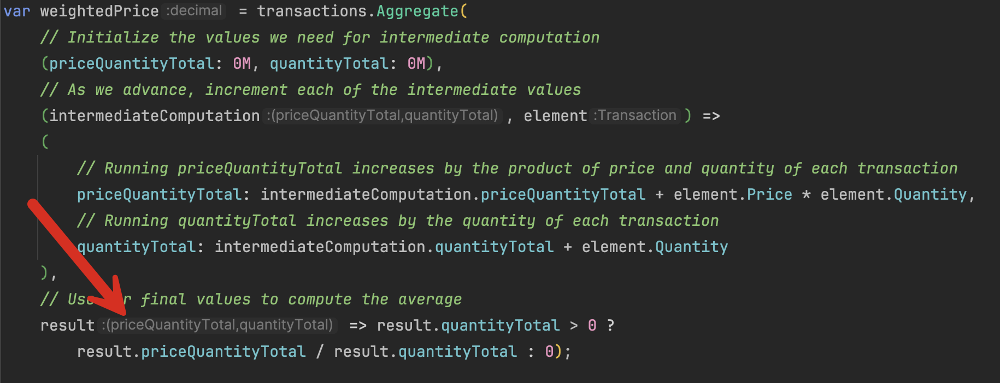

Another of the more complex [LINQ](https://learn.microsoft.com/en-us/dotnet/csharp/linq/) methods is the [Aggregate](https://learn.microsoft.com/en-us/dotnet/api/system.linq.enumerable.aggregate?view=net-9.0) method. This is the method you use to compute some sort of **aggregate computation** where each element in the [IEnumerable<<T>>](https://learn.microsoft.com/en-us/dotnet/api/system.collections.generic.ienumerable-1?view=net-9.0) is being used in the computation. 

Examples of aggregate computations are **average**, **min**, **max**, etc.

For example, if you wanted to **sum** up all the elements in a collection, you would do it like this:

```c#
var sum = numbers.Aggregate(0, (runningTotal, element) => runningTotal + element);
Console.WriteLine(sum);
```

What is happening here is that `runningTotal` is the value we are using to store the intermediate computations (the **seed**). This is initialized to zero at the start of the aggregation, and as the `Aggregate` method evaluates each element, the **element value is added to the seed**.

**You do not need to aggregate to sum yourself as LINQ already provides a method that does this - [Sum](https://learn.microsoft.com/en-us/dotnet/api/system.linq.enumerable.sum?view=net-9.0).**

We can also use the `Aggregate` method to do something more elaborate - to compute the **average**.

Here, it will require a bit of heavy lifting. Unlike the previous aggregation `Sum`, we need to keep track of a number of things:

1. The running **total**
2. The **number** of elements

And at the very end we verify that there is **at least one element and then compute the average**.

Our expression will be as follows:

```c#
var sum = numbers.Aggregate(
    // Initialize the values we need for intermediate computation
    (runningTotal: 0M, elementCount: 0M),
    // As we advance, increment each of the intermediate values
    (intermediateComputation, element) =>
    (
        // Running total increases by the VALUE of each element
        runningTotal: intermediateComputation.runningTotal + element,
        // Element count increases by the COUNT of each element
        elementCount: intermediateComputation.elementCount += 1
    ),
    // Use our final values to compute the average
    result => result.elementCount > 0 ? result.runningTotal / result.elementCount : 0);
```

Note here that the type of `intermediateComputation` is a tuple whose members are our intermediate values.



Again, there is no need to do this yourself as `LINQ` already provides an [Average](https://learn.microsoft.com/en-us/dotnet/api/system.linq.enumerable.average?view=net-9.0) method for this purpose.

However, this knowledge is useful because you might run into a **complex operation you must do yourself**.

For example, assume we have this type:

```c#
public sealed record Transaction
{
    public required decimal Price { get; init; }
    public required int Quantity { get; init; }
}
```

We then create a bunch of transactions.

```c#
Transaction[] transactons =
[
    new Transaction { Price = 100, Quantity = 1000 },
    new Transaction { Price = 95, Quantity = 800 },
    new Transaction { Price = 110, Quantity = 700 },
    new Transaction { Price = 105, Quantity = 900 },
    new Transaction { Price = 110, Quantity = 100 },
];
```

Now, let us assume we need to compute the **weighted average price**.

The formula for this is as follows:



The expression to compute the weighted total is as follows:

```c#
var weightedPrice = transactions.Aggregate(
    // Initialize the values we need for intermediate computation
    (priceQuantityTotal: 0M, quantityTotal: 0M),
    // As we advance, increment each of the intermediate values
    (intermediateComputation, element) =>
    (
        // Running priceQuantityTotal increases by the product of price and quantity of each transaction
        priceQuantityTotal: intermediateComputation.priceQuantityTotal + element.Price * element.Quantity,
        // Running quantityTotal increases by the quantity of each transaction
        quantityTotal: intermediateComputation.quantityTotal + element.Quantity
    ),
    // Use our final values to compute the average
    result => result.quantityTotal > 0 ? result.priceQuantityTotal / result.quantityTotal : 0);
```

As you can see here, the structure is similar to the previous aggregation.

The magic occurs in the **result selector**, where we have access to the final version of our intermediate object.



As usual, we perform a sanity check to ensure that the total is greater than zero before computing the average.

We can leverage this to do some very powerful computations.

Let us say we had the following type:

```c#
public sealed record StockTransaction
{
    public required string Stock { get; init; }
    public required decimal Price { get; init; }
    public required int Quantity { get; init; }
}
```

And the following transactions:

```c#
StockTransaction[] stockTransactions =
[
    new StockTransaction { Stock = "Apple", Price = 100, Quantity = 1000 },
    new StockTransaction { Stock = "Microsoft", Price = 95, Quantity = 800 },
    new StockTransaction { Stock = "Apple", Price = 110, Quantity = 700 },
    new StockTransaction { Stock = "Microsoft", Price = 105, Quantity = 900 },
    new StockTransaction { Stock = "Apple", Price = 110, Quantity = 100 },
];
```

Suppose we needed to compute the **weighted average price for each stock**.

We can leverage the [AggregateBy](https://learn.microsoft.com/en-us/dotnet/api/system.linq.enumerable.aggregateby?view=net-9.0) method, which builds on `Aggregate`, for this purpose.

Our expression will be like this:

```c#
var stockWeightedPrices = stockTransactions.AggregateBy(x =>
        // Partition our transactions by Stock
        x.Stock,
        // Initialize the values we need for intermediate computation
        (priceQuantityTotal: 0M, quantityTotal: 0M),
        // As we advance, increment each of the intermediate values
        (intermediateComputation, element) =>
        (
            // Running priceQuantityTotal increases by the product of price and quantity of each transaction
            priceQuantityTotal: intermediateComputation.priceQuantityTotal + element.Price * element.Quantity,
            // Running quantityTotal increases by the quantity of each transaction
            quantityTotal: intermediateComputation.quantityTotal + element.Quantity
        )).Select(x => new
    {
        Stock = x.Key,
        WeightedAveragePrice = x.Value.quantityTotal > 0 ? 
          x.Value.priceQuantityTotal / x.Value.quantityTotal : 0
    })
    .ToArray();
```

Note that we are **not getting back a single value** because we are computing the weighted average price for **multiple stocks**.

We project the results into an [anonymous type](https://learn.microsoft.com/en-us/dotnet/csharp/fundamentals/types/anonymous-types) with `Stock` and `WeightedAveragePrice` properties, which we can then **iterate over**.

```c#
foreach (var item in stockWeightedPrices)
    Console.WriteLine($"Weighted Average Price For {item.Stock} is {item.WeightedAveragePrice:#,0.0000}");
```

This should print the following:

```plaintext
Weighted Average Price For Apple is 104.4444
Weighted Average Price For Microsoft is 100.2941
```

The code is in my [Github](https://github.com/conradakunga/BlogCode/tree/master/2025-01-26%20-%20Aggregate).

Happy hacking!
