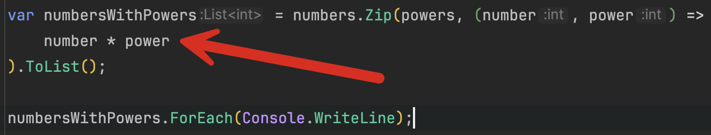

One of the **lesser-used** but very **useful** [LINQ](https://learn.microsoft.com/en-us/dotnet/csharp/linq/) methods is the [Zip](https://learn.microsoft.com/en-us/dotnet/api/system.linq.enumerable.zip?view=net-9.0) method.

`Zip` is at its best when **combining two input collections and producing a third collection**.

This is very analogous to an actual zip.


Let us take a simple example. We want to take a sequence of numbers, `1` to `10`, and then **multiply each number by its corresponding entry in a second sequence of numbers**.

In other words, we want to take **two sequences of 1 to 10** and **transform them into a third** where each element is the **corresponding element in each source element multiplied by itself**.

```c#
var numbers = Enumerable.Range(1, 10);
var powers = Enumerable.Range(1, 10);

var numbersWithPowers = numbers.Zip(powers, (number, power) => (number * power)).ToList();

numbersWithPowers.ForEach(Console.WriteLine);
```

This should print the following:

```plaintext
1
4
9
16
25
36
49
64
81
100
```

The magic occurs in the result selector, where we specify **how to combine** each of the respective collection elements.



We can combine the elements in other ways. 

For example, given the following collections of **first names and surnames**:

```c#
string[] firstNames = ["James", "Jason", "Evelyn", "Roz", "Harry"];
string[] surnames = ["Bond", "Bourne", "Salt", "Myers", "Pearce"];

var products = firstNames.Zip(surnames, (firstName, surname) => $"{firstName} {surname}").ToList();

products.ForEach(Console.WriteLine);
```

Here, we combine each corresponding element from each collection by [concatenating](https://en.wikipedia.org/wiki/Concatenation) them.

The code prints the following:

```plaintext
James Bond
Jason Bourne
Evelyn Salt
Roz Myers
Harry Pearce
```

What if you have more than three collections? As is the case here:

```c#
string[] stocks = ["Microsoft", "Safaricom", "Mercedes"];
int[] quantities = [1_000, 1_500, 800];
decimal[] prices = [100, 20, 75];
```

We then need to combine these and determine the value of each.

`Zip` only allows the combination of **two collections**, so we need to `Zip` **twice**, also referred to as a nested zip.

First, we combine each `stock` and its corresponding `quantity`:

```c#
// Combine the stock and quantity into an anonymous type
var stockQuantities = stocks.Zip(quantities, (stock, quantity) => new { stock, quantity }).ToList();
// Combine the previous step with the prices into a second type
var stockValues = stockQuantities.Zip(prices,
    (stockQuantity, price) => new { Stock = stockQuantity.stock, Value = stockQuantity.quantity * price }).ToList();

// Output our results
stockValues.ForEach(item => Console.WriteLine($"The value of {item.Stock} is {item.Value:#,0.00}"));
```

This will print the following:

```plaintext
The value of Microsoft is 100,000.00
The value of Safaricom is 30,000.00
The value of Mercedes is 60,000.00
```

What if you have collections that are of **different lengths**?

`Zip` will **stop** operations at the **shorter of the collections**.

In other words, if we had removed *Mercedes* from our previous collection:

```c#
string[] stocks = ["Microsoft", "Safaricom"];
int[] quantities = [1_000, 1_500, 800];
decimal[] prices = [100, 20, 75];
```

Our result would be as follows:

```plaintext
The value of Microsoft is 100,000.00
The value of Safaricom is 30,000.00
```

You can see the extra elements for `quantities`, and `prices` are ignored.

### TLDR

**The [LINQ](https://learn.microsoft.com/en-us/dotnet/csharp/linq/) [Zip](https://learn.microsoft.com/en-us/dotnet/api/system.linq.enumerable.zip?view=net-9.0) method is a very useful method when you want to combine two collections of the same length. If you have more collections, you can nest your `Zip` operations.**

The code is in my [GitHub](https://github.com/conradakunga/BlogCode/tree/master/2025-01-27%20-%20Zip).

Happy hacking!
