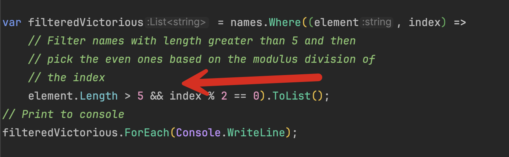

A common algorithmic challenge you will probably run into is having a collection of items and then, for whatever reason, **requiring the index of each item relative to the others in the collection**.

For example, take this collection:

```c#
string[] names =
[
    "Brenda", "Latisha", "Linda", "Felicia", "Dawn", "LeShaun", "Ines", "Alicia", "Teresa", "Monica", "Sharon", "Nicki",
    "Lisa", "Veronica", "Karen", "Vicky", "Cookie", "Tonya", "Diane", "Lori", "Carla", "Marina", "Selena", "Katrina",
    "Sabrina", "Kim", "LaToya", "Tina", "Shelley", "Bridget", "Cathy", "Rasheeda", "Kelly", "Nicole", "Angel",
    "Juanita", "Stacy", "Tracie", "Rohna", "Ronda", "Donna", "Yolanda", "Tawana", "Wanda",
];
```

 A quick way to get the **index** is as follows:

```c#
for (var i = 0; i < names.Length; i++)
{
    Console.WriteLine($"{names[i]} is item {i}");
}
```

If we needed a list of **every other name**, we could do it like this:

```c#
var everyOtherName = new List<string>();

for (var i = 0; i < names.Length; i++)
{
    if (i % 2 == 0)
        everyOtherName.Add(names[i]);
}

everyOtherName.ForEach(Console.WriteLine);
```

There are several ways to solve the problem of accessing the index using [LINQ](https://learn.microsoft.com/en-us/dotnet/csharp/linq/).

The first is the [Index](https://learn.microsoft.com/en-us/dotnet/api/system.linq.enumerable.index?view=net-9.0) method.

```c#
var namesWithIndexes = names.Index().ToList();
namesWithIndexes.ForEach(element =>
    Console.WriteLine($"{element.Item} is index {element.Index}"));
```

For each item in the collection, `Index` returns a [Tuple](https://learn.microsoft.com/en-us/dotnet/csharp/language-reference/builtin-types/value-tuples) of each item and its corresponding **index**. You can then use this `Tuple` subsequently in your logic. You can view this `Tuple` in the intellisense.


You can also use the [Select](https://learn.microsoft.com/en-us/dotnet/api/system.linq.enumerable.select?view=net-9.0) method, which has an overload that allows access to the **index**.

```c#
var otherNamesWithIndexes = names.Select((element, index) => 
    new { Name = element, Index = index }).ToList();
otherNamesWithIndexes.ForEach(element =>
    Console.WriteLine($"{element.Name} is index {element.Index}"));
```

You can view this in the Intellisense.


A lesser-known fact is that the [Where](https://learn.microsoft.com/en-us/dotnet/api/system.linq.enumerable.where?view=net-9.0) method also has an **overload** that allows you to access the **index** as well as specify your **filter criteria**.

This allows you to compose collections from some complicated scenarios.

Suppose we wanted to select **all names with a length greater than five** and then give an award to **every other**.

```c#
var filteredVictorious = names.Where((element, index) =>
    // Filter names with length greater than 5 and then
    // pick the even ones based on the modulus division of
    // the index
    element.Length > 5 && index % 2 == 0).ToList();
// Print to console
filteredVictorious.ForEach(Console.WriteLine);
```

Here, we use the `Where` method and provide a function within which we leverage the collection **element** and its **index** for our logic.



This should print the following:

```plaintext
Brenda
Teresa
Sharon
Cookie
Selena
Sabrina
LaToya
```

### TLDR

**LINQ has several methods that allow you to access the index of items in your collection that you can leverage in your logic.**

The code is in my Github.

Happy hacking!
